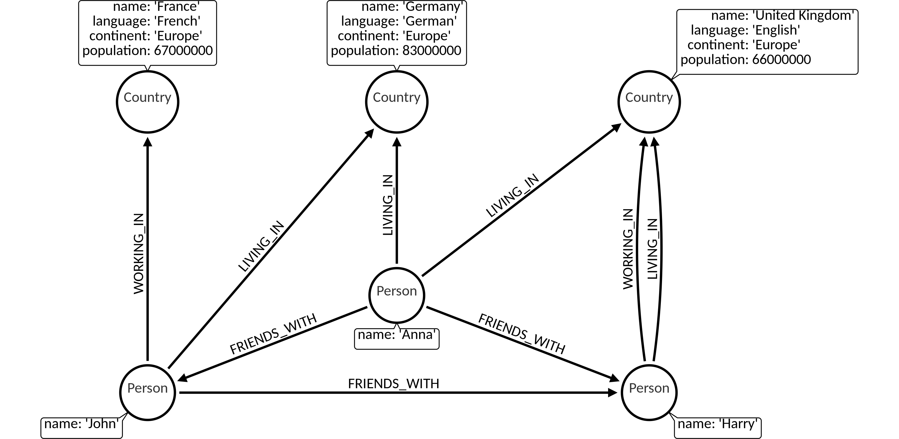

The `DELETE` clause is used to delete nodes and relationships from the database.

1. [Deleting a node](#1-deleting-a-node) <br />
2. [Deleting a node and its relationships](#2-deleting-a-node-and-its-relationships) <br />
3. [Deleting a relationship](#3-deleting-a-relationship) <br />
4. [Deleting everything](#4-deleting-everything)

## Dataset

The following examples are executed with this data et. You can create this dataset
locally by executing the queries at the end of the page: [Dataset queries](#data-set-queries).



## 1. Deleting a node

The `DELETE` clause can be used to delete a node:

```cypher
MATCH (c:Country {name: 'United Kingdom'})
DELETE c;
```

Output:

```nocopy
Failed to remove node because of it's existing connections. Consider using DETACH DELETE.
```

On the dataset we are using, this query results in an error because `DELETE`
can only be used on nodes that have no relationships.

## 2. Deleting a node and its relationships

The `DELETE` clause can be used to delete a node along with all of its relationships with the keyword `DETACH`:

```cypher
MATCH (n:Country {name: 'United Kingdom'})
DETACH DELETE n;
```

Output:

```nocopy
Empty set (0.001 sec)
```

## 3. Deleting a relationship

The `DELETE` clause can be used to delete a relationship:

```cypher
MATCH (n:Country {name: 'Germany'})<-[r:LIVING_IN]-()
DELETE r;
```

Output:

```nocopy
Empty set (0.003 sec)
```

## 4. Deleting everything

To delete all nodes and relationships in a graph, use the following query:

```cypher
MATCH (n)
DETACH DELETE n;
```

Output:

```nocopy
Empty set (0.001 sec)
```

## Dataset queries

We encourage you to try out the examples by yourself.
You can get our dataset locally by executing the following query block.

```cypher
MATCH (n) DETACH DELETE n;

CREATE (c1:Country {name: 'Germany', language: 'German', continent: 'Europe', population: 83000000});
CREATE (c2:Country {name: 'France', language: 'French', continent: 'Europe', population: 67000000});
CREATE (c3:Country {name: 'United Kingdom', language: 'English', continent: 'Europe', population: 66000000});

MATCH (c1),(c2)
WHERE c1.name = 'Germany' AND c2.name = 'France'
CREATE (c2)<-[:WORKING_IN {date_of_start: 2014}]-(p:Person {name: 'John'})-[:LIVING_IN {date_of_start: 2014}]->(c1);

MATCH (c)
WHERE c.name = 'United Kingdom'
CREATE (c)<-[:WORKING_IN {date_of_start: 2014}]-(p:Person {name: 'Harry'})-[:LIVING_IN {date_of_start: 2013}]->(c);

MATCH (p1),(p2)
WHERE p1.name = 'John' AND p2.name = 'Harry'
CREATE (p1)-[:FRIENDS_WITH {date_of_start: 2011}]->(p2);

MATCH (p1),(p2)
WHERE p1.name = 'John' AND p2.name = 'Harry'
CREATE (p1)<-[:FRIENDS_WITH {date_of_start: 2012}]-(:Person {name: 'Anna'})-[:FRIENDS_WITH {date_of_start: 2014}]->(p2);

MATCH (p),(c1),(c2)
WHERE p.name = 'Anna' AND c1.name = 'United Kingdom' AND c2.name = 'Germany'
CREATE (c2)<-[:LIVING_IN {date_of_start: 2014}]-(p)-[:LIVING_IN {date_of_start: 2014}]->(c1);

MATCH (n)-[r]->(m) RETURN n,r,m;
```
