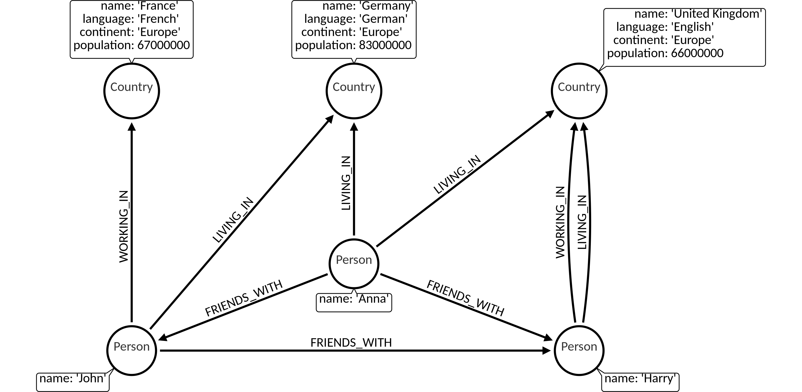

The `WITH` is used to chain together parts of a query, piping the results from one to be used as starting points or criteria in the next.

1. [Filter on aggregate functions](#1-filter-on-aggregate-functions) <br />
2. [Sorting results](#2-sorting-results) <br />
3. [Limited path searches](#3-limited-path-searches)

## Dataset

The following examples are executed with this dataset. You can create this dataset
locally by executing the queries at the end of the page: [Dataset queries](#data-set-queries).



## 1. Filter on aggregate functions

Aggregated results have to pass through a `WITH` if you want to filter them:

```cypher
MATCH (p:Person {name: 'John'})--(person)-->()
WITH person, count(*) AS foaf
WHERE foaf > 1
RETURN person.name;
```

Output:

```nocopy
+-------------+
| person.name |
+-------------+
| Harry       |
| Anna        |
+-------------+
```

Sorting unique aggregated results can be done with `DISTINCT` operator in aggregation function which can be then filtered:

```cypher
MATCH (p:Person {name: 'John'})--(person)-->(m)
WITH person, count(DISTINCT m) AS foaf
WHERE foaf > 1
RETURN person.name;
```

Output:

```nocopy
+-------------+
| person.name |
+-------------+
| Harry       |
| Anna        |
+-------------+
```

## 2. Sorting results

The `WITH` clause can be used to order results before using `collect()` on them:

```cypher
MATCH (n)
WITH n
ORDER BY n.name ASC LIMIT 3
RETURN collect(n.name);
```

Output:

```nocopy
+-------------------------------+
| collect(n.name)               |
+-------------------------------+
| ["Anna", "France", "Germany"] |
+-------------------------------+
```

if you want to `collect()` only unique values:

```cypher
MATCH (n)
WITH n
ORDER BY n.name ASC LIMIT 3
RETURN collect(DISTINCT n.name) as unique_names;
```

Output:

```nocopy
+-------------------------------+
| unique_names                  |
+-------------------------------+
| ["Anna", "France", "Germany"] |
+-------------------------------+
```

## 3. Limited path searches

The `WITH` clause can be used to match paths, limit to a certain number,
and then match again using those paths as a base:

```cypher
MATCH (p1 {name: 'John'})--(p2)
WITH p2
ORDER BY p2.name ASC LIMIT 1
MATCH (p2)--(p3)
RETURN p3.name;
```

Output:

```nocopy
+----------------+
| p3.name        |
+----------------+
| John           |
| Harry          |
| Germany        |
| United Kingdom |
+----------------+
```

## Dataset queries

We encourage you to try out the examples by yourself.
You can get our dataset locally by executing the following query block.

```cypher
MATCH (n) DETACH DELETE n;

CREATE (c1:Country {name: 'Germany', language: 'German', continent: 'Europe', population: 83000000});
CREATE (c2:Country {name: 'France', language: 'French', continent: 'Europe', population: 67000000});
CREATE (c3:Country {name: 'United Kingdom', language: 'English', continent: 'Europe', population: 66000000});

MATCH (c1),(c2)
WHERE c1.name= 'Germany' AND c2.name = 'France'
CREATE (c2)<-[:WORKING_IN {date_of_start: 2014}]-(p:Person {name: 'John'})-[:LIVING_IN {date_of_start: 2014}]->(c1);

MATCH (c)
WHERE c.name= 'United Kingdom'
CREATE (c)<-[:WORKING_IN {date_of_start: 2014}]-(p:Person {name: 'Harry'})-[:LIVING_IN {date_of_start: 2013}]->(c);

MATCH (p1),(p2)
WHERE p1.name = 'John' AND p2.name = 'Harry'
CREATE (p1)-[:FRIENDS_WITH {date_of_start: 2011}]->(p2);

MATCH (p1),(p2)
WHERE p1.name = 'John' AND p2.name = 'Harry'
CREATE (p1)<-[:FRIENDS_WITH {date_of_start: 2012}]-(:Person {name: 'Anna'})-[:FRIENDS_WITH {date_of_start: 2014}]->(p2);

MATCH (p),(c1),(c2)
WHERE p.name = 'Anna' AND c1.name = 'United Kingdom' AND c2.name = 'Germany'
CREATE (c2)<-[:LIVING_IN {date_of_start: 2014}]-(p)-[:LIVING_IN {date_of_start: 2014}]->(c1);

MATCH (n)-[r]->(m) RETURN n,r,m;
```
