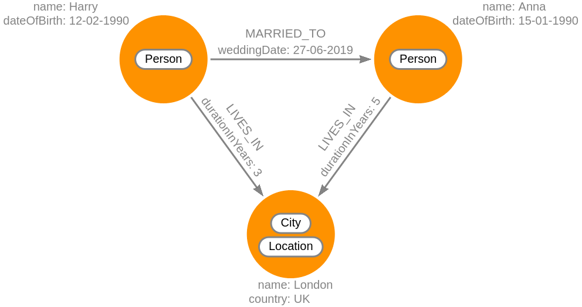

**Relationships** (or edges) are the **lines that connect nodes** to each other
and represent a defined connection between them. Every relationship has a source
node and a target node that represent in which direction the relationship works.
If this direction is important, the relationship is considered directed;
otherwise, it's undirected.

Relationships can also store data in the form of **properties**, just as nodes.
In most cases, relationships store quantitative properties such as weights,
costs, distances, ratings, etc. 



In our example, the relationship between two nodes labeled `Person` could be of
the type `MARRIED_TO`. The relationship between `Person` and `City` is
represented by the type `LIVES_IN`.

The relationship of the type `MARRIED_TO` has the property `weddingDate`, which
represents the date when the marriage was formed. Relationships of the type
`LIVES_IN` have the property `durationInYears` which denotes how long a person
has lived in the specified location.

### Creating relationships

To create a relationship between two nodes, we need to specify which nodes
either by creating them or filtering them with the WHERE clause:

```cypher
CREATE (p1:Person { name: 'Harry' }), (p2:Person { name: 'Anna' })
CREATE (p1)-[r:MARRIED_TO]->(p2)
RETURN r;
```

If the nodes already existed, the query would look like this:

```cypher
MATCH (p1:Person),(p2:Person)
WHERE p1.name = 'Harry' AND p2.name = 'Anna'
CREATE (p1)-[r:MARRIED_TO]->(p2)
RETURN r;
```

Instead of using the CREATE clause, you are just searching for existing nodes
using the WHERE clause and accessing them using variables `p1` and `p2`.

### Retrieving relationship types

The built-in function `type()` can be used to return the type of a relationship.

```cypher
CREATE (p1:Person { name: 'Harry' }), (p2:Person { name: 'Anna' })
CREATE (p1)-[r:MARRIED_TO { weddingDate: '27-06-2019' }]->(p2)
RETURN r, type(r);
```

### Querying using relationships

So far, we have only used nodes and their labels for querying the database, but
you can also use relationships within the same clauses:

```cypher
MATCH (p1)-[:MARRIED_TO]-(p2)
RETURN p1, p2
```

### Relationship properties

Just like with properties on nodes, the same rules apply when creating or
matching a relationship. You can add properties to relationships at the time of
creation:

```cypher
CREATE (p1:Person { name: 'Harry' }), (p2:Person { name: 'Anna' })
CREATE (p1)-[r:MARRIED_TO { weddingDate: '27-06-2019' }]->(p2)
RETURN r;
```

You can also specify them in the MATCH clause:

```cypher
MATCH (p1)-[:MARRIED_TO { weddingDate: '27-06-2019' }]-(p2)
RETURN p1, p2
```


