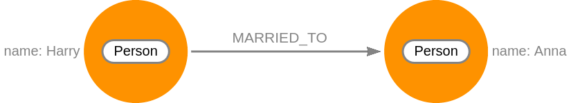

## What is Cypher?

Cypher is a declarative query language specifically designed to handle querying
graph data efficiently. With Cypher, you express what to retrieve but not how to
retrieve it. This allows you to focus on the problem domain instead of worrying
about the syntax.

Cypher was designed to be easy to learn but very powerful when it comes to graph
analytics. This means that you can use Cypher to write complex queries
relatively easily. Being a declarative language, Cypher expresses what to
retrieve and not how to retrieve it.

You can think of Cypher as mapping English language sentence structure to
patterns in a graph. For example, the nouns are nodes of the graph, the verbs
are the relationships in the graph, and the adjectives and adverbs are the
properties.

In the following image, you can see one such example. We have a graph that
consists of two nodes and one relationship



We can interpret this graph by using the said method of mapping patterns to
language structures: 

```nocopy
A person named Harry is married to a person named Anna.
```

## Cypher styling and syntax

Same as other languages, Cypher has its own set of syntax rules and styling
recommendations. And as always, it is sensible to add comments to code as you
write it.

### Comments

To specify a comment in Cypher, place the characters `//` before the line you
want to be a comment:

```cypher
// This is a Cypher comment
CREATE (p1:Person { name: 'Harry' }), (p2:Person { name: 'Anna' })
CREATE (p1)-[r:MARRIED_TO]->(p2)
RETURN r;
```

### Naming convention

**Node labels** should be written using CamelCase and start with an upper-case
letter. Node labels are case-sensitive. 

```nocopy
(:Country)
(:City)
(:CapitalCity)
```

**Property keys**, **variables**, **parameters**, **aliases**, and **functions**
are camelCase and begin with a lower-case letter. These components are
case-sensitive. 

```cypher
dateOfBirth // Property key
largestCountry // Variable
size() // Function
countryOne // Alias
```

**Relationship types** are styled upper-case and use the underscore character
`_` to separate multiple words. Relationship types are case-sensitive and you
cannot use the `-` character in a relationship type.

```cypher
[:LIVES_IN]
(:BORDERS_WITH)
```

Aside from clauses, there is a number of **keywords** that should be styled with
capital letters even though they are not case sensitive. These include:
`DISTINCT`, `IN`, `STARTS WITH`, `CONTAINS`, `NOT`, `AND`, `OR` and `AS`.

```cypher
MATCH (c:Country)
WHERE c.name CONTAINS 'United' AND c.population > 9000000
RETURN c AS Country;
```

### Indentations and line breaks

Sometimes it's helpful to separate new clauses with an indent. Even though they
are in a new line, subqueries should be indented to ensure readability. If there
are multiple subqueries, they can be further grouped with curly brackets.

```cypher
//Indent 2 spaces on lines with ON CREATE or ON MATCH subqueries
MATCH (p:Person {name: 'Helga'})
MERGE (c:Country {name: 'UK'})
MERGE (p)-[l:LIVES_IN]->(c)
  ON CREATE SET l.movedIn = date({year: 2020})
  ON MATCH SET l.modified = date()
RETURN p, l, c;

//Indent 2 spaces with braces for subqueries
MATCH (p:Person)
WHERE EXISTS {
  MATCH (p)-->(c:Country)
  WHERE c.name = 'UK'
}
RETURN p;
```

An exception to this rule would be a one-line subquery where you don't need to
use a new line or an indent.

```cypher
MATCH (p:Person)
WHERE EXISTS { MATCH (p)-->(c:Country {name: 'UK'}) }
RETURN p;
```

### Quotes

When it comes to quotes, a simple rule is to use whichever provides the fewest
escaped characters in the string. If escaped characters are not needed, or their
number is the same for single and double quotes, then single quotes should be
favored. 

```cypher
// Bad syntax
RETURN 'Memgraph\'s mission is: ', "A very famous quote is: \"Astra inclinant, sed non obligant.\""

// Recommended syntax
RETURN "Memgraph's mission is: ", 'A very famous quote is: "Astra inclinant, sed non obligant."'
```
