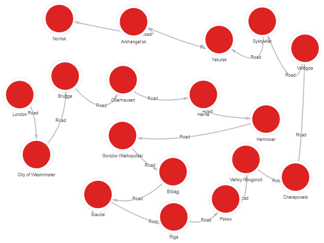
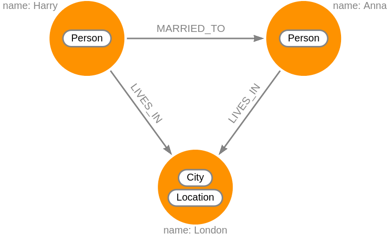
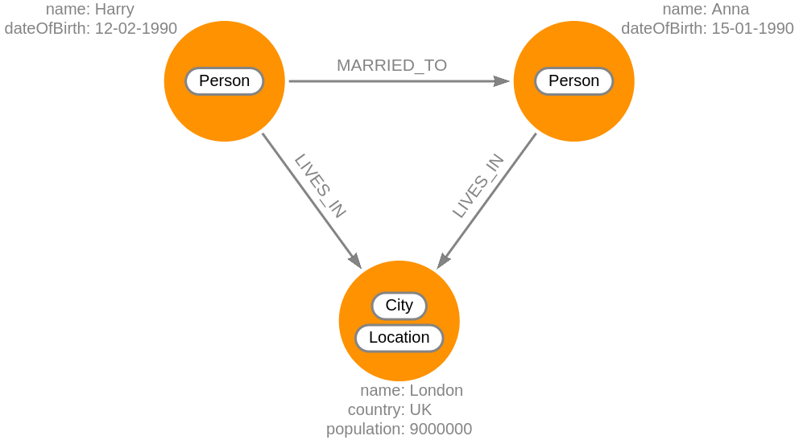

A **graph database** is a type of database that stores data in the form of nodes
that can be connected with relationships. **Graphs** are essentially very simple
structures that map relations between objects. We call these objects **nodes**
and the connections between them are **relationships**.



## Graph terminology 
Every graph can consist of four components: 

* **Nodes** - the main entities in a graph. They are also sometimes referred to
  as vertices or points. 
* **Relationships** - the connections between those entities. Sometimes they are
  referred to as edges or links.
* **Labels** - attributes that group similar nodes together.
* **Properties** - key/value pairs stored within nodes or relationships.

Nodes and relationships are fundamental components that are used. Labels and
properties are often included because of the added functionalities they offer. 

### Nodes

Like a circle on a whiteboard, a pair of parentheses is used to represent nodes.
Here is the simplified syntax for representing a node:

```cypher
()
(node)
```

The variable `(node)` stores node values by the query engine so they can be
processed or returned in a query later on.  If you do not need to do anything
with the node, you can skip the use of the variable. By doing so, you are
creating an **anonymous node**.

### Relationships

Relationships are the lines that connect nodes and represent a defined
connection between them. Every relationship has a source node and a target node
that represent the direction of the relationship. If this direction is
important, the relationship is considered directed; otherwise, it’s undirected.

Relationships can also store data in the form of properties, just as nodes. In
most cases, relationships store quantitative properties such as weights, costs,
distances, ratings, etc.

### Labels

You can use labels to shape the domain by **grouping nodes into sets or
categories**. Nodes with the same label belong to the same set. This way of
grouping nodes together simplifies database operations significantly. We no
longer need to select the whole graph but only the set of nodes we are
interested in.



As you can see in the example above, nodes can also have multiple labels. These
nodes can be represented in Cypher the following way:

```cypher
(:Person)
(:City:Location)
```
### Properties

Properties are key-value pairs of data stored on nodes or on relationships. They
allow you to store relevant data about the node or relationship with the entity
it describes. Properties support most standard data types like integers,
strings, booleans, etc. You can find a complete table of property types in our
[storage guide](/memgraph/under-the-hood/storage#properties).

The flexibility and simplicity of properties allow users to easily review the
data structure and update it according to their needs. Properties are also very
easy to spot. One common way would be asking yourself questions about the nodes
and relationships in your model. What information will you need in the future
when working with the graph?

Here is one simple example that shows properties for several nodes:

* What are the names of the people? - `name`
* How old are the people? - `dateOfBirth`
* What is the name of the city? - `name`
* What country is the city located in? - `country`
* What is the population of the city? - `population`

