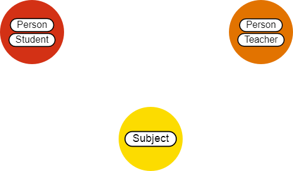
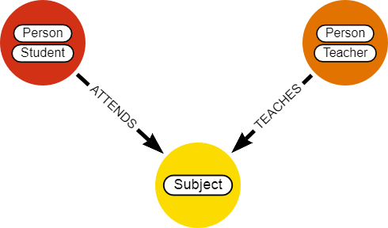
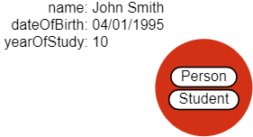
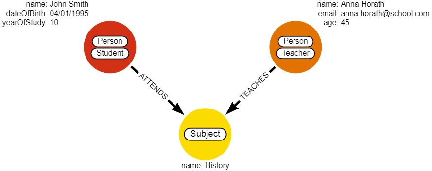

In this tutorial, you will learn teh basic terminology related to graph
databases and graph modeling.

## Prerequisites

For this tutorial, there are no particular prerequisites.

## 1. What is a graph database?

A **graph database** uses mathematical graph structures to represent and store
data. Graph databases are designed to treat the relationships between data as
equally important as the data itself. Those relationships allow stored data to
be linked together directly and, in many cases, retrieved with one operation.

### 1.1 Where can you use graph database?

Graph databases have a wide range of functionalities and therefore a numerous
variety of possible use cases. They offer agility, scalability, and performance
for managing vast amounts of dynamic and growing data. 

Some of the most relevant use cases include:

*  *Social Networks Graphs* - the most common use case for a graph database,
   typical for relationship analysis between the users, community detection, or
   finding the influence of people in the network.
*  *Fraud Detection* - the scalability and agility of graph databases help to
   avoid heavy and slow queries which are causing the late detection of frauds.
*  *Network Analysis* - network management revolves around complex
   interdependencies and high connectivity.
*  *Graph Theory* - graph databases are built on the principles of graph theory
   and as such can be used to showcase and solve common problems in the area.
*  *Recommendations Systems* - real-time, sophisticated recommendation engines
   to personalize products, content, and services.
*  *Data Management* - a way to manage “data silos”, keeping the track of data
   and its usage.
*  *Telecommunications* - telecommunications are all about connections users,
   network components, devices... which makes them suitable for graph modeling.
*  *Supply Chain Management* - optimization of product flow, uncover
   vulnerabilities, and boost the overall resilience of the supply chain.

## 2. Graph components

**Graphs** are essentially very simple structures that map relations between
objects. These objects are **nodes** and the connections between them are
**relationships**. Keep in mind that there are other terms for nodes and
relationships:

* **node == vertex == point**
* **relationship == edge == link**

People often use the terms graph and tree interchangeably, but graphs are a
superset of trees. Graphs, for example, can have cycles while trees can't. A
**cycle** means that there is only one way to go to a node by following
relationships from another node.

To fully utilize the power of graphs, you first need to get a basic
understanding of the underlying concepts in graph theory.

There are four components that every graph consists of: **nodes**,
**relationships**, **labels**, and **properties**. While only nodes and
relationships are fundamental components that need to be utilized, labels and
properties are often included as well because of the added functionalities they
offer.

### 2.1 Nodes

Nodes often represent entities in the graph. They hold specific data in the form
of properties represented as key-value pairs. To assign a role to each node,
nodes can be tagged with labels. When working with the model domain, nodes can
be easily identified by searching for nouns that represent entities with a
unique conceptual identity.

As you can see in the example further down, in our university model, a typical
node could represent a university student, a professor, or a course.

### 2.2 Relationships

Relationships (or edges) are the lines that connect nodes to each other and
represent a defined connection between them. Every relationship has a source
node and a target node that represent in which direction the relationship works.
If this direction is important, the relationship is considered directed while
otherwise, it's undirected. Relationships can also store data in the form of
**properties**, just as nodes. In most cases, relationships store quantitative
properties such as weights, costs, distances, ratings, etc. 

In our example, the relationship between a `Student` node and a `Subject` node
could be of the type `ATTENDS`, while the relationship between `Professor` and
`Subject` is represented by the type `TEACHES`.

### 2.3 Labels

Labels are used to shape the domain by **grouping nodes into sets or
categories**. Nodes with the same label belong to the same set. This way of
grouping nodes together simplifies database operations significantly. We no
longer need to select the whole graph but only the set of nodes we are
interested in. Nodes can also have multiple labels attached to them. Just as
nodes can be easily identified as nouns in the domain description, you can
identify labels by generic nouns or groups of people, places, or things.

The node in the example below demonstrates how an entity can belong to multiple
groups. A university student can at the same time have the label `Person` and
`Student`.

### 2.4 Properties

Properties are key-value pairs of data stored on nodes or on relationships. They
allow you to store relevant data about the node or relationship with the entity
it describes. Properties support most standard data types like integers,
strings, booleans... and you can find a complete table in our [storage
guide](https://docs.memgraph.com/memgraph/concepts/storage/#properties). The
flexibility and simplicity of properties allow users to easily review the data
structure and update it according to their needs. Properties are also very easy
to spot. One common way would be asking yourself questions about the nodes and
relationships in your model. What information will you need in the future when
working with the graph?

In our example, the most relevant questions and their corresponding properties
would be:
* What are the names of the students, professors, and courses? - `name`
* How old are the students and the professors? - `dateOfBirth`, `age`
* What year of studies does the student attend? - `yearOfStudies`
* How to get in touch with the professor? - `email`

## 3. Types of graphs

There are some characteristics that define the type of graph. Here are some basic types: 

* **Undirected and Directed Graphs** - In an undirected graph, the relationships
  have no orientation. These relationships are sometimes referred to as
  **bi-directional**. The relationships in a directed graph have an orientation. 

 

* **Weighted And Unweighted Graphs**  - A weighted graph has attributes on its
relationships that specify their weight. For example, an relationship that
represents the distance between two cities would have this distance stored as an
relationship attribute.  Unweighted graphs have no such relationship attributes
and are sometimes referred to as **Non-Weighted Graphs**.

On top of direction and graph can also have a **self-loop** (also called a loop
or a buckle). Self-loop is an relationship that connects a node to itself while
**parallel relationships** (also called multiple relationships or a
multi-relationship) are two or more relationships that are incident to the same
two nodes.

With combination of mentioned characteristics and properties you can create different graphs:

* **Graph** - An undirected graph with self-loops.
* **DiGraph** - A directed graph with self-loops.
* **MultiGraph** - An undirected graph with self-loops and parallel
  relationships.
* **MultiDiGraph** - A directed graph with self-loops and parallel
  relationships.
