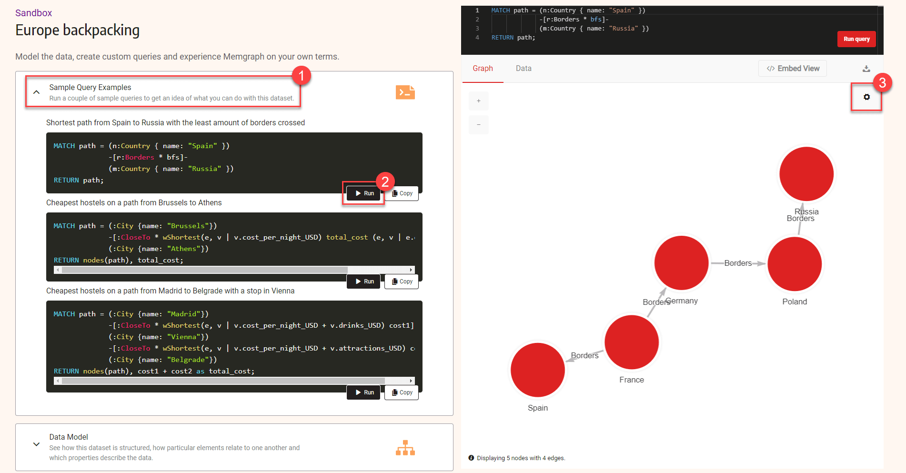

### Introduction

In this tutorial, you will learn how to use Style script to add style to your graphs. You will use  Memgraph sandbox site to try out some of the styling.


## Prerequisites

For this tutorial there are no special prerequisites. All that you need for is a web browser.


## Step 1 — Connecting to Memgraph sandbox

First, you will connect to [Memgraph sandbox Europe backpacking](https://playground.memgraph.com/sandbox/europe-backpacking). When the sandbox is loaded do the following:

1. Expand **Sample Query Examples**.
2. Run the first query to display the shortest path from Spain to Russia.
3. Click the cogwheel icon to open **Style editor**



## Step 2 — Using colors and borders to style graph nodes

With a Style editor in front of you, you are ready to style your graph! You will use Style editor to modify exiting style and to add some new style rules.
First you will modify the code that defines node style. Look for this section of the code:

```nocopy
@NodeStyle {
  size: 50
  border-width: 5
  border-color: #ffffff
  shadow-color: #bab8bb
  shadow-size: 6
}
```
You will now change it so that nodes will be a smaller, with larger and darker shadow. You need to update the values for `size`, `shadow-color` and `shadow-size`. Your code will look something like this:

```
@NodeStyle {
  size: 35
  border-width: 5
  border-color: #ffffff
  shadow-color: #333333
  shadow-size: 20
}
```
Click **Apply** to see what you graph look like now.

You will now change the color of the nodes from red to gold and you will make them orange on hover. Fine the following code:

```nocopy
@NodeStyle HasLabel?(node, "Country") {
  color: #dd2222
  color-hover: Darker(#dd2222)
  color-selected: #dd2222
}
```
Replace that code with:

```
@NodeStyle HasLabel?(node, "Country") {
  color: #ffd700
  color-hover: #ffa500
  color-selected: #dd2222
}
```

## Step 3 — Add images to the nodes

Now that you have all of the colors and borders in place it is time to add images to the nodes. You will add images to the first and last node. As a source your will use two images from Wikipedia.

Add the following code at the end of the style script:

```
@NodeStyle Equals?(Property(node, "name"), "Russia") {
   image-url: "https://upload.wikimedia.org/wikipedia/en/thumb/f/f3/Flag_of_Russia.svg/320px-Flag_of_Russia.svg.png"
}

@NodeStyle Equals?(Property(node, "name"), "Spain") {
  image-url: "https://upload.wikimedia.org/wikipedia/en/thumb/9/9a/Flag_of_Spain.svg/320px-Flag_of_Spain.svg.png"
 }
 ```

## Step 4 — Using colors to style graph relationships

With all of the nodes looking just the way that you have wanted now it is time to style the relationships between them. You will represent your relationships as straight, thin lines that have no arrows. To do tah locate the code:

```nocopy
@EdgeStyle {
  width: 3
  label: Type(edge)
}
```
Now replace that code with:

```
@EdgeStyle {
  width: 1
  label: Type(edge)
  arrow-size: 0
  type: "straight"
  color: #6AA84F
}
```
### Step 5 - Checking the final result


You ...

```
@NodeStyle {
  size: 35
  border-width: 5
  border-color: #ffffff
  shadow-color: #333333
  shadow-size: 20
}

@NodeStyle Greater?(Size(Labels(node)), 0) {
  label: Format(":{}", Join(Labels(node), " :"))
}

@NodeStyle HasLabel?(node, "Country") {
  color: #ffd700
  color-hover: #ffa500
  color-selected: #dd2222
}

@NodeStyle HasProperty?(node, "name") {
  label: AsText(Property(node, "name"))
}

@EdgeStyle {
  width: 1
  label: Type(edge)
  arrow-size: 0
  type: "straight"
  color: #6AA84F
}

@NodeStyle Equals?(Property(node, "name"), "Russia") {
   image-url: "https://upload.wikimedia.org/wikipedia/en/thumb/f/f3/Flag_of_Russia.svg/320px-Flag_of_Russia.svg.png"
}

@NodeStyle Equals?(Property(node, "name"), "Spain") {
  image-url: "https://upload.wikimedia.org/wikipedia/en/thumb/9/9a/Flag_of_Spain.svg/320px-Flag_of_Spain.svg.png"
 }
```

## Conclusion

In this tutorial, you have learned how to style graphs using Memgraph Lab. 

You can continue playing in Playground, or even better  [download and install Memgraph](/docs/memgraph/installation) on your computer.

Be sure to checkout [Quick start guide to Style script](/docs/memgraph-lab/style-script/quick-start) or take a deep dive into [Style script reference guide](http://localhost:3000/docs/memgraph-lab/style-script/reference-guide) to learn more about Style script.


:::info

This code will be used in steps that follows 

:::

```
@NodeStyle {
  size: 50
  border-width: 5
  border-color: #ffffff
  shadow-color: #bab8bb
  shadow-size: 6
}

@NodeStyle Greater?(Size(Labels(node)), 0) {
  label: Format(":{}", Join(Labels(node), " :"))
}

@NodeStyle HasLabel?(node, "Country") {
  color: #dd2222
  color-hover: Darker(#dd2222)
  color-selected: #dd2222
  font-family: "cursive"
}

@NodeStyle HasProperty?(node, "name") {
  label: AsText(Property(node, "name"))
}

@EdgeStyle {
  width: 4
  arrow-size: 1
  color: #ff8000
  label: Type(edge)
  color-hover: #ff0000
    font-family: "fantasy"
}

@NodeStyle Equals?(Property(node, "name"), "Russia") {
   image-url: "https://upload.wikimedia.org/wikipedia/en/thumb/f/f3/Flag_of_Russia.svg/320px-Flag_of_Russia.svg.png"
}

@NodeStyle Equals?(Property(node, "name"), "Spain") {
  image-url: "https://upload.wikimedia.org/wikipedia/en/thumb/9/9a/Flag_of_Spain.svg/320px-Flag_of_Spain.svg.png"
 }
 ```