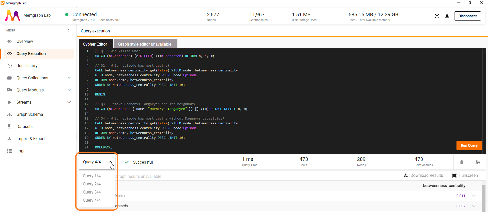
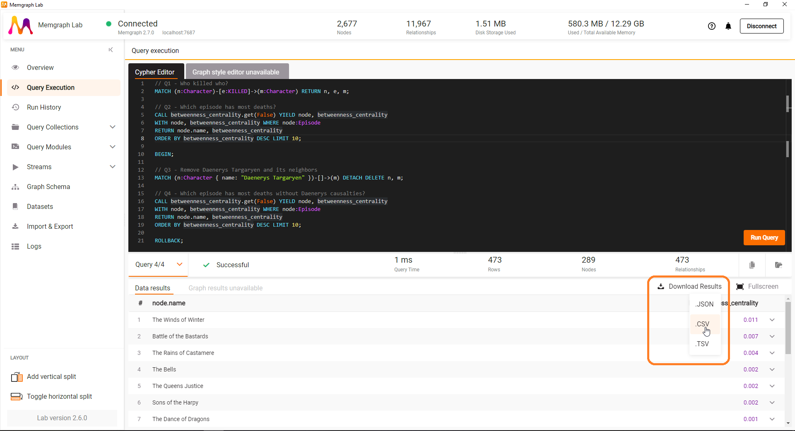
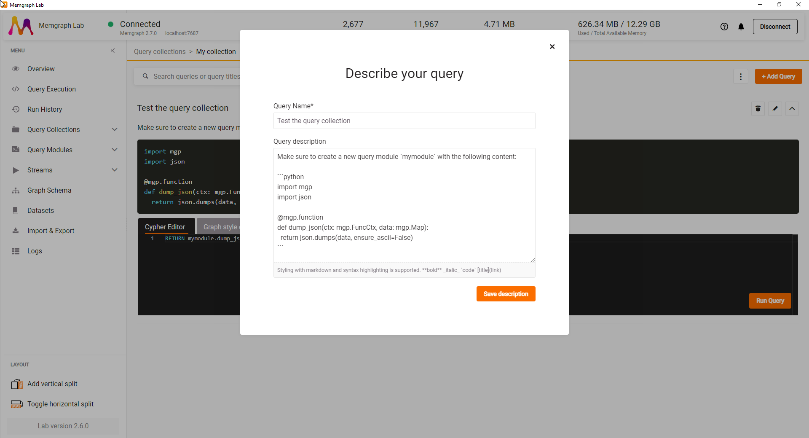
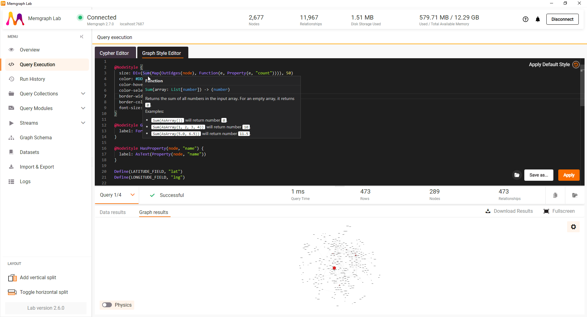
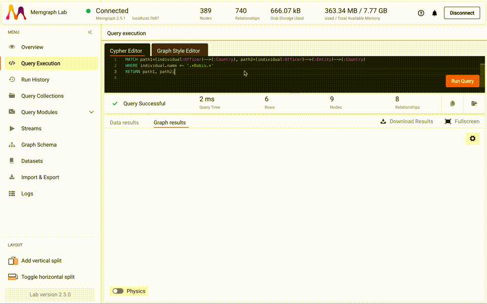
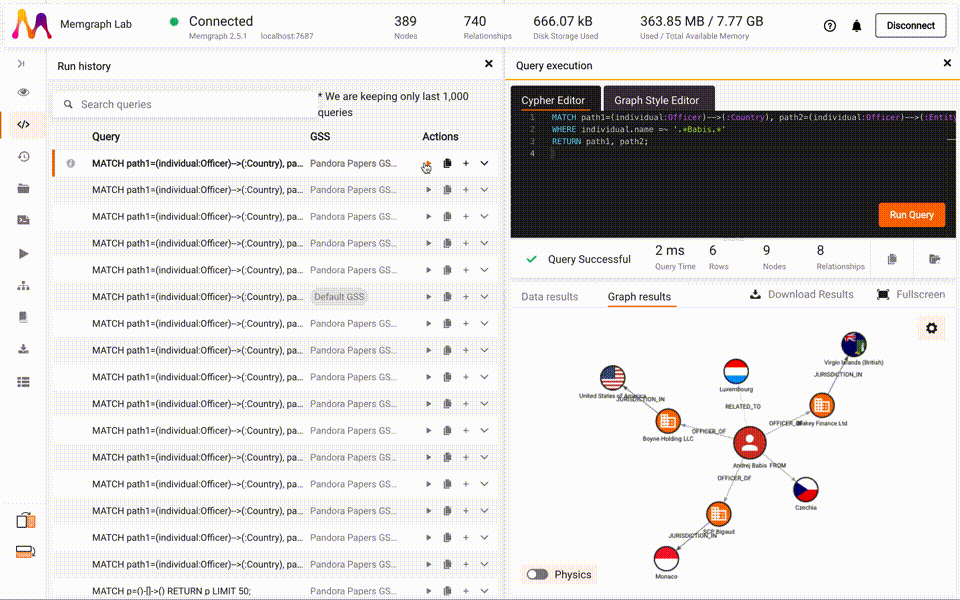

## Lab v2.8.1 - Aug 22, 2023

### Bug fixes

- Quick connect will now try to connect to Memgraph on `127.0.0.1` instead of
  `localhost` because it is not always clear what `localhost` will be resolved
  to.
- Paths in query results now return a correct presentation instead of an empty
  path when there is only one node in the path.
- On hard refresh of the Lab application, you are now redirected to the correct
  connection screen.
- Logs no longer scroll automatically to new log records when you scroll up to
  check past log records.

## Lab v2.8.0 - Aug 04, 2023

### New features and improvements

- You can now save and edit connection details so you don't have to type them in
  on every reconnect.
- A list of recent connections is now shown in the sidebar and you can use it to
  quickly connect to any of the recent successful connections.
- When you click on a node or relationship in the Graph View, the object
  properties will be shown in a sidebar next to the Graph View rather then on
  the canvas next to the object. 
- Nodes can be expanded by a double-click.
- As Memgraph now supports multi-tenant architecture, you can see the database
  you are currently working in the status bar with an option to switch to another
  database.
- Along with the number of nodes and relationships in the database, the status
  bar now also shows the number of indexes, constraints, and triggers.
- Now you can recenter, zoom in and zoom out the graph view by clicking on the
  action buttons in the bottom right corner of the Graph Results view.
- Now you can copy query results to the clipboard in JSON, CSV, or TSV format.
- You can start a name of a variable in Graph Style Script with an underscore
  `_` which is pretty handy for defining local variables in `@NodeStyle` and
  `@EdgeStyle` directives. 

### Bug fixes

- Setting up the `z-index` for edges in Graph Style Script now works as expected.
- Large integer numbers in query table results are now shown correctly, e.g. it
  shows `10,000,000,000,000,001` for the query `RETURN 10000000000000000 + 1`
  instead of incorrect result `10000000000000000`.
- Results now correctly show "No results" when there are no results in the query
  response, instead of a previously fetched result.
- The Lab web application is no longer unexpectedly crashing when using the
  Memgraph Platform Docker image.

## Lab v2.7.1 - Jul 05, 2023

### Improvements

- System Default style has been renamed to System Style. 
- If you run a query that has errors in the Graph Style Script code, you can
  decide to run it using the System Style. 

### Bug fixes

- Bug that would allow multiple styles to be the default has been fixed. 
- The System Default Style now has `background-color` set to white.
- Queries selected in the Query Editor now execute as expected. 
- Creating and editing a query module as well as selecting a transformation
  module in the Streams section now work as expected. 
- All links are now linked with appropriate external resources.
- The pop-up window in the Run History that allows rerunning the query now
  closes once an option is selected.

## Lab v2.7.0 - Jun 28, 2023

### What's new

- Now you can adjust the following settings:
  - Code completion and automatic graph rendering limits
  - The capacity of run history and its clearing
  - The limit for visible logs

  
- The new interfaces for managing saved styles enables searching and changing
  the default style in the Lab. The saved styles now also have a preview. 
  
- The run history now also tracks changes to the query, style, or both. You can
  also filter out records to show All (both queries runs and applied styles),
  Query history (only query runs), and Style history (only applied style
  changes). You can expand both the query and style to see the full Cypher or
  GSS code.
  
  
  
- Queries inside a collection can be expanded and collapsed by clicking on their
  name.
- When testing and trying out different functions in the GSS you can use
  single-line (`// comment`) and multi-line (`/* comment */`) comments in the
  GSS code editor without losing previous state.
- Change the canvas color of the graph view with the new property
  `background-color` in [`@ViewStyle`](/style-script/gss-viewstyle-directive.md).
- Change the stack order of how nodes and edges are rendered in the graph view
  with the property `z-index` in
  [`@NodeStyle`](/style-script/gss-nodestyle-directive.md) and
  [`@EdgeStyle`](/style-script/gss-edgestyle-directive.md) directives. It works
  the same as the CSS z-index property.
- Set up transparent colors with the [new GSS
  functions](/style-script/gss-functions.md) `RGBA` and `HSLA`. You can also get
  the transparency value with the function `Alpha`.
- [New functions](/style-script/gss-functions.md) allow more customizations: `Sort`, `Coalesce`, `Reverse`,
  `IsMap`, `AsMap`, `Execute`, `Get`, `Set`, `Del`, `MapKeys`, `MapValues`,
  `AsIterator`, `IsIterator`, `Next`
- [Global and local
    variables](/memgraph-lab/graph-style-script-language#caching-results-for-faster-performance)
    make developing new styles easier:
  - Variable graph is now available outside `@NodeStyle` and `@EdgeStyle`
    context
  - Local variables can be defined with `Define` within `@NodeStyle` and
    `@EdgeStyle` context
- Memgraph Lab is now packaged as an RPM package and arm64 (M1 chip) for MacOS.

### Bug fixes

- Running a selected part of the Cypher query would just place that selected
  part in the run history. Now, the full query will be saved in the run history,
  and on its run, only the selected part will be executed again.
- Rows that would hide when scrolling the data results view now preview as expected.
- The System Default style colors all the nodes with the same label with a
  unique color.
- When showing a graph view on a map, you will no longer see a progress
  percentage which is unnecessary as each node has a fixed and known position
  due to its latitude and longitude values.
- All tables across the Lab are responsive as expected.
- Layouts no longer cause memory leaks and work as expected.
- By fixing a bug, you can now successfully connect to Memgraph using a hostname
  that contains numbers in the top-level domain.
- Markdown lists in query descriptions are indented as expected.

## Lab v2.6.0 - Apr 20, 2023

### What's new

- If you execute multiple Cypher queries, you can now view the result of each
  query instead of viewing just the last result.
  
- Besides exporting query results to JSON, you can also export them to CSV and
  TSV file format.
  
- If the dataset contains millions or billions nodes and relationships, their
  count in the status bar will be in the following format: X.XXM or X.XXB.
- Syntax of code blocks in the query collection description can now be
  highlighted by using one of the following language
  styles: `cypher`, `bash`, `python`, `css`, `c`, `cpp`, `json`, `sql`,
  and `yaml`. Check the examples of syntax highlighting in the [Markdown
  Guide](https://www.markdownguide.org/extended-syntax/#syntax-highlighting).
  
- [New functions of the Graph Style Script
  language](/style-script/gss-functions.md) used for customizing graph appearance
  are: `Reduce`, `Sum`, `Avg`, `Min`, `Max`, `IsArray`, `Hue`, `Saturation`,
  `Lightness`, `HSL`.
  

### Bug fixes

- The initial node count has been removed from the connection initialization so
  connecting to the Memgraph instance containing a huge number of nodes will no
  longer cause a timeout. 
- Run History now logs queries as expected.
- When switching between the map view and the default view the graph view no
  longer becomes unresponsive. 
- Using a new line character `\n` in the query module doesn’t result in a new
  line, but an explicit character `\n`.
- Viewing the code of multiple query modules in the split screen now
  works as expected.
- Notifications no longer mix with the Query Editor and Query Collections visual
  elements.
- Pressing CMD/CTRL + S will save a query within a query collection execution section as intended.
- The autosave in query collection is now triggered on every query run as it was
  intended.
- Running a selected portion of the query won’t remove the rest of the query
  from the query collection execution view.
- GSS `Blue` function was returning a wrong number. It is fixed now. `Lighter`
  and `Darker` functions now work correctly as well because they were depending
  on the output from the `Blue` function.
  
## Lab v2.5.0 - Mar 17, 2023

### What's New

* If there are several Cypher queries in the query editor you can select a single query and run
  it without commenting out all the other queries.

* You can now open multiple query executions views side by side and compare query execution speed or results.

* Query modules are now sorted alphabetically for easier and faster browsing. A search box has also been added to query modules with more
  than 5 procedures to help narrow them down (e.g. `nxalg` query module has [49 procedures](https://memgraph.com/docs/mage/query-modules/python/nxalg)).
* When rendering a graph with more than 3,500 nodes or 8,500 relationships, which might take considerable amount of time to preview, you will be
  asked if you want to proceed with the graph visualization or switch to the data view.
* Besides manually saving changes in the Cypher query and GSS style editor in the query collections section, they will also be saved
  automatically after each query run.
* Memgraph Lab will now notify you of any product updates and offer various tips and tricks for using the Memgraph ecosystem.

### Bug Fixes

* Cypher code suggestions can now handle labels and properties of 250k nodes and 500k relationships, compared to the previous limit of
  100k nodes nad 200k relationships.
* Multiple scrollable elements of the query collections was making scrolling difficult. Now you can focus on a particular element and
  scroll through it by clicking on it.
* Browser's back button is now working as expected when using Lab as a web application.
* Data in the query results, query modules and query run history tables now loads faster making the scrolling smoother and improving
  the user experience.
* Graph schema is now generated even if the database has no relationships.
* In-progress feedback when generating graph schema and exporting datasets for graphs with more than 10M nodes
  is now previewed as expected.
* A scrolling issue with expanded results in the Data view where you couldn't see a completely expanded row because the
  scroll would jump to the next row is now fixed.
* Dataset cards no longer spread apart when conducting a search. 

## v2.4.0 - Dec 2, 2022

### What's New

* Memgraph Lab now supports manual transaction workflows you can construct using transaction commands `BEGIN`, `COMMIT`, and `ROLLBACK`.
* Cypher intellisense has been updated to suggest new Cypher features from Memgraph 2.4.0 such as:
  * Privileges for user-role authorization.
  * Commands and privileges for label-based authorization.
  * Manual transaction commands: `BEGIN`, `COMMIT`, `ROLLBACK`.
  * Checking configuration with `SHOW CONFIG`.
  * All shortest path algorithm `allShortest`.
  * Graph projection function `project`.
  * Additional query module signature that accepts a projected graph as an optional first argument.
* Graph results view will check for nodes and relationships in arrays and projected graphs. It simplifies
  the visualization of a projected graph or an array of nodes/relationships without using `UNWIND`.

### Bug Fixes

* Once the table results view is selected, the results of the following query run will also preview in the table results view, instead of automatically switching to the graph view.
* Exploring a dataset's query collection now works as expected. It opens up a list of queries that can be used to explore the dataset.
* Failed queries from the rich collections now return a detailed error message.
* _Save code changes_ button in rich collections will now be enabled only if there are unsaved changes for the Cypher query 
  or GSS.
* A bug that would only show the first node label instead of all node labels in the table results view has been fixed.

## v2.3.1 - Nov 4, 2022

### Bug Fixes

* Writing a single-line comment in the Cypher code no longer results in an error.
* Having different map tiles (e.g. "light" map tile on one map view, but "dark" map tile on another map view) for multiple graph map views in the rich collection is enabled and works as expected.
* Graph rendering freeze when toggling the map view on/off during the graph rendering process has been fixed.
* All the information about nodes and edges on the graph schema is now previewed as expected.
* A bug that would mix query title and description when queries are reordered in the rich query collection has been fixed.
* A bug that would not reset the description field when adding a new query to the query collection has been fixed.
* Saving a new style now works as expected. The active style is saved, not the last applied one.

## v2.3.0 - Oct 24, 2022

### What's New

* Add new updates to the prepared datasets:
  * Add a search bar for searching and filtering datasets.
  * Add featured (highlighted) datasets.
  * Add rich collections with prepared queries, descriptions, and GSS for each dataset.
* Add new updates to the latest queries:
  * Change the name from "Latest queries" to "Run history" because it contains both queries and GSS changes.
  * Show GSS changes in the "Run history" section.
* Replace previous collections with "Rich collections":
  * Add more context to each collected query: title, markdown description, Cypher query, and GSS.
  * Add the ability to run multiple query executions within the query collection.
  * Add import and export functionality of a collection.
* Add a new version of GSS:
  * Add new GSS directive `@ViewStyle` to configure physics, link distance, repel force, and view type (`default` or `map`).
  * Add new GSS directive `@ViewStyle.Map` to configure map tiles for map view.
  * Add new GSS functions: `Slice`, `Split`, `Replace`, `Trim`, `Nodes`, `Edges`, `IsNumber`, `IsBoolean`, `IsString`, `IsNull`.
  * Add new GSS node properties `latitude` and `longitude` used to define the latitude and longitude of each node for the map view.
* Integrate graph visualization library `orb`.
* Add the ability to enable/disable map background view for nodes with geo information.
* Add the ability to connect to Neo4j, load datasets, and run Cypher queries.

### Bug Fixes

* Fix map view to use latitude and longitude from GSS style instead of `lat` and `lng` node properties.
* Fix the default GSS to match new the map view configuration by checking `lat` and `lng` node properties.

## v2.2.1 - Aug 12, 2022

### What's New

* Add improved and more precise progress when importing built-in datasets.
* Add an indicator for the total count of error log messages in the sidebar.
* Change the color scheme of code snippets for query modules.
* Add a help section when Lab's connection is reconnecting.
* Add breadcrumbs for the layout titles.

### Bug Fixes

* Fix issues with query collections.
* Fix vertical layout usability when the help sidebar is opened.
* Fix various UI and UX issues across the application.
* Fix query results on the reconnected connection.

## v2.2.0 - Jul 15, 2022

### What's New

* Add a new table look and feel across the application: query results, the latest queries, modules, streams.
* Add a help section with relevant links, guides, and documentation search capability.
* Add test parameters (batch size, timeout) for testing stream transformation.
* Add new GSS functions: `Round`, `Floor`, and `Ceil`.

### Bug Fixes

* Fix various issues in graph view, streams, and query collections.

## v2.1.2 - Jun 21, 2022

### What's New

* Add a dashboard and overview page for the better onboarding experience.
* Add environment variables for query, modules, and streams name length validator limits.
* Add logs connection status messages in the logs view.

### Bug Fixes

* Fix several bugs with the stream configuration creation.
* Fix showing the logs when connected to Memgraph via an encrypted SSL connection.

## v2.1.1 - May 27, 2022

### What's New

* Add tooltips and highlights throughout the application.

### Bug Fixes

* Fix several bugs with streams.

## v2.1.0 - May 25, 2022

### What's New

* Add the ability to view, create, edit, start, stop, test, and remove streams.
* Add a new connecting screen with the ability to set monitoring (logs) port.
* Add Cypher query persistence when closing/opening Cypher query editor.
* Add node label, relationship type, and node/relationship property Cypher code suggestions for small graphs (number of nodes < 100k and number of relationships < 200k).
* Add module function Cypher code suggestions.
* Add module support for adding functions along with `mgp` suggestions and documentation.
* Add new GSS graph functions: `InEdges`, `OutEdges`, `Edges`, `AdjacentNodes`, `StartNode`, `EndNode`, `NodeCount`, `EdgeCount`.
* Add new GSS array functions: `RandomOf`, `Find`, `Filter`, `Map`, `All`, `Any`, `Uniq`.

### Bug Fixes

* Fix the UI for the GSS error messages.
* Fix the Cypher code suggestion for modules with `.` in the namespace name.
* Fix several bugs with query collections.
* Fix the empty states across the application.
* Fix the import progress bar.
* Fix the graph schema for an empty database.
* Fix the responsiveness across the application.
* Add the maximum limit of five vertical layouts.
* Fix the loading issue when running multiple Cypher queries at once.

## v2.0.3 - Apr 27, 2022

### Bug Fixes

* Fix the encrypted connection creation towards Memgraph.
* Fix duplicate keywords in Cypher and Python code suggestion tools.

## v2.0.2 - Apr 22, 2022

### Major Features and Improvements

- Add guides for empty states throughout the app.
- Add an ability to close hints for transformations and procedures in module view.
- Add an ability to download query results in JSON format.
- Add confirmation step for all delete actions throughout the app.
- Add the generic Cypher query as a sample query after custom dataset file import.

### Bug Fixes

- Fix the table view with a better resize functionality throughout the app.
- Change the color of the node labels and relationship types in the Cypher query editor.
- Fix the delete query collection action.
- Fix opening an external link in the browser instead of the Lab app.
- Fix the initial render of the map for geo graph results.
- Replace the toast message "Web socket stopped working" with better notice in the "Logs" view.

## v2.0.1 - Apr 8, 2022

### Major Features and Improvements

- Add context (graph schema, description) to each dataset template.
- Add an action to download query results.

### Bug Fixes

- Fix the bug when adding a query to the query collection.
- Fix several typos and copies.
- Fix the web socket connection issue for the manual Memgraph connect.
- Fix initial code suggestions which are dependent on the Memgraph version.

## v2.0.0 - Mar 31, 2022

### Major Features and Improvements

- Add horizontal and vertical layouts for custom layout configuration.
- Add more query information in the latest queries: runtime, status, number of
  results.
- Add query collections to structure and save favorite queries.
- Add better Cypher code suggestion for functions, modules, nodes,
  relationships, properties.
- Add Cypher code documentation on highlight.
- Add Graph Style Script code suggestion for `@NodeStyle`, `@EdgeStyle`,
  properties and functions.
- Add Graph Style Script code documentation on highlight.
- Add improved table views throughout the app.
- Add new rendering and simulation engine based on D3.js.
- Add new rendering simulation options: collision, repel force and link
  distance.
- Remove definition of query parameters when running a Cypher query with
  `$variable`.
- Add real-time logs view from Memgraph.
- Add a status tray with connection status and main Memgraph metrics.
- Add real-time connection status and automatic reconnect ability.
- Add new graph schema view with distribution of present properties in
  nodes/relationships.
- Add ability to view, edit, remove and change query modules.

## v1.3.6 - Dec 3, 2021

### Bug Fixes

* Fix the bug when returning edges: `Cannot read properties of undefined (reading 'push')`.

## v1.3.5 - Nov 17, 2021

### What's New

* Add new Cypher stream keywords from Memgraph 2.1.0 release.

### Bug Fixes

* Fix the copy to the clipboard bug to keep new lines.

## v1.3.4 - Nov 15, 2021

### What's New

* Add quick connect for Memgraph running locally.
* Add guides on how to install Memgraph locally.

## v1.3.3 - Oct 22, 2021

### Bug Fixes

- Fixed the action of exporting the database to a `cypherl` file.
- Added support for the temporal types in query responses.

## v1.3.2 - Oct 5, 2021

### Bug Fixes

- Fixed the copy to clipboard bug with removed spaces.
- Updated the Cypher IntelliSense with the latest commands.

## v1.3.1 - Sep 27, 2021

### Major Features and Improvements

- Signed the Memgraph Lab applications for macOS and Windows.

### Bug Fixes

- Fixed the paste overwrite action in the query editor.
- Fixed the bug `Cannot read property 'class' of null`.

## v1.3.0 - Feb 19, 2021

### Major Features and Improvements

- Added option to show predefined datasets with the ability to import them to
  Memgraph.
- Added option to show sample query for every loaded predefined dataset.
- Added import of custom Cypher file datasets (`cypherl` format).
- Added export of current database state to Cypher file (`cypherl` format).
- Added default node label in graph view if name property is missing.
- Added default relationship type label in graph view for smaller graphs.

### Bug Fixes and Other Changes

- Fixed sidebar links in the browser Lab.
- Fixed columns in favorite queries view.
- Fixed showing large amounts of properties in a popup when viewing node details
  in the graph view.
- Fixed the label in the popup when switching between edges and nodes in the
  graph view.
- Fixed node count in the dashboard view.
- Added descriptive and better error messages when connecting to Memgraph with
  encryption on/off.
- Fixed the close button in a node popup in the graph view.
- Fixed the spacing of the close button and relationship type in a relationship
  popup in the graph view.
- Fixed storing physics and styles across multiple query runs.
- Fixed initial positioning in graph view when running query in the data view.
- Fixed graph view reset when a query on data view had no results to show.
- Fixed map disappearing when running query multiple times in a row.
- Fixed running multiple Lab instances of the application on Windows and Linux.
- Fixed node size and spacing in graph view when showing smaller graphs.
- Fixed transition state issues between graph view and data view.

## v1.2.0 - Nov 3, 2020

### Major Features and Improvements

- Added ability to create custom graph styling for nodes and edges in graph view
  with graph style language (similar to CSS).
- Added ability to save and load custom graph styling.
- Added ability to show map background for nodes with lat and lng numeric
  properties.
- Added ability to change map background style.
- Removed edge labels to be shown by default in graph view.
- Fixed overall UI and UX.
- Set encrypted connection to be turned off by default on login screen (Memgraph
  v1.2.0 comes with SSL off by default).

### Bug Fixes

- Added ability to hide graph view if there are no node/edge data in response.

## v1.1.3 - Jun 5, 2020

### Bug Fixes

* Disable hardware acceleration.

## v1.1.2 - Apr 10, 2020

### Bug Fixes

* Fix side menu documentation and support links.

## v1.1.1 - Apr 3, 2020

### Bug Fixes

* Fix bug showing integers in node properties as strings.

## v1.1.0

### Major Features and Improvements

- Enable explain and profile view.
- Memgraph v0.15.0 keywords support.

### Bug Fixes and Other Changes

- Fix bug with a new line in parsing multi-command queries.
- On empty data for graph redirect to data view.

## v1.0.0

### Major Features and Improvements

- Added unsecure connection option.
- Improved UX of login screen.
- Added basic tutorial that shows on the initial run.
- Added text search of history and favorite queries.
- Added storage statistics on overview screen.
- Added debug view with query explain and profile capabilities.
- Added graph schema (metagraph) generator.
- Improved query data (table) view.

## v0.1.2

### Bug Fixes and Other Changes

- Fixed app icon on MacOS.
- Improved error handling on the initial connect screen. Handle availability and
  secure connection errors.

## v0.1.1

### Major Features and Improvements

- Added overview view.
- Added query view (Monaco editor).
- Added graph, data and table data views.
- Added JSON export.
- Added electron builder packages for MacOS and Debian.
