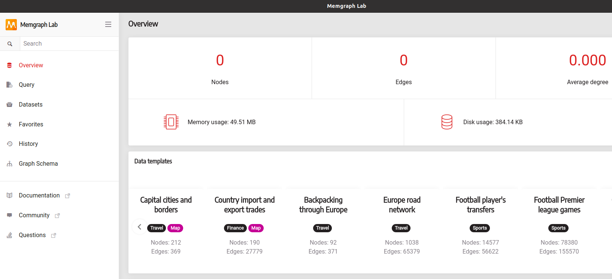
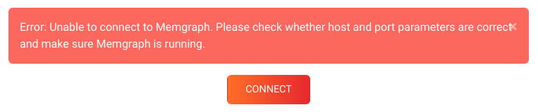
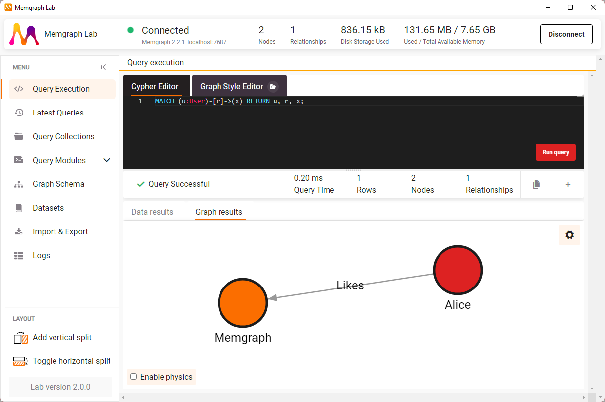

We recommend you [install **Memgraph Platform**](/memgraph/installation) and get
the complete streaming graph application platform that includes <br/> **MemgraphDB**,
command-line tool **mgconsole**, visual user interface **Memgraph Lab** running
within the browser and **MAGE** - graph algorithms and modules library.

To access the web application go to http://lab.memgraph.com/ and if you want to
install Memgraph Lab as a desktop application, follow the instructions below.

## Step 1 - Download and install Memgraph

Memgraph Lab needs a running MemgraphDB instance

If you installed Memgraph Platform you should already have one. <br/>If not,
install [MemgraphDB](/memgraph/installation) and once the database instance is
running  you can continue with the next step.

If you installed Memgraph DB using Docker, and you want to be able to use in-browser Memgraph Lab, be sure to expose port 3000 (`-p 3000:3000`) in the `docker run ...` command. 

If you installed Memgraph DB using Docker, and you want to be able to connect to it with Memgraph Lab application, be sure to expose ports 7687 for the instance connection (`-p 7687:7687`) and 7444 for logs (`-p 7444:7444`) in the `docker run ...` command.

## Step 2 - Installing and setting up Memgraph Lab

**1.** Download Memgraph Lab by visiting the [Download
Hub](https://memgraph.com/download/#memgraph-lab).

**2.** Once you have Memgraph Lab installed, run the app, and you should be
presented with a login screen. The username and password fields are empty by
default. The default connection string is set to `localhost:7687`. If you're
using a different port, you will have to change the connection string to point
to that port, i.e. `localhost:<your port number>`.

**3.** Click on connect, and you should be presented with the following
dashboard:



Congratulations! You have successfully installed Memgraph Lab and connected it
to Memgraph. You are now ready to start building your graph and querying it.

:::caution

You might receive the following error message when trying to connect.



In this case, make sure that Memgraph is properly up and running and that you
have entered the correct port number.

:::

## Step 3 - Create a simple graph

Let's create a simple graph and execute some queries. This will make sure
everything is running correctly.

Go to **Query execution**, enter the following query in the **Cypher Editor** tab and click **Run Query**.

```cypher
CREATE (u:User {name: "Alice"})-[:Likes]->(m:Software {name: "Memgraph"});
```

You just created 2 nodes in the database, one labeled `User` with the name
"Alice" and the other labeled `Software` with the name "Memgraph". Between them,
you also created a relationship indicating that "Alice" likes "Memgraph".

Now that the data is stored inside Memgraph, you can run a query to retrieve and
visualize the graph. Execute the following query:

```cypher
MATCH (u:User)-[r]->(x) RETURN u, r, x;
```

You should get the following result:



Now that you know your development environment is working, you are ready to
continue exploring Memgraph and building much more interesting projects
leveraging connected data.

## Where to next?

To learn more about the **Cypher** language, visit the **[Cypher
manual](/cypher-manual)** or **[Memgraph
Playground](https://playground.memgraph.com/)** for interactive guides. For
real-world examples of how to use Memgraph, we strongly suggest going through
one of the available **[Tutorials](/memgraph/tutorials)**.

## Getting help

Visit the **[Help Center](/help-center)** page in case you run into any kind of
problem or you have additional questions.
