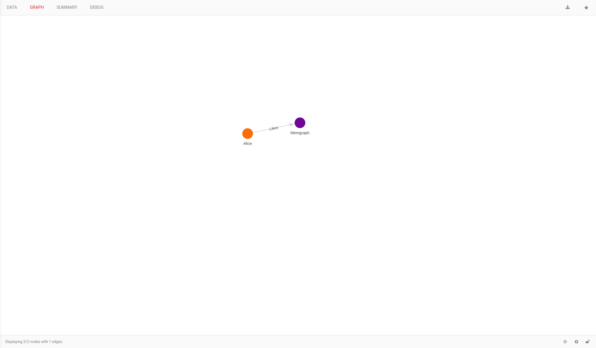

## Prerequisites

- You will need a macOS computer running High Sierra or higher with
  administrative access and an internet connection.
- You will need Docker version 1.12 or later installed on your macOS computer.
  Instructions on how to install Docker on macOS can be found
  [here](https://docs.docker.com/desktop/mac/install/).

## Step 1 - Download and install Memgraph with Docker

Docker is the easiest way to run Memgraph. Once you have successfully installed
[Docker](https://docs.docker.com/desktop/mac/install/), you will now install the
Memgraph Docker image and import it.

Instructions on how to install Memgraph can be found
[here](/memgraph/install-memgraph-on-macos-docker). After Memgraph is installed
and running on your computer, you can continue with the next step.

## Step 2 - Installing and setting up Memgraph Lab

Download Memgraph Lab by visiting [the download
page](https://memgraph.com/download/#tools).


Once you have Memgraph Lab installed, run the app, and you should be presented
with a login screen. The username and password fields are empty by default. The
default connection string is set to `bolt://localhost:7687`. If you're using a
different port, you will have to change the connection string to point to that
port, i.e. `bolt://localhost:<your port number>`.

Click on connect, and you should be presented with the following dashboard:


Note: You might receive the following error message when trying to connect.


In this case, make sure that Memgraph is properly up and running with Docker and
that you have entered the correct port number.

Congratulations! You have successfully installed Memgraph Lab and connected it
to Memgraph. You are now ready to start building your graph and queries.

## Step 3 - Create a simple graph

Let's create a simple graph and run some queries. This will make sure everything
is running correctly.

Go to the "Queries" tab, enter the following Cypher query and click "Run".

```cypher
CREATE (u:User {name: "Alice"})-[:Likes]->(m:Software {name: "Memgraph"});
```

You just created 2 nodes in the database, one labeled `User` with the name
"Alice" and the other labeled `Software` with the name "Memgraph". Between them,
you also created a relationship indicating that "Alice" likes "Memgraph".

Now that the data is stored inside Memgraph, you can run a query to retrieve and
visualize the graph. Execute the following query:

```cypher
MATCH (u:User)-[r]->(x) RETURN u, r, x;
```

You should get the following result:



Now that you know your development environment is working, you are ready to
continue exploring Memgraph and building much more interesting projects
leveraging connected data.

## Where to next?

To learn more about the **Cypher** language, visit the **[Cypher
manual](/cypher-manual)** or **[Memgraph
Playground](https://playground.memgraph.com/)** for interactive guides. For
real-world examples of how to use Memgraph, we strongly suggest going through
one of the available **[Tutorials](/memgraph/tutorials)**. Details on what can
be stored in Memgraph can be found in the article about **[Data
storage](/memgraph/concepts/storage)**.

## Getting help

Visit the **[Getting help](/help-center)** page in case you run into any kind of
problem or you have additional questions.
