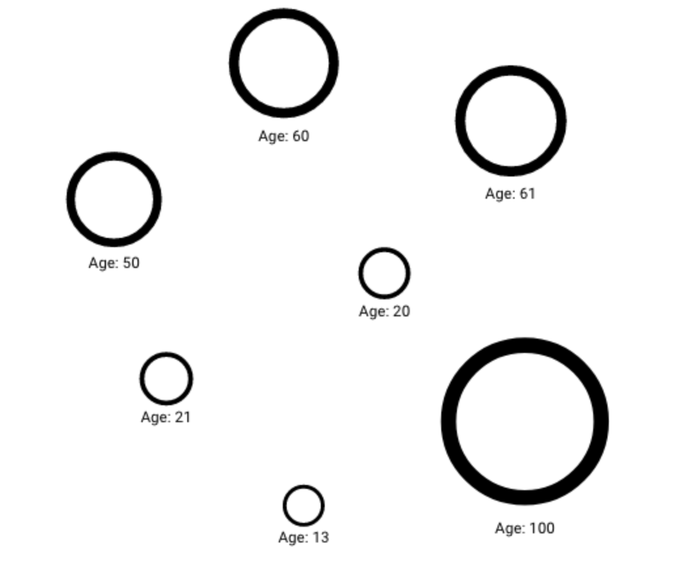

[](/memgraph/tutorials/style-your-graphs-in-memgraph-lab)

This guide will show you how to easily get started with the Graph Style Script
language. GSS is a language for customizing the visual display of graphs. For a
complete list of available features consult the [Style script
reference guide](./reference-guide.md).

## Graph example

In this guide, we will use an example graph with European countries and cities.
The data can be found
[here](https://memgraph.com/docs/memgraph/tutorials-overview/backpacking-through-europe).
Countries have the label `Country`, while cities have the label `City`. All
nodes have the property `name`. Cities have many additional properties,
including `country` (containing country) and `drinks_USD` (average drink price).

## Setting graph labels

We want to label country nodes with country names, and city nodes with city
names and containing country names. To achieve that we can use two directives.
The first one selects countries and the second one selects cities.

```cpp
@NodeStyle HasLabel(node, "Country") {
  label: Property(node, "name")
}

@NodeStyle HasLabel(node, "City") {
    label: Format("{cityName}, {countryName}",
                  Property(node, "name"),
                  Property(node, "country"))
}
```

In the case of the [`Format`](gss-functions.md#formatformatstring-val1-val2)
function, content inside the curly braces is ignored but can be helpful for
clarity.

## Setting node images

It would be nice to display flags in the country nodes. This can be achieved
using URLs of flag images. There is a website that hosts many world flags so we
can use images from [there](https://cdn.countryflags.com). Their API expects a
country name as a part of the URL path so we will make the following directive.

```cpp
@NodeStyle HasLabel(node, "Country") {
  image-url: Format("https://cdn.countryflags.com/thumbs/{}/flag-800.png",
                    LowerCase(Property(node, "name")))
}
```

Unfortunately, this won't work for all countries. Flags for England and Scotland
cannot be found on the website because they aren't real countries. So we can get
around that by providing custom directives below the general one above.

```cpp
@NodeStyle Equals(Property(node, "name"), "England") {
   image-url: "https://upload.wikimedia.org/wikipedia/en/thumb/b/be/Flag_of_England.svg/2560px-Flag_of_England.svg.png"
}

@NodeStyle Equals(Property(node, "name"), "Scotland") {
  image-url: "https://upload.wikimedia.org/wikipedia/commons/thumb/1/10/Flag_of_Scotland.svg/1200px-Flag_of_Scotland.svg.png"
 }
```

Also, URLs for a country name with whitespace inside them don't so we also have
to provide custom URLs for the Czech Republic and Bosnia and Herzegovina.

```cpp
@NodeStyle Equals(Property(node, "name"), "Bosnia and Herzegovina") {
   image-url: "https://upload.wikimedia.org/wikipedia/commons/thumb/b/bf/Flag_of_Bosnia_and_Herzegovina.svg/1200px-Flag_of_Bosnia_and_Herzegovina.svg.png"
 }

 @NodeStyle Equals(Property(node, "name"), "Czech Republic") {
   image-url: "https://upload.wikimedia.org/wikipedia/commons/thumb/c/cb/Flag_of_the_Czech_Republic.svg/2560px-Flag_of_the_Czech_Republic.svg.png"
 }
```

Now all the country nodes have their flags displayed.

## Highlighting interesting nodes

We can highlight nodes with low drink prices in the following way. We want to
use a beer image and a bigger size along with a red shadow.

```cpp
@NodeStyle And(
     HasLabel(node, "City"),
     Less(Property(node, "drinks_USD"), 5)) {
  size: 50
  image-url: "https://www.sciencenews.org/wp-content/uploads/2020/05/050620_mt_beer_feat-1028x579.jpg"
  shadow-color: red
 }
```

## Caching results for faster performance

To normalize some value, for example, the size or width of all the
nodes or relationships in the graph, find the minimum and maximum values
of all nodes.
For example, a node labled "Person"` has the property `age` that holds the age information
of a particular person. We want the node property `size` to be 5 for the youngest person
and 20 for the oldest one in the presented graph. All other node sizes should be normalized
within that range.

One of the solutions could look like this:

```cpp
// Size range min/max variables
Define(MIN_SIZE, 5)
Define(MAX_SIZE, 20)
Define(PROP_NAME, "age")
Define(SIZE_RANGE, Sub(MAX_SIZE, MIN_SIZE))

// A set of utility functions
// Create a new array of property values from an array of nodes
Define(GetProperties, Function(nodes, propName,
  Map(nodes, Function(singleNode, Property(singleNode, propName)))
))
// Keep only the numeric values from an array of values
Define(KeepNumericValues, Function(values,
  Filter(values, Function(value, IsNumber(value)))
))

// Functions to find min and max value in the input nodes
Define(GetMaxValue, Function(nodes,
  Max(KeepNumericValues(GetProperties(nodes, PROP_NAME)))
))
Define(GetMinValue, Function(nodes,
  Min(KeepNumericValues(GetProperties(nodes, PROP_NAME)))
))

// Normalize function that receives two inputs: node (n) and
// graph (g) and returns normalized value into a range
// [MIN_SIZE, MAX_SIZE]
Define(Normalize, Function(n, g,
  Add(
    MIN_SIZE,
    Mul(
      SIZE_RANGE,
      Div(
        Sub(Property(n, PROP_NAME), GetMinValue(Nodes(g))),
        Sub(GetMaxValue(Nodes(g)), GetMinValue(Nodes(g)))
      )
    )
  )
))

// For all nodes with the label "Person" and numeric property "age"
@NodeStyle And(HasLabel(node, "Person"), IsNumber(Property(node, PROP_NAME))) {
  color: white
  size: Normalize(node, graph)
  width: Div(Normalize(node, graph), 5)
  label: Format("Age: {}", AsText(Property(node, PROP_NAME)))
}
```



The problem with the solution above is slow performance. The `Normalize` function is called twice
for each node in the graph view. Each `Normalize` call iterates through all nodes three times: two
times for `GetMinValue` and once for `GetMaxValue`. For small graphs, you won't see a difference
in performance but as the number of nodes rises the performance issues will follow. 

To solve this issue, cache the results by calculating outside of `@NodeStyle` and
`@EdgeStyle` directives where the variable `graph` is also available.
Inside the `@NodeStyle` directive, a local variable can be used to store the normalized
value and use it with `size` and `width` properties thus calling the `Normalize` function only once.

Check the improved GSS code below:

```cpp
// Size range min/max variables
Define(MIN_SIZE, 5)
Define(MAX_SIZE, 20)
Define(PROP_NAME, "age")
Define(SIZE_RANGE, Sub(MAX_SIZE, MIN_SIZE))

// A set of utility functions
// Create a new array of property values from an array of nodes
Define(GetProperties, Function(nodes, propName,
  Map(nodes, Function(singleNode, Property(singleNode, propName)))
))
// Keep only the numeric values from an array of values
Define(KeepNumericValues, Function(values,
  Filter(values, Function(value, IsNumber(value)))
))

// Variables MAX_VALUE and MIN_VALUE will hold the max and min
// values of all node properties.
// The If statement is used to handle errors when there are no values to calculate
// min and max from.
Define(MAX_VALUE, If(
  Greater(NodeCount(graph), 0),
  Max(KeepNumericValues(GetProperties(Nodes(graph), PROP_NAME))),
  0
))
Define(MIN_VALUE, If(
  Greater(NodeCount(graph), 0),
  Min(KeepNumericValues(GetProperties(Nodes(graph), PROP_NAME))),
  0
))

// Normalize function that receives one inputs: node and
// returns normalized value into a range [MIN_SIZE, MAX_SIZE]
Define(Normalize, Function(n,
  Add(
    MIN_SIZE,
    Mul(
      SIZE_RANGE,
      Div(
        Sub(Property(n, PROP_NAME), MIN_VALUE),
        Sub(MAX_VALUE, MIN_VALUE)
      )
    )
  )
))

// For all the nodes with label "Person" and numeric property "age"
@NodeStyle And(HasLabel(node, "Person"), IsNumber(Property(node, PROP_NAME))) {
  // Local variable used to cache a result from function Normalize
  Define(NORM, Normalize(node))

  color: white
  size: NORM
  width: Div(NORM, 5)
  label: Format("Age: {}", AsText(Property(node, PROP_NAME)))
}
```
