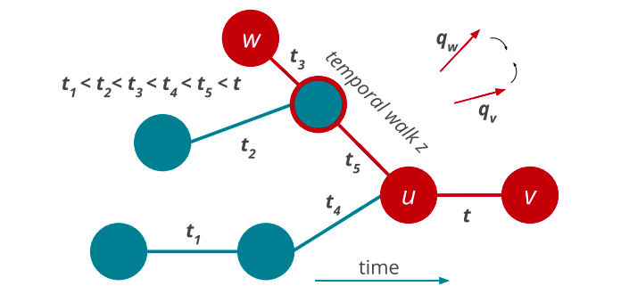

## Description
**Dynamic node2vec** is **random walk based** method which creates embeddings for every new node added to the graph. 
For every new edge, there is a recalculation of probabilities (weights) which are used in walk sampling. 
A goal of the method is to enforce that the embedding of node `v` is similar to the embedding of nodes with the ability to reach node `v` across edges appeared one before other.

Photo by author on <a href="https://appliednetsci.springeropen.com/articles/10.1007/s41109-019-0169-5"> Node embeddings in dynamic graphs</a>

### Why Dynamic node2vec
Many methods, like **node2vec**, **deepwalk**, focus on computing the embedding for static graphs which is great but also has a big drawback. 
Networks in **practical applications** are **dynamic** and evolve constantly over time. 
For example, new links are formed (when people make new friends on social networks) and old links can disappear. 
Moreover, new nodes can be introduced into the graph (e.g., users can join the social network) and create new links to existing nodes.

**Naively applying one of the static** embedding algorithms leads to unsatisfactory performance due to the following challenges:
* **Stability**: the embedding of graphs at consecutive time steps can differ substantially even though the graphs do not change much.
* **Growing Graphs**: All existing approaches assume a fixed number of nodes in learning graph embeddings and thus cannot handle growing graphs.
* **Scalability**: Learning embeddings independently for each snapshot leads to running time linear in the number of snapshots. As learning a single embedding is computationally expensive, the naive approach does not scale to dynamic networks with many snapshots

## Implementation

Dynamic node2vec is implemented within project [**MAGE**](https://github.com/memgraph/mage). Be sure to check it out in the link above. :point_up:

## Blog posts

Also, for broader understanding of the topic we have prepared few blog posts for you:

## Use cases

Dynamic node2vec can be used for any of the following problems:
* node classification
* link prediction
* graph reconstruction
* clustering (community detection)

We have created a blog post :point_up: by building recommendation system with dynamic node2vec by finding clusters (community detection). Be sure to check it out.

