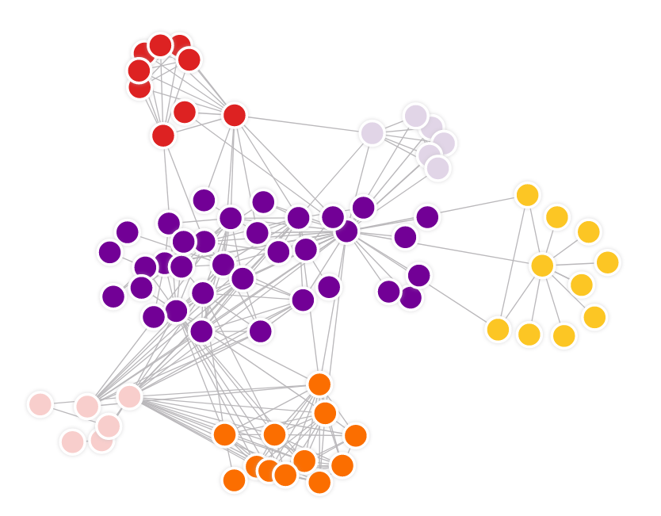
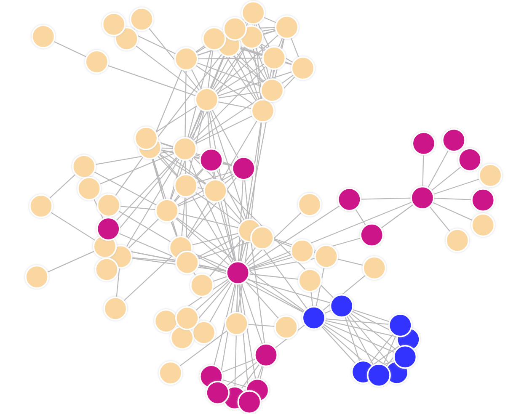

## Description

In [graph theory](https://en.wikipedia.org/wiki/Graph_theory), **graph
clustering** is used to find subsets of similar nodes and group them together.
It is part of **graph analysis** which has been attracting increasing attention
in the recent years due the ubiquity of networks in the real world.

Graph clustering also known as network partitioning can be of two types: 
* **structure based**
* **attribute based clustering**

The **structure based** can be further divided into two categories, namely
**community based**, and **structurally equivalent clustering**. 

**Community-based** methods aim to find dense subgraphs with high number of
intra-cluster edges, and low number of inter-cluster edges. Examples are
following algorithms:
* [A min-max cut algorithm for graph partitioning and data
  clustering](https://ieeexplore.ieee.org/document/989507)
* [Finding and evaluating community structure in
  networks](https://arxiv.org/abs/cond-mat/0308217)

> Structure based community clustering

**Structural equivalence** clustering on the contrary, is designed to identify
nodes with similar roles (like bridges and hubs). Example is [SCAN: A Structural
Clustering Algorithm for
Networks](http://web.cs.ucla.edu/~yzsun/classes/2014Spring_CS7280/Papers/Clustering/SCAN.pdf)

> Structure based structural equivalence clustering

One example that can vary between **community based** and **structurally
equivalent clustering** is [Node2Vec](https://arxiv.org/abs/1607.00653). 

**Attribute based** methods utilize node labels, in addition to observed links,
to cluster nodes like following algorithm: [Graph clustering based on
structural/attribute
similarities](https://dl.acm.org/doi/10.14778/1687627.1687709)

## Materials

### Implementation

**Node2Vec** is implemented within project
[**MAGE**](https://github.com/memgraph/mage). Be sure to check it out in the
link above.

Also, finding communities in dynamic graphs is possible with **[Dynamic
Node2Vec](/mage/query-modules/python/node2vec-online)**.

**Dynamic Node2Vec** is implemented within the project
[**MAGE**](https://github.com/memgraph/mage). Be sure to check it out in the
link above.

## Use cases

Biggest use case for graph clustering is in social networks. There communities
can be explored, hubs found and many more.
