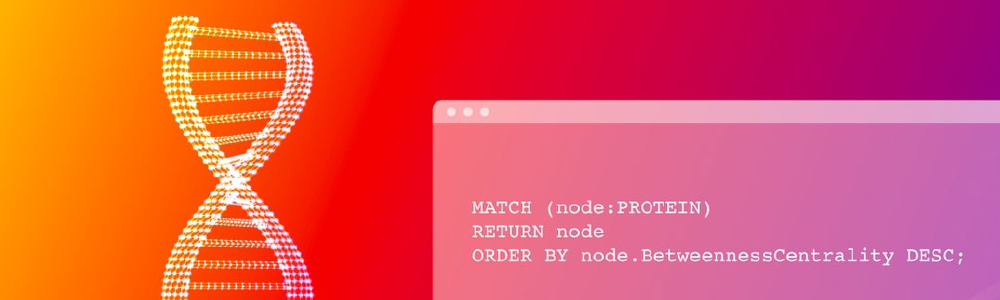

## Introduction

**Bioinformatics** is a subdiscipline of biology and computer science that
focuses on discovering, storing, analyzing, and disseminating biological data
such as DNA and amino acid sequences. This kind of data often comes in the form
of highly complex and interconnected networks. While most of the data is
currently stored in relational databases, the problem of complicated domain
models and evergrowing data diversity presents a challenge to data scientists. 

Memgraph as a graph database can efficiently map the relationships in such
highly interconnected networks in the field of biology. From molecule to protein
interactions, almost everything can be modeled using graphs and explored with
graph algorithms.

## Applying graphs

### Protein-protein interaction networks

Proteins rarely act individually, they are often in interaction with other
proteins to perform some function. Protein-protein interaction networks (PPIN)
are used to simplify and model these complex interactions. In PPIN, proteins are
represented as nodes. Interactions between proteins are described by edges
connecting the corresponding nodes.

Researches have discovered an important property of PPINs and consequentially
enabled us to develop methods for identifying essential proteins. Most proteins
in PPINs interact with only several other proteins, meaning that they do not
have many connections. However, there is a small number of proteins that
interact with almost every other protein. These proteins, included in many
interactions, [can be
detected](https://www.ebi.ac.uk/training/online/courses/network-analysis-of-protein-interaction-data-an-introduction/building-and-analysing-ppins/topological-ppin-analysis/centrality-analysis/)
in the network as highly connected nodes, called hubs and they are very likely
essential proteins.

### Sequence similarity networks

A [sequence similarity
network](http://sfld.rbvi.ucsf.edu/archive/django/web/networks/index.html) (SNN)
enables the visualization of relationships among protein sequences. The proteins
which are related in some way are most often grouped in clusters. The graph is
made up of nodes that represent proteins while the edges indicate similarity in
amino acid sequence.

SNNs are used to explore relationships in large and diverse sets of sequences
because the computational resources needed for traditional methods of analysis
(for example, phylogenetic trees) would be unfeasible, due to the difficulty in
generating accurate multiple alignments.

### Disease networks

Systems biology experiments create an enormous amount of data of multiple
modalities. This kind of data because of its complexity and rich semantics
presents a hurdle for standard storage and analysis solutions.

Graph databases provide a flexible solution for the integration of multiple
types of biological data and facilitate exploratory data mining to support
hypothesis generation.

## Where to next?

This text is a **summary** of one area that fits perfectly with the application
of graphs. Therefore, we would like to have you with us when **implementing**
some of these solutions. Share **opinions**, **experiences** and **problems**
you encounter when working with **Memgraph** on our [Discord
server](https://discord.gg/memgraph). We are here for you and we will help you
along the way.
