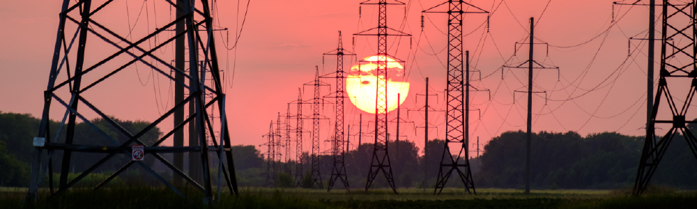

## Introduction

The utility industry is undergoing a transformational period driven by
technological and competitive forces, as well as changing customer expectations
and growing regulatory constraints. As these forces accelerate, electric power
distributors must tap new technologies to expand opportunities to improve
operational efficiencies, reduce costs and maximize customer satisfaction. 

Similar to its impact on other major industries, advanced analytics have the
potential to unlock novel groundbreaking opportunities in the power grid sector.
As power grid technologies evolve in conjunction with measurement and
communication technologies, this results in an unprecedented amount of
heterogeneous and deeply interconnected data from diverse sources. The effective
combination and utilization of this electrical data with external data sources
(e.g. weather), has the potential to revolutionize electrical grid operations by
enhancing observability of system-wide conditions, the behavior of end-users,
and energy availability.

## Applying graphs

### Minimum spanning tree designed for power grids

In the case of a network failure, a smart grid should be able to automatically
reconfigure itself and continue energy distribution without additional
disruptions. The generation of minimum spanning trees could overcome potential
points of failure by enabling smart grids to heal themselves and propose new
configurations within the network. While such an algorithm would require
significant resources, Memgraph, with its in-memory implementation, ensures
real-time computation. 

### Finding shortest paths

This type of network analysis is crucial to infrastructure managers. It helps
uncover vulnerabilities and bottlenecks, model the impact incidents and outages
may have on the network, and carry out critical contingency planning. By
examining the power grid as a graph, this task is transformed into a simple graph
problem which can be tackled in a myriad of ways. 

### Handling failures in power grids

Because of their size and locations, power grids are prone to multiple failures
throughout the year. Individual elements can experience technical problems due
to their age or weather effects which means that the grid needs to have certain
redundancies in place. 

By examining the grid through a graph, we can simulate the behavior in case of a
critical failure. The graph should provide enough information to predict
potential shortcomings. We can also simulate new elements such as transformers
or high voltage transmission lines to find the most appropriate locations.

## Where to next?

This text is a **summary** of one area that fits perfectly with the application
of graphs. Therefore, we would like to have you with us when **implementing**
some of these solutions. Share **opinions**, **experiences** and **problems**
you encounter when working with **Memgraph** on our [Discord
server](https://discord.gg/memgraph). We are here for you and we will help you
along the way.
