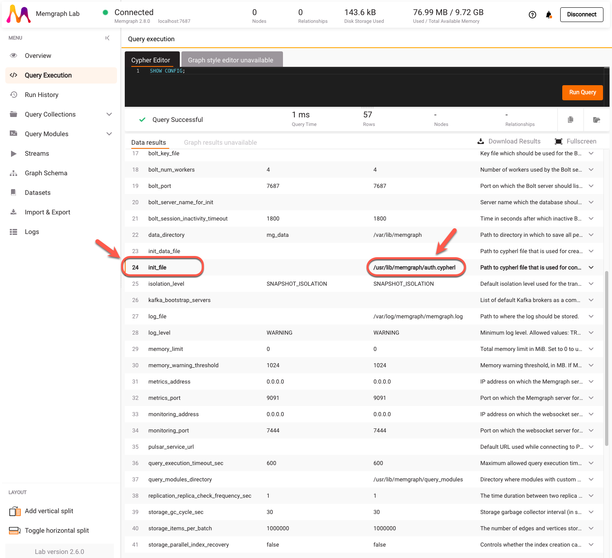
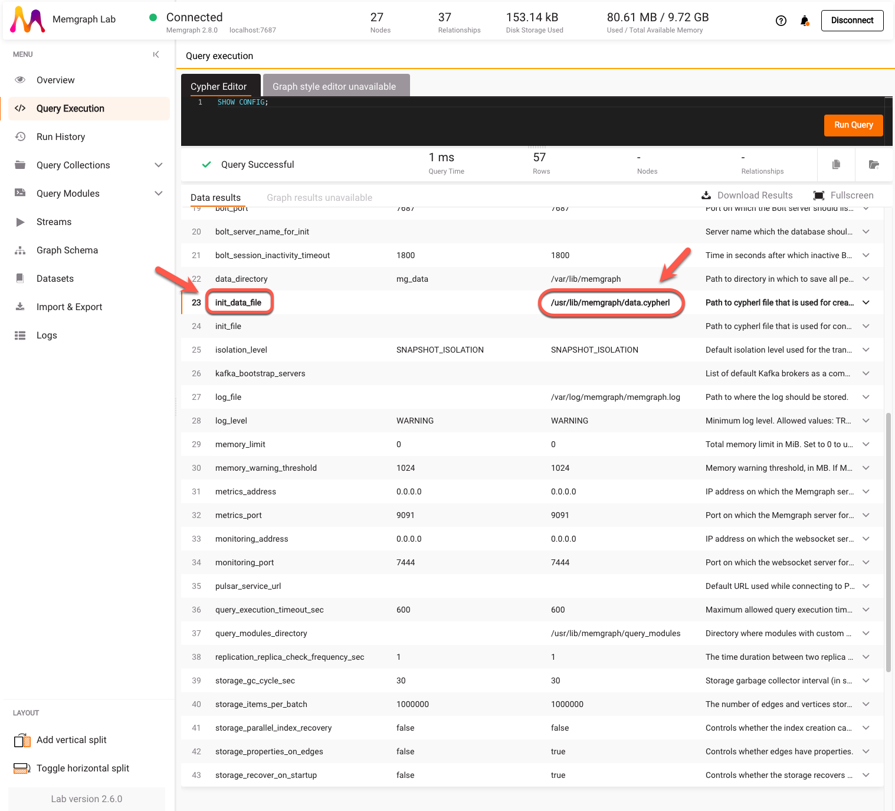

With `init-file` and `init-data-file` [configuration flags](/docs/reference-guide/configuration.md), you can execute queries from a CYPHERL file that need to be executed before or immediately after the Bolt server starts. The CYPHERL file the `init-file` flag points to is usually used to create users and set their passwords allowing only authorized users to access the data in the first run. The CYPHERL file the `init-data-file` points to is usually used to populate the database. 

If you will run Memgraph with Docker, make sure that the `init-file` and `init-data-file` configuration flags are referring to the files inside the container before Memgraph starts. Files can't be directly copied into a container before it's started because the filesystem of the container doesn't exist until it's actually running. However, you can tackle this by using a Dockerfile.

In this guide you will learn how to:
- [**Use the `init-file` flag with Docker**](#use-the-init-file-flag-with-docker)
- [**Use the `init-data-file` flag with Docker**](#use-the-init-data-file-flag-with-docker)

## Use the `init-file` flag with Docker

### 1. Create all necessary files

First, create a local directory called `my_init_test` with `auth.cypherl` and Dockerfile inside it.

Below is the content of the `auth.cypherl` file:

```
CREATE USER memgraph1 IDENTIFIED BY '1234';
```

The Dockerfile should be defined like this:

```bash
FROM memgraph/memgraph:latest

USER root

COPY auth.cypherl /usr/lib/memgraph/auth.cypherl

USER memgraph
```

The above Dockerfile builds an image based on `memgraph/memgraph:latest` image. For other images, [check Memgraph's Docker Hub](https://hub.docker.com/u/memgraph). Then, it switches to the user `root` to be able to copy the local file to the container where Memgraph will be run. Due to the permissions set, it is recommended to copy it to `/usr/lib/memgraph/` or any subfolder within that folder. In the end, the user is switched back to `memgraph`.

### 2. Build the Docker image

Open the terminal, place yourself in the `my_init_test` directory and build the image called `my_image` with the following command:

```
docker build -t my_image .
```

### 3. Run the Docker image

Once you've built the Docker image, you can run it with the `init-file` flag set to the appropriate value:

```
docker run -it -p 7687:7687 -p 7444:7444 my_image --init-file=/usr/lib/memgraph/auth.cypherl
```

To check all available flags in Memgraph, refer to [the configuration reference guide](/docs/reference-guide/configuration.md).

### 4. Connect to Memgraph

To verify that everything is set up correctly, [run Memgraph Lab](/docs/memgraph-lab) and [connect to Memgraph](/docs/memgraph-lab/connect-to-memgraph). You'll notice that you have to connect manually and input the correct username and password. This happened because `auth.cypherl` file was run before the Bolt server started. You can also run the `SHOW CONFIG` query:



Notice how the current value of `init_file` is updated with the path to the CYPHERL file inside the container.

## Use the `init-data-file` flag with Docker 

### 1. Create all necessary files

First, create a local directory called `my_init_test` with `data.cypherl` and Dockerfile inside it.

Below is the content of the `data.cypherl` file:

```
CREATE INDEX ON :__mg_vertex__(__mg_id__);
CREATE (:__mg_vertex__:`Person` {__mg_id__: 0, `name`: "Peter"});
CREATE (:__mg_vertex__:`Team` {__mg_id__: 1, `name`: "Engineering"});
CREATE (:__mg_vertex__:`Repository` {__mg_id__: 2, `name`: "Memgraph"});
CREATE (:__mg_vertex__:`Repository` {__mg_id__: 3, `name`: "MAGE"});
CREATE (:__mg_vertex__:`Repository` {__mg_id__: 4, `name`: "GQLAlchemy"});
CREATE (:__mg_vertex__:`Company` {__mg_id__: 5, `name`: "Memgraph"});
CREATE (:__mg_vertex__:`File` {__mg_id__: 6, `name`: "welcome_to_engineering.txt"});
CREATE (:__mg_vertex__:`Storage` {__mg_id__: 7, `name`: "Google Drive"});
CREATE (:__mg_vertex__:`Storage` {__mg_id__: 8, `name`: "Notion"});
CREATE (:__mg_vertex__:`File` {__mg_id__: 9, `name`: "welcome_to_memgraph.txt"});
CREATE (:__mg_vertex__:`Person` {__mg_id__: 10, `name`: "Carl"});
CREATE (:__mg_vertex__:`Folder` {__mg_id__: 11, `name`: "engineering_folder"});
CREATE (:__mg_vertex__:`Person` {__mg_id__: 12, `name`: "Anna"});
CREATE (:__mg_vertex__:`Folder` {__mg_id__: 13, `name`: "operations_folder"});
CREATE (:__mg_vertex__:`Team` {__mg_id__: 14, `name`: "Operations"});
CREATE (:__mg_vertex__:`File` {__mg_id__: 15, `name`: "operations101.txt"});
CREATE (:__mg_vertex__:`File` {__mg_id__: 16, `name`: "expenses2022.csv"});
CREATE (:__mg_vertex__:`File` {__mg_id__: 17, `name`: "salaries2022.csv"});
CREATE (:__mg_vertex__:`File` {__mg_id__: 18, `name`: "engineering101.txt"});
CREATE (:__mg_vertex__:`File` {__mg_id__: 19, `name`: "working_with_github.txt"});
CREATE (:__mg_vertex__:`File` {__mg_id__: 20, `name`: "working_with_notion.txt"});
CREATE (:__mg_vertex__:`Team` {__mg_id__: 21, `name`: "Marketing"});
CREATE (:__mg_vertex__:`Person` {__mg_id__: 22, `name`: "Julie"});
CREATE (:__mg_vertex__:`Account` {__mg_id__: 23, `name`: "Facebook"});
CREATE (:__mg_vertex__:`Account` {__mg_id__: 24, `name`: "LinkedIn"});
CREATE (:__mg_vertex__:`Account` {__mg_id__: 25, `name`: "HackerNews"});
CREATE (:__mg_vertex__:`File` {__mg_id__: 26, `name`: "welcome_to_marketing.txt"});
MATCH (u:__mg_vertex__), (v:__mg_vertex__) WHERE u.__mg_id__ = 0 AND v.__mg_id__ = 1 CREATE (u)-[:`IS_PART_OF`]->(v);
MATCH (u:__mg_vertex__), (v:__mg_vertex__) WHERE u.__mg_id__ = 0 AND v.__mg_id__ = 5 CREATE (u)-[:`IS_PART_OF`]->(v);
MATCH (u:__mg_vertex__), (v:__mg_vertex__) WHERE u.__mg_id__ = 0 AND v.__mg_id__ = 9 CREATE (u)-[:`HAS_ACCESS_TO`]->(v);
MATCH (u:__mg_vertex__), (v:__mg_vertex__) WHERE u.__mg_id__ = 0 AND v.__mg_id__ = 14 CREATE (u)-[:`IS_PART_OF`]->(v);
MATCH (u:__mg_vertex__), (v:__mg_vertex__) WHERE u.__mg_id__ = 1 AND v.__mg_id__ = 2 CREATE (u)-[:`HAS_ACCESS_TO`]->(v);
MATCH (u:__mg_vertex__), (v:__mg_vertex__) WHERE u.__mg_id__ = 1 AND v.__mg_id__ = 3 CREATE (u)-[:`HAS_ACCESS_TO`]->(v);
MATCH (u:__mg_vertex__), (v:__mg_vertex__) WHERE u.__mg_id__ = 1 AND v.__mg_id__ = 4 CREATE (u)-[:`HAS_ACCESS_TO`]->(v);
MATCH (u:__mg_vertex__), (v:__mg_vertex__) WHERE u.__mg_id__ = 1 AND v.__mg_id__ = 6 CREATE (u)-[:`HAS_ACCESS_TO`]->(v);
MATCH (u:__mg_vertex__), (v:__mg_vertex__) WHERE u.__mg_id__ = 1 AND v.__mg_id__ = 11 CREATE (u)-[:`HAS_ACCESS_TO`]->(v);
MATCH (u:__mg_vertex__), (v:__mg_vertex__) WHERE u.__mg_id__ = 5 AND v.__mg_id__ = 1 CREATE (u)-[:`HAS_TEAM`]->(v);
MATCH (u:__mg_vertex__), (v:__mg_vertex__) WHERE u.__mg_id__ = 5 AND v.__mg_id__ = 21 CREATE (u)-[:`HAS_TEAM`]->(v);
MATCH (u:__mg_vertex__), (v:__mg_vertex__) WHERE u.__mg_id__ = 5 AND v.__mg_id__ = 14 CREATE (u)-[:`HAS_TEAM`]->(v);
MATCH (u:__mg_vertex__), (v:__mg_vertex__) WHERE u.__mg_id__ = 6 AND v.__mg_id__ = 7 CREATE (u)-[:`IS_STORED_IN`]->(v);
MATCH (u:__mg_vertex__), (v:__mg_vertex__) WHERE u.__mg_id__ = 6 AND v.__mg_id__ = 8 CREATE (u)-[:`IS_STORED_IN`]->(v);
MATCH (u:__mg_vertex__), (v:__mg_vertex__) WHERE u.__mg_id__ = 9 AND v.__mg_id__ = 12 CREATE (u)-[:`CREATED_BY`]->(v);
MATCH (u:__mg_vertex__), (v:__mg_vertex__) WHERE u.__mg_id__ = 10 AND v.__mg_id__ = 1 CREATE (u)-[:`IS_PART_OF`]->(v);
MATCH (u:__mg_vertex__), (v:__mg_vertex__) WHERE u.__mg_id__ = 10 AND v.__mg_id__ = 5 CREATE (u)-[:`IS_PART_OF`]->(v);
MATCH (u:__mg_vertex__), (v:__mg_vertex__) WHERE u.__mg_id__ = 10 AND v.__mg_id__ = 9 CREATE (u)-[:`HAS_ACCESS_TO`]->(v);
MATCH (u:__mg_vertex__), (v:__mg_vertex__) WHERE u.__mg_id__ = 11 AND v.__mg_id__ = 7 CREATE (u)-[:`IS_STORED_IN`]->(v);
MATCH (u:__mg_vertex__), (v:__mg_vertex__) WHERE u.__mg_id__ = 11 AND v.__mg_id__ = 18 CREATE (u)-[:`HAS_ACCESS_TO`]->(v);
MATCH (u:__mg_vertex__), (v:__mg_vertex__) WHERE u.__mg_id__ = 11 AND v.__mg_id__ = 19 CREATE (u)-[:`HAS_ACCESS_TO`]->(v);
MATCH (u:__mg_vertex__), (v:__mg_vertex__) WHERE u.__mg_id__ = 11 AND v.__mg_id__ = 20 CREATE (u)-[:`HAS_ACCESS_TO`]->(v);
MATCH (u:__mg_vertex__), (v:__mg_vertex__) WHERE u.__mg_id__ = 12 AND v.__mg_id__ = 14 CREATE (u)-[:`IS_PART_OF`]->(v);
MATCH (u:__mg_vertex__), (v:__mg_vertex__) WHERE u.__mg_id__ = 13 AND v.__mg_id__ = 15 CREATE (u)-[:`HAS_ACCESS_TO`]->(v);
MATCH (u:__mg_vertex__), (v:__mg_vertex__) WHERE u.__mg_id__ = 13 AND v.__mg_id__ = 16 CREATE (u)-[:`HAS_ACCESS_TO`]->(v);
MATCH (u:__mg_vertex__), (v:__mg_vertex__) WHERE u.__mg_id__ = 13 AND v.__mg_id__ = 17 CREATE (u)-[:`HAS_ACCESS_TO`]->(v);
MATCH (u:__mg_vertex__), (v:__mg_vertex__) WHERE u.__mg_id__ = 13 AND v.__mg_id__ = 7 CREATE (u)-[:`IS_STORED_IN`]->(v);
MATCH (u:__mg_vertex__), (v:__mg_vertex__) WHERE u.__mg_id__ = 14 AND v.__mg_id__ = 13 CREATE (u)-[:`HAS_ACCESS_TO`]->(v);
MATCH (u:__mg_vertex__), (v:__mg_vertex__) WHERE u.__mg_id__ = 21 AND v.__mg_id__ = 23 CREATE (u)-[:`HAS_ACCESS_TO`]->(v);
MATCH (u:__mg_vertex__), (v:__mg_vertex__) WHERE u.__mg_id__ = 21 AND v.__mg_id__ = 24 CREATE (u)-[:`HAS_ACCESS_TO`]->(v);
MATCH (u:__mg_vertex__), (v:__mg_vertex__) WHERE u.__mg_id__ = 21 AND v.__mg_id__ = 25 CREATE (u)-[:`HAS_ACCESS_TO`]->(v);
MATCH (u:__mg_vertex__), (v:__mg_vertex__) WHERE u.__mg_id__ = 21 AND v.__mg_id__ = 26 CREATE (u)-[:`HAS_ACCESS_TO`]->(v);
MATCH (u:__mg_vertex__), (v:__mg_vertex__) WHERE u.__mg_id__ = 22 AND v.__mg_id__ = 21 CREATE (u)-[:`IS_PART_OF`]->(v);
MATCH (u:__mg_vertex__), (v:__mg_vertex__) WHERE u.__mg_id__ = 22 AND v.__mg_id__ = 5 CREATE (u)-[:`IS_PART_OF`]->(v);
MATCH (u:__mg_vertex__), (v:__mg_vertex__) WHERE u.__mg_id__ = 22 AND v.__mg_id__ = 9 CREATE (u)-[:`HAS_ACCESS_TO`]->(v);
MATCH (u:__mg_vertex__), (v:__mg_vertex__) WHERE u.__mg_id__ = 26 AND v.__mg_id__ = 7 CREATE (u)-[:`IS_STORED_IN`]->(v);
MATCH (u:__mg_vertex__), (v:__mg_vertex__) WHERE u.__mg_id__ = 26 AND v.__mg_id__ = 8 CREATE (u)-[:`IS_STORED_IN`]->(v);
DROP INDEX ON :__mg_vertex__(__mg_id__);
MATCH (u) REMOVE u:__mg_vertex__, u.__mg_id__;
```

These Cypher queries will create the *Identity and access management* dataset available in Memgraph Lab. You can get this CYPHERL file by exporting the dataset from the Memgraph Lab.

The Dockerfile should be defined like this:

```bash
FROM memgraph/memgraph:latest

USER root

COPY data.cypherl /usr/lib/memgraph/data.cypherl

USER memgraph
```

The above Dockerfile builds an image based on `memgraph/memgraph:latest` image. For other images, [check Memgraph's Docker Hub](https://hub.docker.com/u/memgraph). Then, it switches to the user `root` to be able to copy the local file to the container where Memgraph will be run. Due to the permissions set, it is recommended to copy it to `/usr/lib/memgraph/` or any subfolder within that folder. In the end, the user is switched back to `memgraph`.


### 2. Build the Docker image

Open the terminal, place yourself in the `my_init_test` directory and build the image called `my_image` with the following command:

```
docker build -t my_image .
```

### 3. Run the Docker image

Once you've built the Docker image, you can run it with the `init-data-file` flag set to the appropriate value:

```
docker run -it -p 7687:7687 -p 7444:7444 my_image --init-data-file=/usr/lib/memgraph/data.cypherl
```

To check all available flags in Memgraph, refer to [the configuration reference guide](/docs/reference-guide/configuration.md).

### 4. Connect to Memgraph

To verify that everything is set up correctly, [run Memgraph Lab](/docs/memgraph-lab), [connect to Memgraph](/docs/memgraph-lab/connect-to-memgraph), and run the `SHOW CONFIG` query: 



Notice how the database is already populated and the current value of `init_data_file` is updated with the path to the CYPHERL file inside the container.


