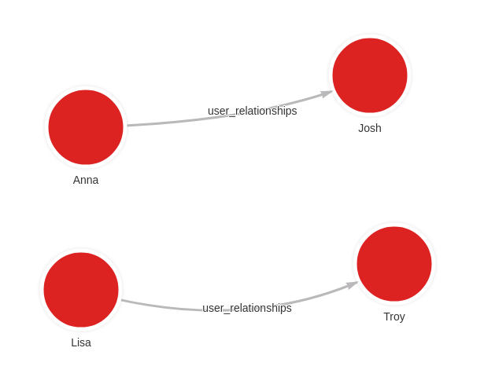

[](/tutorials/migrate-relational-database.md)

## Prerequisites

* A running **[PostgreSQL](https://www.postgresql.org/)** instance with the database you wish to migrate.
* A running **[Memgraph](https://memgraph.com/product)** instance where you want to migrate the data.
* The **[mgmigrate](https://github.com/memgraph/mgmigrate)** tool installed.
  Installation instructions can be found
  [here](https://github.com/memgraph/mgmigrate).

## How to migrate data from PostgreSQL to Memgraph?

### Dataset

For this tutorial, we will be working with a PostgreSQL database named `users_db`
that contains two tables, `users` and `user_relationships`:

import Tabs from '@theme/Tabs';
import TabItem from '@theme/TabItem';

<Tabs
  groupId="platform"
  defaultValue="users"
  values={[
    {label: "Table 'users'", value: 'users'},
    {label: "Table 'user_relationships'", value: 'user_relationships'}
  ]}>
  <TabItem value="users">

The `users` table contains four users with their ids and names:

```console
users_db=# SELECT * FROM "users";
 id | name
----+------
  0 | Anna
  1 | Josh
  2 | Lisa
  3 | Troy
```

  </TabItem>
  <TabItem value='user_relationships'>

The `user_relationships` table contains the relationships between users:

```console
users_db=# SELECT * FROM user_relationships;
 user_one | user_two
----------+----------
        0 |        1
        2 |        3
```

  </TabItem>
</Tabs>

____

### Migrating

**1.** You can migrate this database into Memgraph by running:

```console
build/src/mgmigrate --source-kind=postgresql /
  --source-host 127.0.0.1 /
  --source-port 5432 /
  --source-username postgres /
  --source-password postgres /
  --source-database=users_db /
  --destination-host 127.0.0.1 /
  --destination-port 7687 /
  --destination-use-ssl=false
```

**2.** Run the following query in **[Memgraph Lab](https://memgraph.com/product/lab)** or **[mgconsole](/connect-to-memgraph/mgconsole.md)** to see the results:

```cypher
MATCH (n)-[r]-(m) RETURN n,r,m;
```

The query results should be:

<Tabs
  groupId="platform"
  defaultValue="mgconsole"
  values={[
    {label: 'mgconsole', value: 'mgconsole'},
    {label: 'Memgraph Lab', value: 'memgraphlab'}
  ]}>
  <TabItem value="mgconsole">

```console
memgraph> MATCH (n)-[r]-(m) RETURN n,r,m;
+--------------------------------+--------------------------------+--------------------------------+
| n                              | r                              | m                              |
+--------------------------------+--------------------------------+--------------------------------+
| (:users {id: 1, name: "Josh"}) | [:user_relationships]          | (:users {id: 0, name: "Anna"}) |
| (:users {id: 0, name: "Anna"}) | [:user_relationships]          | (:users {id: 1, name: "Josh"}) |
| (:users {id: 3, name: "Troy"}) | [:user_relationships]          | (:users {id: 2, name: "Lisa"}) |
| (:users {id: 2, name: "Lisa"}) | [:user_relationships]          | (:users {id: 3, name: "Troy"}) |
+--------------------------------+--------------------------------+--------------------------------+
```

  </TabItem>
  <TabItem value='memgraphlab'>



  </TabItem>
</Tabs>
