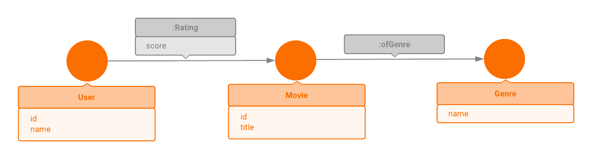

This article is a part of a series intended to show users how to use Memgraph on
real-world data and, by doing so, retrieve some interesting and useful
information.

We highly recommend checking out the other articles from this series which are
listed in our [tutorial overview section](/tutorials/overview.md).

## Introduction

This example shows how to implement a simple recommendation system with
`openCypher` in Memgraph. First, we will show how to perform simple operations,
and then we will implement a query for the movie recommendation.

## Data model

In this example, we will use reduced MovieLens dataset (less than 1000 movies).
There are three different types of data: `Movie`, `User` and `Genre`. Movies
have properties: `id` and `title` Users have properties: `id`, `name` Genres
have a property: `name`

Each movie can be connected with `:ofGenre` relationship to different genres. A user can
rate some movie. Rating is modeled with `:Rating` relationship and this relationship has
a property `score` &mdash; float number between 0 and 5.



## Importing the dataset

To import the dataset, download the [Memgraph
Lab](https://memgraph.com/product/lab) desktop application and navigate to the
`Datasets` tab in the sidebar. From there, choose the dataset `MovieLens:
Movies, genres and users` and continue with the tutorial.

## Example queries

**1\.** List first 10 movies sorted by title

```cypher
MATCH (movie:Movie)
RETURN movie
ORDER BY movie.title
LIMIT 10;
```

**2\.** List last 15 users sorted by name

```cypher
MATCH (user:User)
RETURN user
ORDER BY user.name DESC
LIMIT 15;
```

**3\.** List 10 movies that have _Comedy_ and _Action_ genres and sort them by
title

```cypher
MATCH (movie:Movie)-[:ofGenre]->(:Genre {name:'Action'})
MATCH (movie)-[:ofGenre]->(:Genre {name:'Comedy'})
RETURN movie.title
ORDER BY movie.title
LIMIT 10;
```

**4\.** Uniqueness constraint for genre:

Let's create a new unique constraint:

```cypher
CREATE CONSTRAINT ON (genre:Genre) ASSERT genre.name IS UNIQUE;
```

And now we can try to create new `Genre` node with an existing `name': 'Comedy':

```cypher
CREATE (:Genre {name: 'Comedy'});
```

This query returns an error because genre 'Comedy' already exists.

**5\.** Average score for _Star Wars_ movie:

```cypher
MATCH (:User)-[rating:Rating]->(:Movie {title:'Star Wars'})
RETURN avg(rating.score);
```

**6\.** Average scores for first 10 movies:

```cypher
MATCH (:User)-[:Rating]->(movie:Movie)
RETURN movie.title, avg(r.score) AS score
ORDER BY score DESC
LIMIT 10;
```

**7\.** Create a new user and rate some movies:

```cypher
CREATE (:User {id:1000, name:'Aladin'});
```

Check if new user is created:

```cypher
MATCH (user:User{name:'Aladin'})
RETURN user;
```

Rate some movies:

```cypher
MATCH (u:User {id:1000}), (m:Movie {title:'Trois couleurs : Rouge'})
MERGE (u)-[:Rating {score:3.0}]->(m);
MATCH (u:User {id:1000}), (m:Movie {title:'20,000 Leagues Under the Sea'})
MERGE (u)-[:Rating {score:1.0}]->(m);
MATCH (u:User {id:1000}), (m:Movie {title:'Star Trek: Generations'})
MERGE (u)-[:Rating {score:0.5}]->(m);
MATCH (u:User {id:1000}), (m:Movie {title:'Rebecca'})
MERGE (u)-[:Rating {score:3.0}]->(m);
MATCH (u:User {id:1000}), (m:Movie {title:'The 39 Steps'})
MERGE (u)-[:Rating {score:4.5}]->(m);
MATCH (u:User {id:1000}), (m:Movie {title:'Faster, Pussycat! Kill! Kill!'})
MERGE (u)-[:Rating {score:3.5}]->(m);
MATCH (u:User {id:1000}), (m:Movie {title:'Once Were Warriors'})
MERGE (u)-[:Rating {score:3.5}]->(m);
MATCH (u:User {id:1000}), (m:Movie {title:'Sleepless in Seattle'})
MERGE (u)-[:Rating {score:4.0}]->(m);
MATCH (u:User {id:1000}), (m:Movie {title:'Don Juan DeMarco'})
MERGE (u)-[:Rating {score:4.0}]->(m);
MATCH (u:User {id:1000}), (m:Movie {title:'Jack & Sarah'})
MERGE (u)-[:Rating {score:1.5}]->(m);
MATCH (u:User {id:1000}), (m:Movie {title:'Mr. Holland's Opus'})
MERGE (u)-[:Rating {score:2.0}]->(m);
MATCH (u:User {id:1000}), (m:Movie {title:'The Getaway'})
MERGE (u)-[:Rating {score:3.0}]->(m);
MATCH (u:User {id:1000}), (m:Movie {title:'Color of Night'})
MERGE (u)-[:Rating {score:4.0}]->(m);
MATCH (u:User {id:1000}), (m:Movie {title:'Reality Bites'})
MERGE (u)-[:Rating {score:2.5}]->(m);
MATCH (u:User {id:1000}), (m:Movie {title:'Notorious'})
MERGE (u)-[:Rating {score:3.5}]->(m);
```

**8\.** Recommendation system:

The idea is to implement simple [memory based collaborative
filtering](https://en.wikipedia.org/wiki/Collaborative_filtering).

Let's recommend some movies for user Aladin:

```cypher
MATCH (u:User {id:1000})-[r:Rating]-(m:Movie)
      -[other_r:Rating]-(other:User)
WITH other.id AS other_id,
     avg(abs(r.score-other_r.score)) AS similarity,
     count(*) AS similar_user_count
WHERE similar_user_count > 2
WITH other_id
ORDER BY similarity
LIMIT 10
WITH collect(other_id) AS similar_user_set
MATCH (some_movie: Movie)-[fellow_rate:Rating]-(fellow_user:User)
WHERE fellow_user.id IN similar_user_set
WITH some_movie, avg(fellow_rate.score) AS prediction_score
RETURN some_movie.title AS Title, prediction_score
ORDER BY prediction_score DESC;
```

How does this query work?

This query has two parts:

- Finding similar users
- Predicting the score for some movie (recommendation)

In the first part, we are looking for similar users. First, we need to define
similar users: Two users are considered similar if they tend to give similar
scores to the same movies. For the target user (Aladin) and some other user we
are searching for the same movies:

```cypher
MATCH (u:User {id:1000})-[r:Rating]-(m:Movie)-[other_r:Rating]-(other:User);
```

But this is not enough for finding similar users. We need to choose users with
the same movies and similar scores:

```cypher
WITH other.id AS other_id,
     avg(abs(r.score-other_r.score)) AS similarity,
     count(*) AS similar_user_count
WHERE similar_user_count > 2
WITH other_id
ORDER BY similarity
LIMIT 10;
```

Here we calculate similarities as the average distance between target user score
and some other user score on the same set of movies. There are two parameters:
similarUserCount limit (2) and similar user set size limit (10). Similar user
count limit is used for filtering users who have at least 2 movies in common
with the target user. Similar user set size is used to peek top 10 similar users
(10 or less).

Now we have similar user set. We will use those users to calculate the average
score for all movies in the database.

```cypher
MATCH (some_movie: Movie)-[fellow_rate:Rating]-(fellow_user:User)
WHERE fellow_user.id IN similar_user_set
WITH some_movie, avg(fellow_rate.score) AS prediction_score
RETURN some_movie.title AS title, prediction_score
ORDER BY prediction_score DESC;
```

We encourage you to play with some parameters, like similar user count limit and
similar user set size limit. You can also try to use different similarity
functions, for example [Euclidean
distance](https://en.wikipedia.org/wiki/Euclidean_distance):

```cypher
sqrt(reduce(a=0, x IN collect((r.score - other_r.score) * (r.score - other_r.score)) | a + x)) AS similarity;
```

Here we use `reduce` function. Reduce function accumulate list elements into a
single result by applying an expression. In our query, this function starts with
0 and sums up squared differences. `collect` function is used for putting
squared differences into the list.
