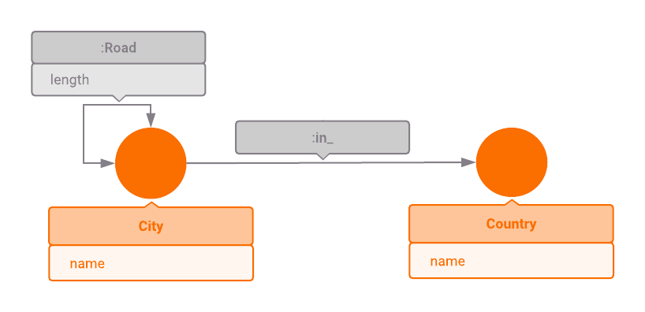

This article is a part of a series intended to show users how to use Memgraph on
real-world data and, by doing so, retrieve some interesting and useful
information.

We highly recommend checking out the other articles from this series which are
listed in our [tutorial overview section](/tutorials/overview.md).

## Introduction

This particular article outlines how to use some of Memgraph's built-in graph
algorithms. More specifically, the article shows how to use breadth-first search
graph traversal algorithm, and Dijkstra's algorithm for finding weighted
shortest paths between nodes in the graph.

## Data model

One of the most common applications of graph traversal algorithms is driving
route computation, so we will use European road network graph as an example. The
graph consists of 999 major European cities from 39 countries in total. Each
city is connected to the country it belongs to via an edge of type `:In_`. There
are edges of type `:Road` connecting cities less than 500 kilometers apart.
Distance between cities is specified in the `length` property of the edge.



## Exploring the dataset

You have two options for exploring this dataset. If you just want to take a look
at the dataset and try out a few queries, open [Memgraph
Playground](https://playground.memgraph.com/sandbox/europe-roads) and continue
with the tutorial there. Note that you will not be able to execute `write`
operations.

On the other hand, if you would like to add changes to the dataset, download the
[Memgraph Lab](https://memgraph.com/product/lab) desktop application and
navigate to the `Datasets` tab in the sidebar. From there, choose the dataset
`Europe road network` and continue with the tutorial.

## Example queries

**1\.** Let's list all of the countries in our road network.

```cypher
MATCH (c:Country)
RETURN c.name
ORDER BY c.name;
```

**2\.** Which Croatian cities are in our road network?

```cypher
MATCH (c:City)-[:In_]->(:Country {name: "Croatia"})
RETURN c.name
ORDER BY c.name;
```

**3\.** Which cities in our road network are less than 200 km away from Zagreb?

```cypher
MATCH (:City {name: "Zagreb"})-[r:Road]->(c:City)
WHERE r.length < 200
RETURN c.name
ORDER BY c.name;
```

Now let's try some queries using Memgraph's graph traversal capabilities.

**4\.** Say you want to drive from Zagreb to Paris. You might wonder, what is
the least number of cities you have to visit if you don't want to drive more
than 500 kilometers between stops. Since the edges in our road network don't
connect cities that are more than 500 km apart, this is a great use case for the
breadth-first search (BFS) algorithm.

```cypher
MATCH p = (:City {name: "Zagreb"})
          -[:Road * bfs]->
          (:City {name: "Paris"})
RETURN nodes(p);
```

**5\.** What if we want to bike to Paris instead of driving? It is unreasonable
(and dangerous!) to bike 500 km per day. Let's limit ourselves to biking no more
than 200 km in one go.

```cypher
MATCH p = (:City {name: "Zagreb"})
          -[:Road * bfs (e, v | e.length <= 200)]->
          (:City {name: "Paris"})
RETURN nodes(p);
```

"What is this special syntax?", you might wonder.

`(e, v | e.length <= 200)` is called a _filter lambda_. It's a function that
takes an edge symbol `e` and a vertex symbol `v` and decides whether this edge
and vertex pair should be considered valid in breadth-first expansion by
returning true or false (or Null). In the above example, lambda is returning
true if edge length is not greater than 200, because we don't want to bike more
than 200 km in one go.

**6\.** Let's say we also don't want to visit Vienna on our way to Paris,
because we have a lot of friends there and visiting all of them would take up a
lot of our time. We just have to update our filter lambda.

```cypher
MATCH p = (:City {name: "Zagreb"})
          -[:Road * bfs (e, v | e.length <= 200 AND v.name != "Vienna")]->
          (:City {name: "Paris"})
RETURN nodes(p);
```

As you can see, without the additional restriction we could visit 11 cities. If
we want to avoid Vienna, we must visit at least 12 cities.

**7\.** Instead of counting the cities visited, we might want to find the
shortest paths in terms of distance travelled. This is a textbook application of
Dijkstra's algorithm. The following query will return the list of cities on the
shortest path from Zagreb to Paris along with the total length of the path.

```cypher
MATCH p = (:City {name: "Zagreb"})
          -[:Road * wShortest (e, v | e.length) total_weight]->
          (:City {name: "Paris"})
RETURN nodes(p) AS cities, total_weight;
```

As you can see, the syntax is quite similar to breadth-first search syntax.
Instead of a filter lambda, we need to provide a _weight lambda_ and the _total
weight symbol_. Given an edge and vertex pair, weight lambda must return the
cost of expanding to the given vertex using the given edge. The path returned
will have the smallest possible sum of costs and it will be stored in the total
weight symbol. A limitation of Dijkstra's algorithm is that the cost must be
non-negative.

**8\.** We can also combine weight and filter lambdas in the shortest-path
query. Let's say we're interested in the shortest path that doesn't require
travelling more that 200 km in one go for our bike route.

```cypher
MATCH p = (:City {name: "Zagreb"})
      -[:Road * wShortest (e, v | e.length) total_weight (e, v | e.length <= 200)]->
      (:City {name: "Paris"})
RETURN nodes(p) AS cities, total_weight;
```

**9\.** Let's try and find 10 cities that are furthest away from Zagreb.

```cypher
MATCH (:City {name: "Zagreb"})
      -[:Road * wShortest (e, v | e.length) total_weight]->
      (c:City)
RETURN c, total_weight
ORDER BY total_weight DESC
LIMIT 10;
```

It is not surprising to see that they are all in Siberia.

To learn more about these algorithms, we suggest you check out their Wikipedia
pages:

- [Breadth-first search](https://en.wikipedia.org/wiki/Breadth-first_search)
- [Dijkstra's algorithm](https://en.wikipedia.org/wiki/Dijkstra%27s_algorithm)
