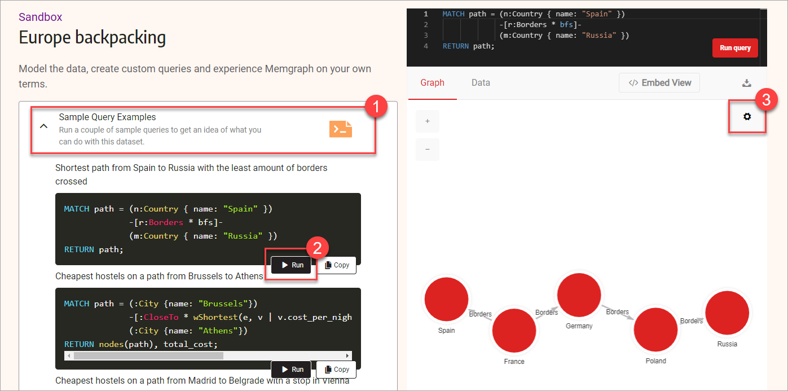
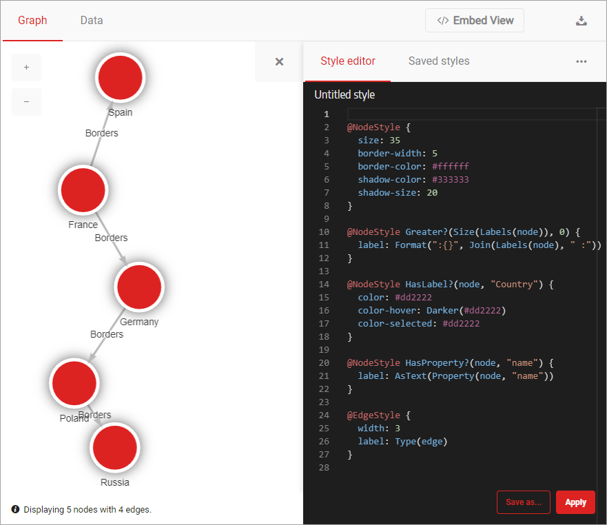
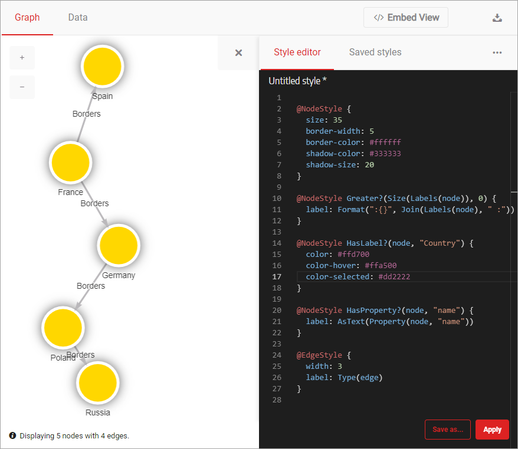
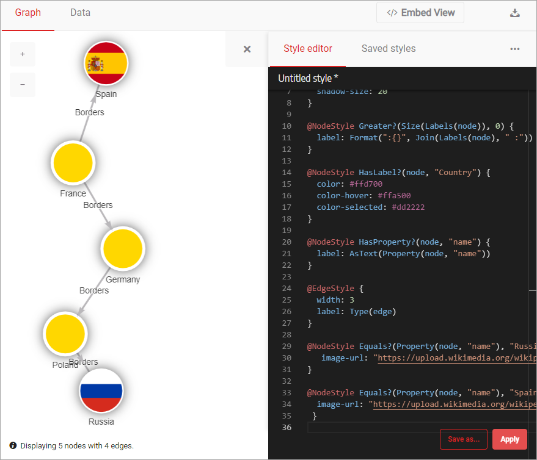
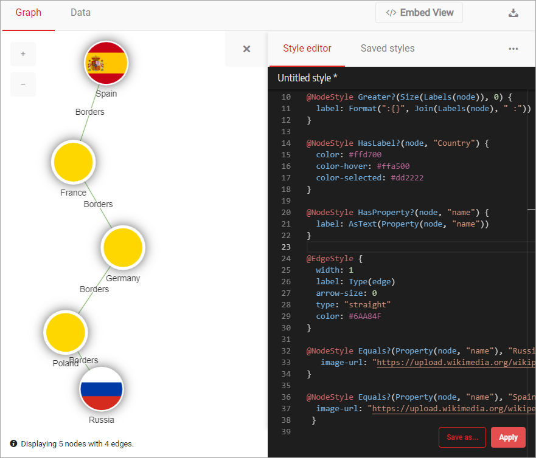
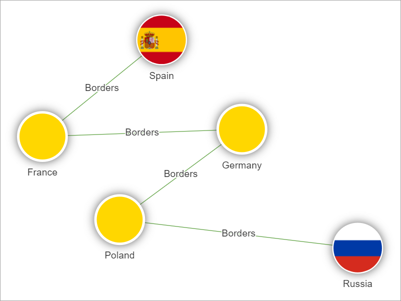

[](https://memgraph.com/blog/how-to-style-your-graphs-in-memgraph-lab)

In this tutorial, you'll learn how to use **Style script** to add style to your
graphs. You'll use [**Memgraph Cloud**](https://memgraph.com/cloud) or the sandbox
site **Memgraph Playground** that runs **Memgraph Lab** to try out styling
graphs.

## Prerequisites

For this tutorial, there are no particular prerequisites. All you need is a web
browser.

## Step 1 - Connecting to Memgraph Cloud or Memgraph Playground

Memgraph Cloud enables you to read and make changes to the data. It comes with a
14-day free trial upon registration. You can also use Memgraph Playground, but
there you can only read the data, but don't worry, you will be able to complete
the tutorial.

### Memgraph Cloud

1. [Sign up](https://cloud.memgraph.com/) to Memgraph Cloud.
2. Once you finish the registration, log in and [create a new
   project](/memgraph-cloud/cloud-projects#create-a-new-memgraph-cloud-project).
3. Open the project and [connect to it via Memgraph
   Lab](/memgraph-cloud/cloud-connect#connect-with-memgraph-lab).

  

4. In Memgraph Lab, navigate to **Datasets** section and upload the Europe
   backpacking dataset.
5. Run the sample query provided by the Lab. 
6. Open the **Graph Style Editor** tab. 

  

Notice there is code already present in the _Graph Style Editor_. In the next few
steps, you'll learn how to adjust that code to style your graph using colors and
images.

### Memgraph Playground

Open the Memgraph Playground sandbox [Europe
backpacking](https://playground.memgraph.com/sandbox/europe-backpacking). When
the sandbox is loaded, do the following:

1. Expand **Sample Query Examples**.
2. Run the first query to display the shortest path from Spain to Russia.
3. Click the gear icon to open the **Style editor**



Notice there is code already present in the _Style editor_. In the next few
steps, you'll learn how to adjust that code to style your graph using colors and
images.

## Step 2 - Using colors and borders to style graph nodes

With the _Style editor_ in front of you, you are ready to style your graph by
modifying the existing style and adding some new style rules. First, let's
modify the code that defines the node style. Look for this section of the code:

```nocopy
@NodeStyle {
  size: 50
  border-width: 5
  border-color: #ffffff
  shadow-color: #bab8bb
  shadow-size: 6
}
```

This part of the code is called a
[directive](https://memgraph.com/docs/memgraph-lab/style-script/reference-guide#directives),
and it is used to define how the node looks and feels.

To start, make the node smaller but with a larger and darker shadow. Update the
values for properties `size`, `shadow-color`, and `shadow-size`. Set the value
of `size` to `35`, `shadow-color` to `#333333`, and `shadow-size` to `20`. Your
code should now look like this:

```
@NodeStyle {
  size: 35
  border-width: 5
  border-color: #ffffff
  shadow-color: #333333
  shadow-size: 20
}
```

Click **Apply** to see what your graph looks like now.



Now change the color of the nodes from red to gold and make them orange on
hover. Find the following code:

```nocopy
@NodeStyle HasLabel?(node, "Country") {
  color: #dd2222
  color-hover: Darker(#dd2222)
  color-selected: #dd2222
}
```

Update value of the property `color` to `#ffd700` and `color-hover` to
`#ffa500`. The updated code should look like this:

```
@NodeStyle HasLabel(node, "Country") {
  color: #ffd700
  color-hover: #ffa500
  color-selected: #dd2222
}
```

Don't forget to click **Apply** to see your updated graph.



## Step 3 - Add images to the nodes

Now that all the colors and borders are just right, it's time to add images to
the nodes. Let's add them to the first and last node using two different images
from Wikipedia. You'll use a predicate to assign a value to a node with a
specific node value.

To display the two images, add the following code at the end of the style
script:

```
@NodeStyle Equals(Property(node, "name"), "Russia") {
   image-url: "https://upload.wikimedia.org/wikipedia/en/thumb/f/f3/Flag_of_Russia.svg/320px-Flag_of_Russia.svg.png"
}

@NodeStyle Equals(Property(node, "name"), "Spain") {
  image-url: "https://upload.wikimedia.org/wikipedia/en/thumb/9/9a/Flag_of_Spain.svg/320px-Flag_of_Spain.svg.png"
 }
```

Click **Apply** to update the style of your graph. Your graph is looking better
with each step, isn't it?



## Step 4 - Using colors to style graph relationships

With all of the nodes looking just like you wanted them to, it's time to style
the relationships between them. You'll represent your relationships as straight,
thin lines with no arrows. To do that, locate the `@EdgeStyle` directive and the
following code:

```nocopy
@EdgeStyle {
  width: 3
  label: Type(edge)
}
```

Now replace that code with this one:

```
@EdgeStyle {
  width: 1
  label: Type(edge)
  arrow-size: 0
  color: #6AA84F
}
```

Click **Apply** and your relationships will have a new style!



## Step 5 - Checking the final result

We are at the end of this tutorial. Move the nodes around to get the final look.
Your result could look similar to the image below.



The complete styling code for this graph is:

```
@NodeStyle {
  size: 35
  border-width: 5
  border-color: #ffffff
  shadow-color: #333333
  shadow-size: 20
}

@NodeStyle Greater(Size(Labels(node)), 0) {
  label: Format(":{}", Join(Labels(node), " :"))
}

@NodeStyle HasLabel(node, "Country") {
  color: #ffd700
  color-hover: #ffa500
  color-selected: #dd2222
}

@NodeStyle HasProperty(node, "name") {
  label: AsText(Property(node, "name"))
}

@EdgeStyle {
  width: 1
  label: Type(edge)
  arrow-size: 0
  color: #6AA84F
}

@NodeStyle Equals(Property(node, "name"), "Russia") {
   image-url: "https://upload.wikimedia.org/wikipedia/en/thumb/f/f3/Flag_of_Russia.svg/320px-Flag_of_Russia.svg.png"
}

@NodeStyle Equals(Property(node, "name"), "Spain") {
  image-url: "https://upload.wikimedia.org/wikipedia/en/thumb/9/9a/Flag_of_Spain.svg/320px-Flag_of_Spain.svg.png"
 }
```

## Where to next?

In this tutorial, you've learned how to style graphs, nodes and relationships in
particular, using Memgraph Lab. We hope that you had fun going through this
tutorial. You can continue playing in Playground, or even better [download and
install **Memgraph Platform**](/docs/memgraph/installation) on your computer.

To get a taste of some more advanced styling features, head to our blog post
[How to style your graphs in Memgraph
Lab](https://memgraph.com/blog/how-to-style-your-graphs-in-memgraph-lab). Also,
be sure to check out [guide to Style Script
script](/docs/memgraph-lab/graph-style-script-language) or take a deep dive into
the [Graph Style Script reference
guide](/docs/memgraph-lab/style-script/reference-guide) to learn more about the
language.
