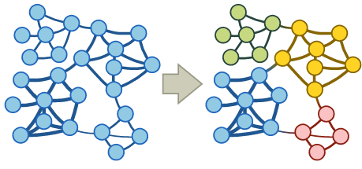
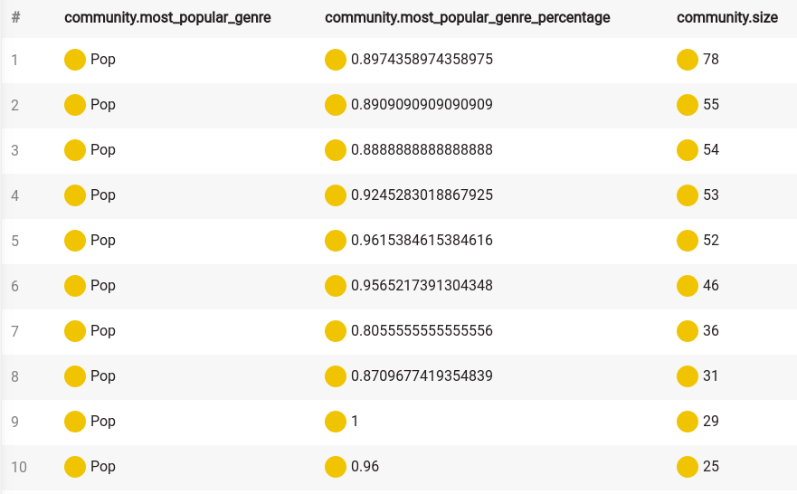

This article is part of a series intended to show users how to use Memgraph on
real-world data and, by doing so, retrieve some interesting and useful
information.

We highly recommend checking out the other articles from this series which are
listed in our [tutorial overview section](/tutorials/overview.md).

## Introduction

Getting useful information from your data is always challenging. With Memgraph,
you can manipulate and extract a huge amount of information by writing queries.
Memgraph even offers a set of built-in graph algorithms. You can use those
algorithms in your queries, extending your power over the data. But what if you
wanted to do more?

At its core, Memgraph "simply" builds a graph from your data. Graphs were always
interesting to scientists and engineers because of their interesting properties
allowing you to represent a specific kind of data in an intuitive way which
makes extracting useful information much easier. A field called graph theory
emerged in mathematics, producing a great number of algorithms, metrics, and
other functions that are applied to the graphs.

Memgraph allows you to use the underlying graph in your functions by using
`Query modules`, and those functions are called procedures. In this tutorial,
we'll see how easy it is to extend the capabilities of Memgraph using Python. It
will also show you how to use one of the most popular Python libraries for
graphs, called [NetworkX](https://networkx.github.io/), which contains an insane
amount of functions and algorithms for the graphs.

To get started, sign up to [Memgraph Cloud](https://memgraph.com/cloud), create
a new instance and connect to it using in-browser Memgraph Lab. If you require
help, check out the [documentation on Memgraph Cloud](/memgraph-cloud). 

You can also install Memgraph using the `memgraph-platform` image by following
the [installment instructions](/installation/overview.mdx) for your OS. Once
Memgraph is up and running, connect to it using **Memgraph Lab**, a visual user
interface that you can also use from your browser at
[`http://localhost:3000`](http://localhost:3000) or [download as an
application](https://memgraph.com/lab).

## Data model

Social graphs is a relatively recent term. Simply said, it's a representation of
a social network. Social networks appear in various sites, e.g., Youtube, which
is primarily a site for watching videos, can be classified as a social network.
For this tutorial, we'll use data consisting of users of the music streaming
platform called [Deezer](https://www.deezer.com/).


The data consists of around 50k Deezer users from Croatia, but we prepared a
subset of the dataset only composed of 2k users. Each user is defined by id and
a list of genres he loved. The edges represent the mutual friendship between the
users. You can find a more detailed explanation of the dataset on the
[GitHub](https://github.com/benedekrozemberczki/datasets#deezer-social-networks)
alongside many more similar datasets kindly provided by the same authors.

## Importing the dataset

To import the dataset navigate to the `Datasets` tab in the sidebar. From there,
choose the dataset `Music genres social network` and continue with the tutorial.

## Example queries and procedures

Memgraph comes with several built-in algorithms. This list is expanded by the
MAGE library, but if the algorithm you require is something completely
different, you can add it yourself as a **query module**.

Let's create a custom query module!

Go to the **Query Modules** section in Memgraph Lab and click on the *+ New
Module* button. Give it a name, such as *deezer_example* and *Create* it. A new
query module will be created with example procedures. Feel free to erase them
and copy the following code into it that will define a procedure called
`genre_count`:

```python
import mgp


@mgp.read_proc
def genre_count(context: mgp.ProcCtx,
                genre: str) -> mgp.Record(genre=str, count=int):
    count = len(
        [v for v in context.graph.vertices if genre in v.properties['genres']])
    return mgp.Record(genre=genre, count=count)
```

Click *Save* and you should be able to see the procedure and its signature as
*Detected procedures & transformations*. 

We can notice multiple things:

- import of the `mgp` module which contains helper functions and types for
  defining custom procedures
- `@mgp.read_proc` decorator which marks the function as a procedure
- every argument is annotated with a type
- result is defined as an object of `mgp.Record` which also has annotated types
  of its members

This example is probably not that interesting to you because we can get the same
result using the following query:

```cypher
MATCH (n)
WITH n, "Pop" AS genre
WHERE genre IN n.genres
RETURN genre, count(n);
```

Let's try something more interesting. The genres are listed in the order the
users have added them. If we assume that users picked the genres in order of
preference, let's write a function that tells us in what percentage each genre
appears in top n places. Add the following code:

```python
from collections import defaultdict


@mgp.read_proc
def in_top_n_percentage(context: mgp.ProcCtx,
                        n: int) -> mgp.Record(genre=str,
                                              percentage=float,
                                              size=int):
    genre_count = defaultdict(lambda: {'total_count': 0, 'in_top_n_count': 0})

    for v in context.graph.vertices:
        for index, genre in enumerate(v.properties['genres']):
            genre_count[genre]['total_count'] += 1
            genre_count[genre]['in_top_n_count'] += index < n

    def get_record(genre, counts): return mgp.Record(
        genre=genre,
        percentage=counts['in_top_n_count'] / counts['total_count'],
        size=counts['total_count']
    )

    return [get_record(
        genre,
        counts) for genre,
        counts in genre_count.items()]
```

*Save and close* the window then move to the *Query Execution* section to use the
procedure.

Let's see what we get:

```cypher
CALL deezer_example.in_top_n_percentage(3)
YIELD *
WITH genre, percentage, size
WHERE size > 10
RETURN genre, percentage, size
ORDER BY percentage DESC;
```

As said in the introduction, we want to use the power of the graphs to extract
some useful information from our data which would be otherwise impossible. Most
of those functions are complex and writing them from scratch would be tedious.
As every modern programmer, we'll just use a package that has everything we need
and more. To be precise, we'll be using `NetworkX` that has a huge amount of
utility functions and graph algorithms implemented.

To use `NetworkX` algorithms we need to transform our graph to a type `NetworkX`
recognizes. In our case, we need to use an undirected graph `networkX.Graph`. To
make our lives easier, let's write a helper function that transforms Memgraph
graph to `networkX.Graph`.

Go back to the *Query Modules* section, find the *deezer_example* query module,
click on the arrow on the right to see its details, then edit it by adding the
following code:

```python
import networkx as nx
import networkx.algorithms as nxa
import itertools


def _create_undirected_graph(context: mgp.ProcCtx) -> nx.Graph:
    g = nx.Graph()

    for v in context.graph.vertices:
        context.check_must_abort()
        g.add_node(v)

    for v in context.graph.vertices:
        context.check_must_abort()
        for e in v.out_edges:
            g.add_edge(e.from_vertex, e.to_vertex)

    return g
```

Now let's get some information about the graph. As our data represents social
network we would like to know if it has [bridges](https://tinyurl.com/y3angsdb)
and we would like to calculate the [average
clustering](https://en.wikipedia.org/wiki/Clustering_coefficient).

```python
@mgp.read_proc
def analyze_graph(
        context: mgp.ProcCtx) -> mgp.Record(
        average_clustering=float,
        has_bridges=bool):
    g = _create_undirected_graph(context)
    return mgp.Record(
        average_clustering=nxa.average_clustering(g),
        has_bridges=nxa.has_bridges(g))
```

*Save and close* the window then move to the *Query Execution* section to use the
procedure:

```cypher
CALL deezer_example.analyze_graph()
YIELD *;
```

Another interesting property of a node in a graph is its
[centrality](https://en.wikipedia.org/wiki/Centrality). Centrality tells us how
important a node is for a graph. In our case, it would mean higher the
centrality, the more popular the user is. Let's find out which user is the most
popular in our network and take a peek at his/her music taste. We will use the
[betweenness centrality](https://en.wikipedia.org/wiki/Betweenness_centrality).
Edit the query module by adding the following code: 

```python
@mgp.read_proc
def betweenness_centrality(
        context: mgp.ProcCtx) -> mgp.Record(node=mgp.Vertex,
                                            centrality=mgp.Number):
    g = _create_undirected_graph(context)
    return [mgp.Record(node=node, centrality=centrality)
            for node,
            centrality in nxa.centrality.betweenness_centrality(g).items()]
```

Now let's take a look at the results:

```
CALL deezer_example.betweenness_centrality()
YIELD *
RETURN node.id, node.genres, centrality
ORDER BY centrality DESC
LIMIT 10;
```

:::info

Calculating betweenness centrality for each node can take some time to finish.
The issue of the slow `NetworkX` implementations is something Memgraph tackled
by implementing a custom betweenness centrality algorithm within the MAGE library. 

:::

For our last trick, let's try to locate communities inside our network.
Communities are a set of nodes that are densely connected. The goal of the
community detection algorithms can be nicely described with the next
visualization: 

As for centrality, there are multiple algorithms for finding communities in a
graph. We will write a function that takes a method for calculating communities,
uses it to find the communities, and, optionally, calculates some metrics
specific to the graph partitioning so we can compare algorithms. To make things
more interesting, let's find out which genre is the most popular in the
community and return the percentage which tells us how many of the users have
that genre on their list. In the end, music is something that connects us! Edit
the query module by adding the following code: 

```python
def _get_communities(
        context: mgp.ProcCtx,
        community_function,
        calculate_quality: bool):
    g = _create_undirected_graph(context)

    communities = list(community_function(g))

    if calculate_quality:
        quality = {
            'coverage': nxa.community.quality.coverage(g, communities),
            'modularity': nxa.community.quality.modularity(g, communities),
            'performance': nxa.community.quality.performance(g, communities)
        }
    else:
        quality = {}

    communities = [list(community) for community in communities]

    def get_community_info(community):
        info = {
            'size': len(community),
        }

        genre_count = defaultdict(lambda: 0)
        for genre in itertools.chain(
                *[user.properties["genres"] for user in community]):
            genre_count[genre] += 1

        if len(genre_count) != 0:
            mpg = max(
                genre_count.items(),
                key=lambda item: item[1])

            info['most_popular_genre'] = mpg[0]
            info['most_popular_genre_percentage'] = mpg[1] / info['size']

        return info

    return mgp.Record(communities=[get_community_info(c)
                                   for c in communities], quality=quality)
```

Now that we have our function in place let's test some algorithms. We will be
checking out community detection using [greedy modularity maximization by
Clauset-Newman-Moore](https://networkx.github.io/documentation/latest/reference/algorithms/generated/networkx.algorithms.community.modularity_max.greedy_modularity_communities.html#networkx.algorithms.community.modularity_max.greedy_modularity_communities)
and [label
propagation](https://networkx.github.io/documentation/latest/reference/algorithms/generated/networkx.algorithms.community.label_propagation.label_propagation_communities.html#networkx.algorithms.community.label_propagation.label_propagation_communities). Edit the query module by adding the following code: 

```python
@mgp.read_proc
def greedy_modularity_communities(
        context: mgp.ProcCtx,
        calculate_quality: bool = False) -> mgp.Record(
        communities=list,
        quality=mgp.Map):
    return _get_communities(
        context,
        nxa.community.greedy_modularity_communities,
        calculate_quality)


@mgp.read_proc
def label_propagation_communities(
        context: mgp.ProcCtx,
        calculate_quality: bool = False) -> mgp.Record(
        communities=list,
        quality=mgp.Map):
    return _get_communities(
        context,
        nxa.community.label_propagation_communities,
        calculate_quality)
```

In the above snippet, we can notice an optional argument `calculate_quality` and
usage of the type `mgp.Map` which is provided by Memgraph.

Let's see the results with:

```cypher
CALL deezer_example.greedy_modularity_communities()
YIELD communities
UNWIND communities as community
WITH community
WHERE community.size > 10
RETURN community.most_popular_genre, community.most_popular_genre_percentage, community.size
ORDER BY community.size DESC;
```

and

```cypher
CALL deezer_example.label_propagation_communities()
YIELD communities
UNWIND communities AS community
WITH community
WHERE community.size > 10
RETURN community.most_popular_genre, community.most_popular_genre_percentage, community.size
ORDER BY community.size DESC;
```

Your results should look something like this:


Hmm, `Pop` sure is popular. Let's ignore that genre in the code:

```python
for genre in itertools.chain(
        *[user.properties["genres"] for user in community]):
    if genre != 'Pop':
        genre_count[genre] += 1
```

and call our procedures again for each algorithm. Well, people always liked to
dance!

We saw the biggest communities in our network using two different methods. It's
hard to say which of the methods did better so let's check a couple of metrics
by calling the same procedure with `calculate_quality` set to true:

```cypher
CALL deezer_example.greedy_modularity_communities(true)
YIELD communities, quality
RETURN quality;
```

and

```cypher
CALL deezer_example.label_propagation_communities(true)
YIELD communities, quality
RETURN quality;
```

I think it should come as no surprise that an algorithm that maximizes
modularity has higher modularity...

## Optimized NetworkX integration

As noted before, we at Memgraph are aware of NetworkX's potential but the
performance for some functions isn't that good. We decided to tackle this
problem by writing a wrapper object for Memgraph's graph and with smarter usage
of NetworkX algorithms. To make things even more convenient, we decided to
implement procedures that call NetworkX functions with our graphs, so you have
out-of-the-box access to the graph algorithms. NetworkX contains a huge amount
of functions, and writing procedures for all of them require insane effort, so
don't blame us if some of the algorithms aren't available. We are always open to
any feedback, so if you think that an implementation for an algorithm is needed,
we will surely take that into account.

To demonstrate performance improvement, we will calculate the betweenness
centrality again, this time by using Memgraph's procedure.

To get access to the NetworkX procedures, start your Memgraph server without
modifying the query modules directory path. That way, the path will be set to
the default path, which contains `nxalg` module.

Now let's call the procedure:

```cypher
CALL nxalg.betweenness_centrality()
YIELD *
RETURN node.id, node.genres, betweenness
ORDER BY betweenness DESC
LIMIT 10;
```

You should get the same results as with our previous procedure for the
betweenness centrality but in much less time.

## Further reading

We encourage you to take a look at our [How to
Implement Query
Modules](/reference-guide/query-modules/implement-custom-query-modules/custom-query-module-example.md) how-to guide.

This tutorial showed you how with a little effort you can extend your control
over the data. Using packages like `NetworkX` you get a huge amount of already
implemented graph algorithms while Memgraph allows you complete access to its
internal graph.

If you want to learn more about how to use Memgraph with NetworkX, check out the [**Memgraph for NetworkX developers resources**](https://memgraph.com/memgraph-for-networkx?utm_source=networkx-guide&utm_medium=referral&utm_campaign=networkx_ppp&utm_term=docs%2Btutorialmusic&utm_content=resources).
