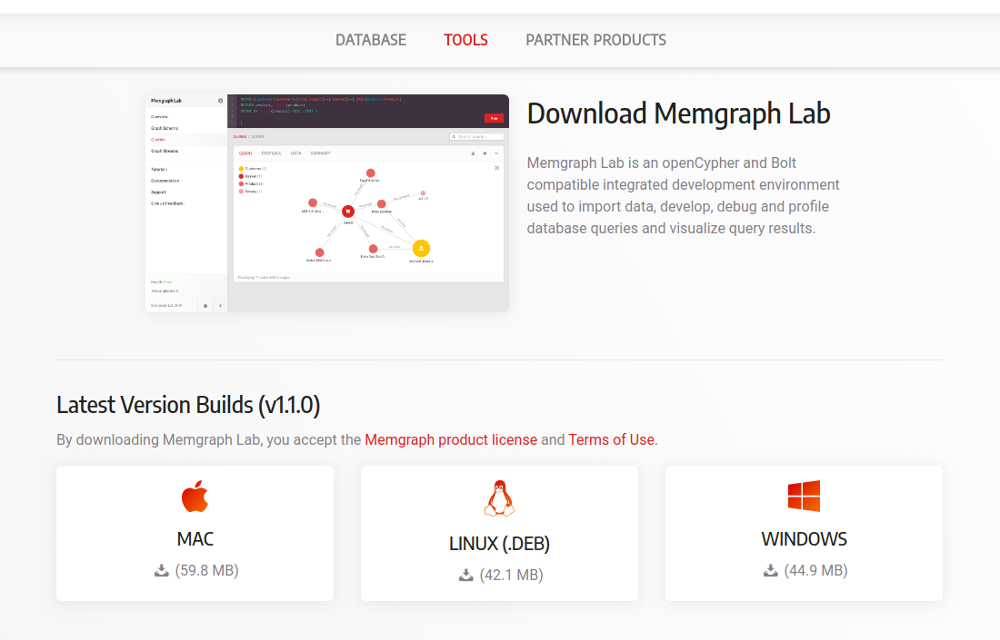

# How to Install Memgraph Lab on MacOS

# Prerequisites

* You will need a macOS computer running High Sierra or higher with
  administrative access and an internet connection.
* You will need Docker version 1.12 or later installed on your macOS computer.
  Instructions on how to install Docker on macOS can be found
[here](https://docs.docker.com/docker-for-mac/install).

## Step 1 - Download and Install Memgraph

Docker is the easiest way to run Memgraph. Once you have successfully installed
Docker, you will now install the Memgraph Docker image and import it.  Download
the latest version of the Memgraph Docker Image by visiting [the download
page](https://memgraph.com/download).


Next, you want to import the Memgraph Docker Image using the following command
on your macOS Terminal.

```bash
docker load -i /path/to/memgraph-<version>-docker.tar.gz
```

You are now ready to launch Memgraph. Run the following Docker command in your
macOS Terminal

```bash
docker run -p 7687:7687 -v mg_lib:/var/lib/memgraph -v mg_log:/var/log/memgraph -v mg_etc:/etc/memgraph memgraph
```

Note: If you previously ran older versions of Memgraph, you might receive the
following error message

```bash
F0102 11:24:08.191903 1] Check failed: durability::VersionConsistency(config_.durability_directory) Contents of durability directory are not compatible with the current version of Memgraph binary!
```

This is due to the fact that older durability versions are not backward
compatible with newer versions of Memgraph. To solve this issue, run the
following command

```bash
docker run -p 7687:7687 -v mg_lib_<version>:/var/lib/memgraph -v mg_log_<version>:/var/log/memgraph -v mg_etc_<version>:/etc/memgraph memgraph:<version>
```

Awesome! You now have Memgraph installed and running on your computer.

## Step 2 - Installing and Setting up Memgraph Lab

Download Memgraph Lab by visiting [the download
page](https://memgraph.com/download/#tools).



Once you have Memgraph Lab installed, run the app and you should be presented
with a connect screen. The username and password fields are only for Memgraph
Enterprise users and are not required if you’re using Memgraph Core.

The default connection string set to `bolt://localhost:7687`. If you're using a
different port you will have to change the connection string to point to that
port. i.e. `bolt://localhost:<your port number>`

Click on connect and you should be presented with the following dashboard:


Note: You might receive the following error message when trying to connect into
Memgraph Lab


In this case, make sure that Memgraph is properly up and running with Docker
and that you have entered the right port number.

Congratulations! You have successfully installed Memgraph Lab and connected it
to Memgraph. You are now ready to start building your graph and queries.

## Step 3 - Create a Simple Graph

Let’s create a simple graph and run some queries. This will make sure
everything is running properly.

Go to the "Queries" tab or click the "+" Icon, enter the following openCypher
query and click "Run".

```opencypher
CREATE (u:User {name: "Alice"})-[:Likes]->(m:Software {name: "Memgraph"});
```

You just created 2 nodes in the database, one labeled "User" with a name
"Alice" and the other labeled "Software" with a name "Memgraph". Between them,
you also created a relationship indicating that "Alice" likes "Memgraph".

Now that the data is stored inside Memgraph, you can run a query to retrieve
and visualize the graph. Click and the "+" icon, input the following query and
hit "Run"

```opencypher
MATCH (u:User)-[r]->(x) RETURN u, r, x;
```

You should get the following result:


Now that you know your development environment is working, you are ready to
continue exploring Memgraph, and building much more interesting projects
leveraging connected data.

## Conclusion

In this tutorial, you have successfully installed Memgraph Lab on your macOS
machine and ran a simple graph project to make sure everything is working.
