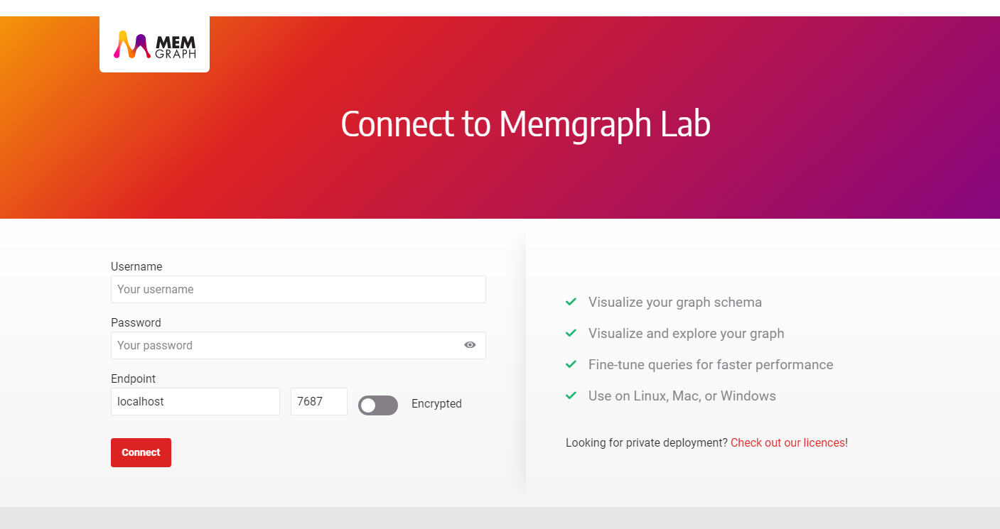

## Querying the database with Memgraph Lab

This article outlines the basic steps necessary to query a running Memgraph database instance from **Memgraph Lab**.

### Prerequisites
Before you proceed with the guide, make sure that you have:
* Installed the latest version of **Memgraph Lab** which you can get from the official [download page](https://memgraph.com/download/).
* A running Memgraph database instance. Instructions on how to do setup Memgraph can be [found here](../../memgraph/v1.2.0/getting_started/installation/installation.md).

### Connecting to the database

Make sure that Memgraph is running and open Memgraph Lab.
If you are starting with a fresh database instance, you don't have to change any of the options.

1. Leave the `Username` and `Password` fields **empty**.
2. The `Host` field can be either **`localhost`**, **`127.0.0.1`** or **`0.0.0.0`**.
3. The `Port` field should be **`7687`**. Every Memgraph instance is listening on this port by default.
4. The `Encrypted` option should be **disabled** by default.

If you fail to connect, make sure that your database instance is up and running. 
If the `Host` address is wrong, take a look at the [Docker Note](../../memgraph/v1.2.0/getting_started/installation/docker-installation.md#docker-note) in the installation guide.



### Executing queries

Now, you can execute Cypher queries on Memgraph.
Open the **Query** tab, located in the left sidebar, copy the following query and press the **Run query** button:

```opencypher
CREATE (u:User {name: "Alice"})-[:Likes]->(m:Software {name: "Memgraph"});
```

The query above will create 2 nodes in the database, one labeled "User" with name
"Alice" and the other labeled "Software" with name "Memgraph". It will also
create a relationship that "Alice" *likes* "Memgraph".

To find created nodes and relationships, execute the following query:

```opencypher
MATCH (u:User)-[r]->(x) RETURN u, r, x;
```

### Where to next?

To learn more about the **Cypher** language, visit the **[Cypher manual](../../memgraph/v1.2.0/cypher_manual/cypher-manual.md)** or **[Memgraph Playground](https://playground.memgraph.com/)** for interactive guides.
For real-world examples of how to use Memgraph, we strongly suggest going through one of the available **[Tutorials](../../memgraph/v1.2.0/tutorials/tutorials.md)**. 
Details on what can be stored in Memgraph can be found in the article about **[Data storage](../../memgraph/v1.2.0/concepts/storage.md)**.

### Getting help

Visit the **Getting help** page in case you run into any kind of problem or you have additional questions.
