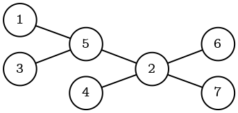
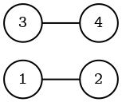
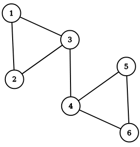
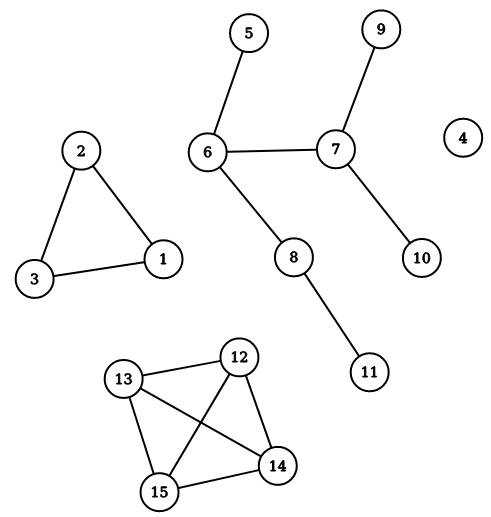

## How to Use Query Modules Provided by Memgraph?

Memgraph supports extending the query language with user-written procedures.
These procedures are grouped into modules, which can be loaded either on startup
or afterwards using the built-in utility module.

### Utility Query Module

Query procedures that allow the users to gain more insight into other query
modules and their procedures are written under our utility `mg` query module.
This module offers three procedures with the following signatures:

* `mg.procedures() :: (name :: STRING, signature :: STRING)`: lists loaded
  procedures and their signatures
* `mg.load(module_name :: STRING) :: ()`: loads or reloads the given module
* `mg.load_all() :: ()`: loads or reloads all modules

For example, invoking `mg.procedures()` from openCypher like so:

```opencypher
CALL mg.procedures() YIELD *;
```

might yield the following result:

```plaintext
+---------------------+-------------------------------------------------------------------+
| name                | signature                                                         |
+---------------------+-------------------------------------------------------------------+
| louvain.communities | louvain.communities() :: (community :: INTEGER, id :: INTEGER)    |
| louvain.modularity  | louvain.modularity() :: (modularity :: FLOAT)                     |
| mg.procedures       | mg.procedures() :: (name :: STRING, signature :: STRING)          |
| mg.load             | mg.load(module_name :: STRING) :: ()                              |
| mg.load_all         | mg.load_all() :: ()                                               |
+---------------------+-------------------------------------------------------------------+
```

In this case, we can see that Memgraph has successfully loaded all utility query
procedures as well as two additional procedures from the `louvain` query module.
This module is included in Memgraph's Enterprise offering.

To load a module (named e.g. `hello`) that wasn't loaded on startup (perhaps
because it was added to Memgraph's query modules directory after the fact), we
can simply invoke:

```opencypher
CALL mg.load("hello");
```

If we wish to reload an existing module, say the `louvain` module above, we
again use the same procedure:

```opencypher
CALL mg.load("louvain");
```

Lastly, if we wish to reload all existing modules and load any newly added ones
we can use:

```opencypher
CALL mg.load_all();
```

### Community Graph Algorithms as Query Modules

Memgraph Community edition comes with a set of Python query modules based on
the [NetworkX](https://networkx.github.io/) library of algorithms. The modules
are already packaged within all Memgraph packages, but `NetworkX` might have to
be installed by running the following command:

```
pip3 install networkx
```

NOTE: The following "How to Guides" provide explanation of basic usage. To find
out more details about each module and documentation of each procedure, please
take a look at installed Python files. On Linux, the files are located in
`/usr/lib/memgraph/query_modules`.

#### Graph Analyzer

The purpose of this module is to get more insights about the stored graph. To
illustrate functionality the following graph will be used:



To create the graph, the following query should be executed:

```opencypher
CREATE (n1)
CREATE (n2)
CREATE (n3)
CREATE (n4)
CREATE (n5)
CREATE (n6)
CREATE (n7)
CREATE (n1)-[:e]->(n5)
CREATE (n3)-[:e]->(n5)
CREATE (n5)-[:e]->(n2)
CREATE (n4)-[:e]->(n2)
CREATE (n2)-[:e]->(n6)
CREATE (n2)-[:e]->(n7);
```

To analyze the whole graph, let's run the following query:

```opencypher
CALL graph_analyzer.analyze() YIELD *;
```

Results should be similar to the ones below.

```bash
+-------------------------------------------+-------------------------+
| name                                      | value                   |
+-------------------------------------------+-------------------------+
| "Number of nodes"                         | "7"                     |
| "Number of edges"                         | "6"                     |
| "Number of bridges"                       | "6"                     |
| "Number of articulation points"           | "2"                     |
| "Average degree"                          | "0.8571428571428571"    |
| "Sorted nodes degree"                     | "[(16, 4),(19, 3), ..." |
| "Self loops"                              | "0"                     |
| "Is bipartite"                            | "True"                  |
| "Is planar"                               | "True"                  |
| "Is biconnected"                          | "False"                 |
| "Is weakly connected"                     | "True"                  |
| "Number of weakly connected components"   | "1"                     |
| "Is strongly connected"                   | "False"                 |
| "Number of strongly connected components" | "7"                     |
| "Is DAG"                                  | "True"                  |
| "Is eulerian"                             | "False"                 |
| "Is forest"                               | "True"                  |
| "Is tree"                                 | "True"                  |
+-------------------------------------------+-------------------------+
```

To analyze a sub-graph, relevant nodes and edges have to be collected by
combining `MATCH` and `WITH` clauses. Once everything is collected,
`analyze_subgraph` procedure can be called as follows:

```opencypher
MATCH (n)-[e]->(m) WITH collect(n) as nodes, collect(e) as edges
CALL graph_analyzer.analyze_subgraph(nodes, edges) YIELD name, value
RETURN name, value;
```

#### Weakly Connected Components

The `wcc.py` query module can run
[WCC](https://mathworld.wolfram.com/WeaklyConnectedComponent.html) analysis on
a sub-graph of the whole graph. To illustrate the number of weakly connected
components and nodes within each component, the following graph will be used:



To create the graph, run the following query:

```opencypher
CREATE (n1 {id: 1})
CREATE (n2 {id: 2})
CREATE (n3 {id: 3})
CREATE (n4 {id: 4})
CREATE (n1)-[:e]->(n2)
CREATE (n3)-[:e]->(n4);
```

The following query will do the calculation:

```opencypher
MATCH (n)-[e]->(m) WITH collect(n) as nodes, collect(e) as edges
CALL wcc.get_components(nodes, edges) YIELD components, n_components
RETURN components, n_components;
```

Expected result follows:

```
+--------------------------------------------------+--------------+
| components                                       | n_components |
+--------------------------------------------------+--------------+
| [[({id: 1}), ({id: 2})], [({id: 3}), ({id: 4})]] | 2            |
+--------------------------------------------------+--------------+
```

Please keep in mind that after the `MATCH` clause there can be a `WHERE` clause
with an arbitrary expression to further filter matched set of results.

### Low-level Optimized Graph Algorithms as Query Modules [Enterprise]

If you have purchased Memgraph's Enterprise edition, you have access to
certain graph algorithms in the form of query modules. These modules were
implemented by our own team using C++ and should offer some additional
performance benefits. Currently we have implemented the following algorithms:

* Louvain algorithm for community detection.
* Weakly connected components.

#### Louvain Algorithm for Community Detection

In essence, this algorithm is a heuristic method which can be used to extract
the community structure of fairly sizeable networks. In the simplest of terms,
the algorithm attempts to assign graph nodes to communities in a way which
maximizes the so-called [modularity
measure](https://en.wikipedia.org/wiki/Modularity_(networks)). For more details,
we advise you to study the [original paper](https://arxiv.org/pdf/0803.0476.pdf).

This query module should be provided as a shared object (`.so`) file called
`louvain.so`. Assuming the standard installation on Debian, that file should be
located in `/usr/lib/memgraph/query_modules`. Again, we can simply run Memgraph with
the following command:

```plaintext
systemctl start memgraph
```

When using Docker, the equivalent would be the following:

```plaintext
docker run -p 7687:7687 \
  -v mg_lib:/var/lib/memgraph -v mg_log:/var/log/memgraph -v mg_etc:/etc/memgraph \
  memgraph
```

Suppose that Memgraph is currently storing a graph as depicted on the figure
below where numbers in the vertices are stored as properties in the graph.



To create the above graph, execute the following query:

```opencypher
CREATE (n1 {number: 1})
CREATE (n2 {number: 2})
CREATE (n3 {number: 3})
CREATE (n4 {number: 4})
CREATE (n5 {number: 5})
CREATE (n6 {number: 6})
CREATE (n1)-[:e]->(n2)
CREATE (n1)-[:e]->(n3)
CREATE (n2)-[:e]->(n3)
CREATE (n3)-[:e]->(n4)
CREATE (n4)-[:e]->(n5)
CREATE (n4)-[:e]->(n6)
CREATE (n5)-[:e]->(n6);
```

Let's run the following query:

```opencypher
CALL louvain.communities() YIELD community, id;
```

We should get a result similar to:

```plaintext
+-----------+-----------+
| community | id        |
+-----------+-----------+
| 1         | 5         |
| 1         | 4         |
| 1         | 3         |
| 0         | 2         |
| 0         | 0         |
| 0         | 1         |
+-----------+-----------+
```

The procedure returns mappings from internal node IDs to communities. In order
to return the nodes instead of the IDs you should execute the following query:

```opencypher
CALL louvain.communities() YIELD community, id MATCH (n) WHERE ID(n) = id RETURN community, n;
```

We should observe the following result:

```plaintext
+---------------+---------------+
| community     | n             |
+---------------+---------------+
| 1             | ({number: 6}) |
| 1             | ({number: 5}) |
| 1             | ({number: 4}) |
| 0             | ({number: 3}) |
| 0             | ({number: 1}) |
| 0             | ({number: 2}) |
+---------------+---------------+
```

As you can see, vertices numbered 1, 2 and 3 belong to one community, while
vertices numbered 4, 5 and 6 belong to another community.

If you wish to know the exact graph modularity after running Louvain, you can
run the following query:

```opencypher
CALL louvain.modularity() YIELD modularity;
```

In our example, the result should be:

```plaintext
+------------+
| modularity |
+------------+
| 0.357143   |
+------------+
```

If you wish, you can model the "strength of connection" between two nodes by
specifying the weight of that edge. To do that, you need to add a property on
that edge named `weight` which stores a real value. Naturally, larger weights
correspond to stronger connections. If you don't explicitly specify the weight
of a certain edge, its weight will internally default to `1`. It's also
important to note that weights are internally represented as 64-bit floating
point numbers.

Finally, we should also state that the runtime of this algorithm (assuming we
let it run until convergence) is not known. It merely appears to run in
O(nlog(n)).

#### Weakly Connected Components

One of the most important features you might be interested when exploring a
certain graph is its connectivity. There are many ways in which we might express
to which extent we are interested in the connectivity of a graph, but one of the
simplest ones is by counting the number of its weakly connected components and
by determining which vertex corresponds to which connected component.

The concept of weakly connected components is natural and simple, two nodes
belong to the same component if path between them exists in a given graph.
Otherwise, we say those nodes are disconnected.

This query module should be provided as a shared object (`.so`) file called
`connectivity.so`. Assuming the standard installation on Debian, that file
should be located in `/usr/lib/memgraph/query_modules`. Again, we can simply run
Memgraph with the following command:

```plaintext
systemctl start memgraph
```

When using Docker, the equivalent would be the following:

```plaintext
docker run -p 7687:7687 \
  -v mg_lib:/var/lib/memgraph -v mg_log:/var/log/memgraph -v mg_etc:/etc/memgraph \
  memgraph
```

Suppose that Memgraph is currently storing a graph as depicted on the figure
below where numbers in the vertices are stored as properties in the graph.
This graph obviously has 4 weakly connected components.



To create the above graph, execute the following query:

```opencypher
CREATE (n1 {number: 1})
CREATE (n2 {number: 2})
CREATE (n3 {number: 3})
CREATE (n4 {number: 4})
CREATE (n5 {number: 5})
CREATE (n6 {number: 6})
CREATE (n7 {number: 7})
CREATE (n8 {number: 8})
CREATE (n9 {number: 9})
CREATE (n10 {number: 10})
CREATE (n11 {number: 11})
CREATE (n12 {number: 12})
CREATE (n13 {number: 13})
CREATE (n14 {number: 14})
CREATE (n15 {number: 15})
CREATE (n1)-[:e]->(n2)
CREATE (n1)-[:e]->(n3)
CREATE (n2)-[:e]->(n3)
CREATE (n5)-[:e]->(n6)
CREATE (n6)-[:e]->(n7)
CREATE (n6)-[:e]->(n8)
CREATE (n7)-[:e]->(n9)
CREATE (n7)-[:e]->(n10)
CREATE (n8)-[:e]->(n11)
CREATE (n12)-[:e]->(n13)
CREATE (n12)-[:e]->(n14)
CREATE (n12)-[:e]->(n15)
CREATE (n13)-[:e]->(n14)
CREATE (n13)-[:e]->(n15)
CREATE (n14)-[:e]->(n15);
```

Let's run the following query:

```opencypher
CALL connectivity.weak() YIELD component, id;
```

We should get a result similar to:

```plaintext
+-----------+-----------+
| component | id        |
+-----------+-----------+
| 3         | 14        |
| 3         | 13        |
| 3         | 12        |
| 3         | 11        |
| 2         | 10        |
| 2         | 9         |
| 2         | 8         |
| 2         | 7         |
| 2         | 6         |
| 0         | 1         |
| 0         | 0         |
| 0         | 2         |
| 1         | 3         |
| 2         | 4         |
| 2         | 5         |
+-----------+-----------+
```

The procedure returns mappings from internal node IDs to components. In order
to return the nodes instead of the IDs you should execute the following query:

```opencypher
CALL connectivity.weak() YIELD component, id MATCH (n) WHERE ID(n) = id RETURN component, n;
```

We should observe the following result:

```plaintext
+----------------+----------------+
| component      | n              |
+----------------+----------------+
| 3              | ({number: 15}) |
| 3              | ({number: 14}) |
| 3              | ({number: 13}) |
| 3              | ({number: 12}) |
| 2              | ({number: 11}) |
| 2              | ({number: 10}) |
| 2              | ({number: 9})  |
| 2              | ({number: 8})  |
| 2              | ({number: 7})  |
| 0              | ({number: 2})  |
| 0              | ({number: 1})  |
| 0              | ({number: 3})  |
| 1              | ({number: 4})  |
| 2              | ({number: 5})  |
| 2              | ({number: 6})  |
+----------------+----------------+
```

As expected, nodes numbered 1, 2, and 3 are all in one connected component,
node numbered 4 is in its own component, nodes numbered 5, 6, 7, 8, 9, 10 and
11 are in another component and, finally, nodes numbered 12, 13, 14 and 15 are
in the last component.

### NetworkX Algorithms Module

In addition to standalone community graph algorithms implemented as Python
modules, we implemented a module providing NetworkX integration with Memgraph.
This module, named nxalgo, provides a comprehensive set of thin wrappers
around most of the algorithms present in the NetworkX package. The wrapper
functions now have the capability to create a NetworkX compatible graph-like
object that can stream the native database graph directly, functions, saving
on memory usage significantly.

For example, you can run the [Page Rank](https://en.wikipedia.org/wiki/PageRank)
algorithm on the data stored in Memgraph. To illustrate the functionality, the
following graph will be used:


To load the graph into Memgraph, the following query should be used:

```opencypher
CREATE (na {name: "Page A"})
CREATE (nb {name: "Page B"})
CREATE (nc {name: "Page C"})
CREATE (nd {name: "Page D"})
CREATE (na)-[:e]->(nb)
CREATE (na)-[:e]->(nc)
CREATE (nc)-[:e]->(na)
CREATE (nb)-[:e]->(nc)
CREATE (nd)-[:e]->(nc);
```

By executing `nxalg.pagerank()`, Memgraph will return the rank for each
node as follows:

```opencypher
CALL nxalg.pagerank() YIELD *;
+--------------------+----------+
| node               | rank     |
+--------------------+----------+
| ({name: "Page C"}) | 0.39415  |
| ({name: "Page D"}) | 0.0375   |
| ({name: "Page A"}) | 0.372526 |
| ({name: "Page B"}) | 0.195824 |
+--------------------+----------+
```

NetworkX algorithms are located inside the `nxalg.py` file installed with
your Memgraph package in `/usr/lib/memgraph/query_modules`.
