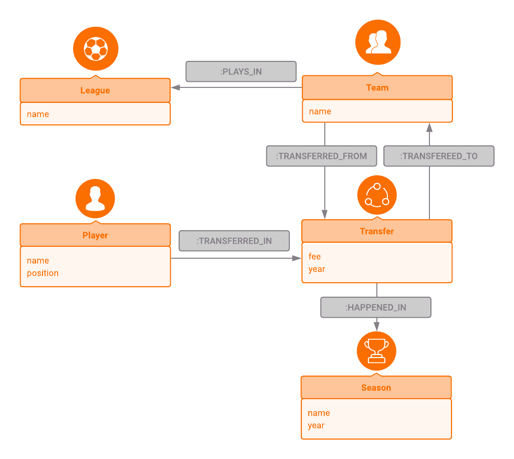
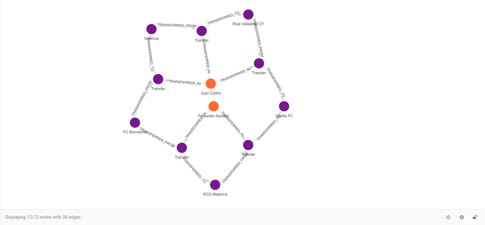

## Football transfers

This article is a part of a series intended to show how to use Memgraph
on real-world data to retrieve some interesting and useful
information.

We highly recommend checking out the other articles from this series which
are listed in our [tutorial overview section](tutorials.md).

### Introduction

Football is a word that could mean one of several sports. In this article,
we are referring to the best-known type of football, association football.
In North America, South Africa, and Australia, to avoid confusion with other
types of football, it is called "soccer".

In professional football, a transfer is the action taken whenever a player
under contract moves between teams. It refers to the transferring of
a player's registration from one association football club to another.
In general, the players can only be transferred during a transfer window
and according to the rules. The transfer window is a period during the year
in which a football team can transfer players. There are two transfer windows per season:
winter and summer windows. Winter transfer windows are throughout January while
the summer windows are from July till August.

Usually some sort of compensation is paid for the player's rights,
which is known as a transfer fee. When a player moves from one team to another,
their old contract is terminated and they negotiate a new one with the team
they are moving to. In some cases, however, transfers can function similarly
to player trades, as teams can offer another player on their team as part of the fee.

As you may presume, there is a lot of money involved in the game of transfers. According to FIFA,
in 2018, from January till September, there were 15,626 international transfers
with fees totaling US$ 7.5 billion dollars.

Football season is that part of the year during which football matches are held. A typical football
season is generally from August/September to May, although in some countries, such as Northern Europe
or East Asia, the season starts in the spring and finishes in autumn due to weather conditions encountered
during the winter.


### Data Model

In this article, we will present a graph model of football transfers
from season 1992/1993 to season 2019/2020 in following five leagues:
* English Premier League
* French Ligue 1
* German Bundesliga
* Italian Serie A
* Spanish Primera Division

The model consists of the following nodes:
* `Team` - a football team with a property `name` (e.g. `"FC Barcelona"`).
* `Player` - a professional football player, contains properties `name` (e.g. `"Luka Modric"`)
and `position` (e.g. `"Central Midfield"`).
* `League` - a football league where multiple teams play in, contains one property
`name` (e.g. `"Premier League"`).
* `Transfer` - represents football transfer that connects a `Player`
that is transferred from one `Team` to another `Team`
within a `Season`. Transfer contains one optional property `fee` (e.g. `80.50`)
that represents a transfer fee in millions of euros and one regular property `year` (e.g `1995`)
that represents how old was a player when the transfer occurred.
* `Season` - a football season with two properties `name` (e.g. `"2019/2020"`)
and `year` (e.g. `2019`).

Nodes are connected with the following edges:

* `:TRANSFERRED_FROM` - connects team node `Team` to node `Transfer` representing a team
where the player is being transferred from.
* `:TRANSFERRED_TO` - connects node `Transfer` to team node `Team` where player is being transferred to.
* `:TRANSFERRED_IN` - connects player node `Player` to node `Transfer` representing a player
that was transferred in the connected transfer.
* `:HAPPENED_IN` - connects node `Transfer` to the node `Season` in which transfer has happened.
* `:PLAYS_IN` - connects node `Team` that plays in league node `League`.




### Importing the Snapshot

We have prepared a database snapshot for this example, so you can easily
import it when starting Memgraph using the `--data-directory` option.

```plaintext
sudo -u memgraph \
  /usr/lib/memgraph/memgraph --data-directory /usr/share/memgraph/examples/FootballTransfers \
    --storage-snapshot-interval-sec=0 --storage-wal-enabled=false \
    --storage-snapshot-on-exit=false --storage-properties-on-edges=true
```

When using Memgraph installed from a Debian or RPM package,
the currently running Memgraph server needs to be stopped before
importing the example, using the following command:

```plaintext
systemctl stop memgraph
```

When using Docker, the example can simply be imported with the following command:

```plaintext
docker run -p 7687:7687 \
  -v mg_lib:/var/lib/memgraph -v mg_log:/var/log/memgraph -v mg_etc:/etc/memgraph \
  memgraph --data-directory /usr/share/memgraph/examples/FootballTransfers \
  --storage-snapshot-interval-sec=0 --storage-wal-enabled=false \
  --storage-snapshot-on-exit=false --storage-properties-on-edges=true
```

You should note that any modifications of the database state will persist
only during this run of Memgraph.

### Example Queries using OpenCypher

In the queries below, we are using [OpenCypher](https://www.opencypher.org)
to query Memgraph via the console.

Now when we have a dataset of football transfers from season 1992/1993 to season 2019/2020
loaded in Memgraph, we are ready to gain some information out of it.


1) Let's say you want to find 20 most expensive transfers.
As mentioned before, transfers fees are represented in millions of euros.

```opencypher
MATCH
    (t:Transfer)<-[:TRANSFERRED_IN]-(p:Player)
WHERE
    t.fee is NOT NULL
RETURN ROUND(t.fee) + 'M €' as transfer_fee, p.name AS player_name
ORDER BY t.fee DESC LIMIT 20;
```

2) What about finding the most expensive transfer per season?

```opencypher
MATCH
    (s:Season)<-[:HAPPENED_IN]-(t:Transfer)<-[:TRANSFERRED_IN]-(:Player)
WHERE
    t.fee is NOT NULL
WITH s.name as season_name, MAX(t.fee) as max_fee
RETURN ROUND(max_fee) + 'M €' as max_transfer_fee, season_name
ORDER BY max_fee DESC;
```

3) How about finding out which teams your favorite player has played for?
If you wish to check the teams for another player, replace "Sime Vrsaljko"
with the name of your favorite player.

```opencypher
MATCH
    (player:Player)-[:TRANSFERRED_IN]->(t:Transfer)-[]-(team:Team)
WHERE
    player.name = "Sime Vrsaljko"
WITH DISTINCT team
RETURN team.name AS team_name;
```

You might wonder why we haven't specified a direction in our Cypher traversal with `(:Transfer)-[]-(:Team)`.
As we want to find the teams that player was transferred from (`(:Transfer)<-[]-(:Team)`) and transferred to
(`(:Transfer)-[]->(:Team)`), we want to collect both inbound and outbound connections. In order to do so, we
omit the arrow (`>`, `<`) in our Cypher command.

4) Find players that were transferred to and played for FC Barcelona and
count them by the player game position.

```opencypher
MATCH
    (team:Team)<-[:TRANSFERRED_TO]-(t:Transfer)<-[:TRANSFERRED_IN]-(player:Player)
WHERE
    team.name = "FC Barcelona"
WITH DISTINCT player
RETURN player.position as player_position, COUNT(player) AS position_count, collect(player.name) as player_names
ORDER BY position_count DESC;
```

5) Football has seen a lot of rivalries develop between clubs during its rich and long history.
One of the most famous ones is between fierce rivals FC Barcelona and Real Madrid.
There is a term, El Clasico, for a match between those two teams. Let's find all the transfers between
FC Barcelona and Real Madrid.

```opencypher
MATCH
    (m:Team)-[:TRANSFERRED_FROM]-(t:Transfer)-[:TRANSFERRED_TO]-(n:Team),
    (t)<-[:TRANSFERRED_IN]-(p:Player)
WHERE
    (m.name = "FC Barcelona" AND n.name = "Real Madrid") OR
    (m.name = "Real Madrid" AND n.name = "FC Barcelona")
RETURN m.name as transferred_from_team, p.name as player_name, n.name as transfered_to_team;
```

6) FC Barcelona is one of the most valuable football clubs in the world. Players often want to play there as long as possible.
But what about those players who didn't fit in well? Where do they go?

```opencypher
MATCH
    (m:Team)-[:TRANSFERRED_FROM]->(t:Transfer)<-[:TRANSFERRED_IN]-(p:Player),
    (t)-[:TRANSFERRED_TO]->(n:Team)
WHERE
    m.name = "FC Barcelona"
RETURN n.name as team_name, collect(p.name) as player_names, COUNT(p) AS number_of_players
ORDER BY number_of_players DESC;
```

7) What are the teams that most players went to in season 2003/2004? The results may surprise you.

```opencypher
MATCH
    (season:Season)<-[:HAPPENED_IN]-(t:Transfer)<-[:TRANSFERRED_IN]-(player:Player),
    (t)-[:TRANSFERRED_TO]->(team:Team)
WHERE
    season.name = "2003/2004"
WITH DISTINCT player, team
RETURN team.name as team_name, COUNT(player) AS number_of_players, collect(player.name) as player_names
ORDER BY number_of_players DESC, team_name
LIMIT 20;
```

8) In great teams, there are players who seem to be irreplaceable. When they leave,
the club board is often struggling to find a proper replacement for them. Let's find out which positions
club "FC Barcelona" spent money on in season 2015/2016.

```opencypher
MATCH
    (:Team)-[:TRANSFERRED_FROM]->(t:Transfer)<-[:TRANSFERRED_IN]-(player:Player),
    (s:Season)<-[:HAPPENED_IN]-(t)-[:TRANSFERRED_TO]->(m:Team)
WHERE
    t.fee IS NOT NULL AND
    s.name = "2015/2016" AND
    m.name = "FC Barcelona"
RETURN collect(player.name) AS player_names, player.position AS player_position, ROUND(SUM(t.fee)) + 'M €' AS money_spent_per_position
ORDER BY money_spent_per_position DESC;
```

9) But what was the highest transfer amount per position FC Barcelona spent on in seasons from 1992/1993 till 2019/2020?

```opencypher
MATCH
    (:Team)-[:TRANSFERRED_FROM]->(t:Transfer)<-[:TRANSFERRED_IN]-(player:Player),
    (t)-[:TRANSFERRED_TO]->(team:Team)
WHERE
    t.fee IS NOT NULL AND
    team.name = "FC Barcelona"
RETURN MAX(t.fee) + 'M €' AS max_money_spent, player.position as player_position
ORDER BY max_money_spent DESC;
```

10) Now, let's find who were the most expensive players per position in team FC Barcelona.

```opencypher
MATCH
    (team:Team)<-[:TRANSFERRED_TO]-(t:Transfer)<-[:TRANSFERRED_IN]-(p:Player),
    (t)-[:HAPPENED_IN]->(s:Season)
WHERE
    t.fee is NOT NULL AND
    team.name = "FC Barcelona"
WITH p.position as player_position, max(t.fee) as max_fee
MATCH
    (p:Player)-[:TRANSFERRED_IN]->(t:Transfer)-[:TRANSFERRED_TO]->(team:Team)
WHERE
    p.position = player_position AND
    t.fee = max_fee AND
    team.name = "FC Barcelona"
RETURN
    max_fee, player_position, collect(p.name) as player_names
ORDER BY max_fee DESC;
```

If we needed to get the maximum transfer fee per position we would only need first `MATCH` in the
above query, making it way shorter. In order to match players with maximum transfer fees per position
our query is split into two parts:
* First `MATCH` in the query finds the maximum transfer fee per position.
* Second `MATCH` in the query is finding all players transferred to "FC Barcelona" with the same position and transfer
fee equal to the maximum one from the previous query.

11) If you want to find all player transfers between two clubs you can do that also.

```opencypher
MATCH
    (t:Transfer)<-[:TRANSFERRED_IN]-(player:Player)-[:TRANSFERRED_IN]->(:Transfer)<-[:TRANSFERRED_FROM]-(team:Team)
WHERE
    team.name = "FC Barcelona"
WITH player, collect(t) as transfers
MATCH
    player_path = (a:Team)-[*bfs..10 (e, n | 'Team' IN labels(n) OR ('Transfer' in labels(n) AND n in transfers) )]->(b:Team)
WHERE
    a.name = "FC Barcelona" AND
    b.name = "Sevilla FC"
UNWIND nodes(player_path) as player_path_node
WITH player_path_node, player
WHERE 'Team' in labels(player_path_node)
WITH collect(player_path_node.name) as team_names, player
RETURN player.name as player_name, team_names;
```
In the above query, we will find all players that transferred from "FC Barcelona" to "Sevilla FC". It
will include direct transfers (from "FC Barcelona" to "Sevilla FC") and indirect transfers (from "FC Barcelona"
to one or multiple other clubs and lastly "Sevilla FC"). That is the reason why we started first `MATCH` with
searching for all players and transfers that were transferred from "FC Barcelona". Next up is the player transfer
traversal through transfers and teams all the way to the "Sevilla FC".

For this part, we used the breadth-first search (BFS) algorithm with lambda filter `(e, v | condition)`.
It's a function that takes an edge symbol `e` and a vertex symbol `v` and decides whether this edge and vertex pair
should be considered valid in breadth-first expansion by returning true or false (or Null). In the above example,
lambda is returning true if a vertex has a label `Team` or a label `Transfer`. If a vertex is `Transfer` there is an
additional check where we need to make sure the transfer is one of the transfers of players transferred from "FC Barcelona".
It needs to be either `Team` or `Transfer` because to get from a team that made the transfer to
the team where the player is being transferred to, we need to go through the node `Transfer` that connects those two teams.
So the traversal from "FC Barcelona" to "Sevilla FC" will go through the following nodes: Transfer, Team, Transfer, Team, Transfer, etc.

12) In the previous query, we found all transfers between two clubs. Let's filter out direct ones now.
We need to add a small change in the query to only get indirect transfers.

```opencypher
MATCH
    (player:Player)-[:TRANSFERRED_IN]->(t:Transfer)<-[:TRANSFERRED_FROM]-(barca:Team),
    (t)-[:TRANSFERRED_TO]->(sevilla:Team)
WHERE
    barca.name = "FC Barcelona" AND
    sevilla.name = "Sevilla FC"
WITH collect(player) as players_direct_to_sevilla
MATCH
    (t:Transfer)<-[e:TRANSFERRED_IN]-(player:Player)-[:TRANSFERRED_IN]->(:Transfer)<-[:TRANSFERRED_FROM]-(barca:Team)
WHERE
    barca.name = "FC Barcelona" AND
    NOT player IN players_direct_to_sevilla
WITH player, collect(t) as transfers
MATCH
    path_indirect = (a:Team)-[*bfs..10 (e, n | 'Team' IN labels(n) OR ('Transfer' in labels(n) AND n in transfers) )]->(b:Team)
WHERE
    a.name = "FC Barcelona" AND
    b.name = "Sevilla FC"
UNWIND nodes(path_indirect) as player_path_node
WITH player_path_node, player
WHERE 'Team' in labels(player_path_node)
WITH collect(player_path_node.name) as team_names, player
RETURN player.name as player_name, team_names;
```

In this query, the only difference is that we need to find players who had a direct transfer to Sevilla first.
In the next `MATCH` we use that information to check whether players that were transferred from FC Barcelona,
didn't have direct transfer to Sevilla FC.

If you are running this in [Memgraph Lab](https://memgraph.com/product/lab) you can change the query
a bit in order to get all nodes and edges required for a visual graph representation of players transferring through teams.

```opencypher
MATCH
    (player:Player)-[:TRANSFERRED_IN]->(t:Transfer)<-[:TRANSFERRED_FROM]-(barca:Team),
    (t)-[:TRANSFERRED_TO]->(sevilla:Team)
WHERE
    barca.name="FC Barcelona" AND
    sevilla.name="Sevilla FC"
WITH collect(player) as players_direct_to_sevilla
MATCH
    (t:Transfer)<-[e:TRANSFERRED_IN]-(player:Player)-[:TRANSFERRED_IN]->(tr:Transfer)<-[:TRANSFERRED_FROM]-(barca:Team)
WHERE
    barca.name = "FC Barcelona" AND
    NOT player in players_direct_to_sevilla
WITH player, collect(t) as transfers, collect(e) as player_to_transfers
MATCH
    path_indirect = (a:Team)-[*bfs..10 (e, n | 'Team' IN labels(n) OR ('Transfer' in labels(n) AND n in transfers) )]->(b:Team)
WHERE
    a.name = "FC Barcelona" AND
    b.name = "Sevilla FC"
UNWIND player_to_transfers as player_to_transfer
RETURN player, player_to_transfer, path_indirect;
```

MemgraphLab graph visual representation draws nodes and edges from query results. If you only have
nodes in the results then only nodes will be drawn on the canvas. If you have both nodes and edges present in the
results, MemgraphLab is able to draw nodes and connections between them because it has all the information relevant
for drawing.

In order to change the query to accommodate that, we need to change the types of results that are returned
and collect any missing edge or node information throughout the query. The first part of the query where we
check whether the player was transferred from "FC Barcelona" to "Sevilla FC" stays the same. In order to draw
all connections from players to transfers, we need to collect edges connecting them. That is the reason why we
are collecting edges `e` through variable `player_to_transfers` because it contains information on which player
is connected to which transfer.
With that in mind, our results contain all the information for the graph visual:
* A path that contains `Transfer` and `Team` nodes, and all the edges collected on the `Team` to `Team` traversal
* A list of `Player` nodes
* A list of `Player - Transfer` edges

Here is a picture of how it will look if you run the query in MemgraphLab.


