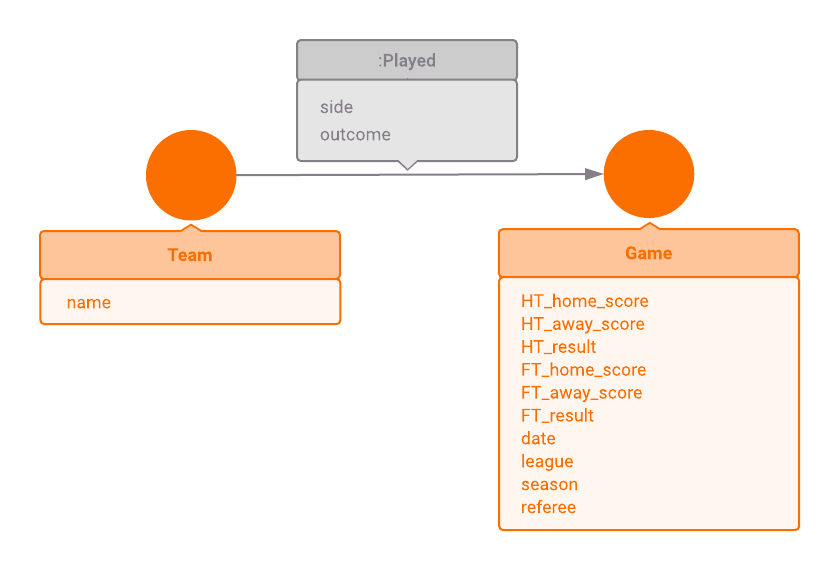

## Graphing the Premier League

This article is a part of a series intended to show users how to use Memgraph
on real-world data and, by doing so, retrieve some interesting and useful
information.

We highly recommend checking out the other articles from this series:

  * [Analyzing TED Talks](analyzing-TED-talks.md)
  * [Exploring the European Road Network](exploring-the-european-road-network.md)
  * [Backpacking Through Europe](backpacking-through-europe.md)
  * [Movie Recommendation System](movie-recommendation.md)

### Introduction

[Football](https://en.wikipedia.org/wiki/Association_football)
is a team sport played between two teams of eleven
players with a spherical ball. The game is played on a rectangular pitch with
a goal at each and. The object of the game is to score by moving the ball
beyond the goal line into the opposing goal. The game is played by more than
250 million players in over 200 countries, making it the world's most
popular sport.

In this article, we will present a graph model of a reasonably sized dataset
of football matches across world's most popular leagues.

### Data Model

In essence, we are trying to model a set of football matches. All information
about a single match is going to be contained in three nodes and two edges.
Two of the nodes will represent the teams that have played the match, while the
third node will represent the game itself. Both edges are directed from the
team nodes to the game node and are labeled as `:Played`.

Every bit of information regarding the data model is nicely condensed in
the following visual representation.



### Importing the Snapshot

We have prepared a database snapshot for this example, so the user can easily
import it when starting Memgraph using the `--data-directory` option.

```plaintext
sudo -u memgraph \
  /usr/lib/memgraph/memgraph --data-directory /usr/share/memgraph/examples/football \
    --storage-snapshot-interval-sec=0 --storage-wal-enabled=false \
    --storage-snapshot-on-exit=false --storage-properties-on-edges=true
```

When using Memgraph installed from DEB or RPM package, the currently running
Memgraph server may need to be stopped before importing the example. The user
can do so using the following command:

```plaintext
systemctl stop memgraph
```

When using Docker, the example can be imported with the following command:

```plaintext
docker run -p 7687:7687 \
  -v mg_lib:/var/lib/memgraph -v mg_log:/var/log/memgraph -v mg_etc:/etc/memgraph \
  memgraph --data-directory /usr/share/memgraph/examples/football \
  --storage-snapshot-interval-sec=0 --storage-wal-enabled=false \
  --storage-snapshot-on-exit=false --storage-properties-on-edges=true
```

The user should note that any modifications of the database state will persist
only during this run of Memgraph.

### Example Queries

1) You might wonder, what leagues are supported?

```opencypher
MATCH (n:Game)
RETURN DISTINCT n.league AS League
ORDER BY League;
```

2) We have stored a certain number of seasons for each league. What is the
oldest/newest season we have included?

```opencypher
MATCH (n:Game)
RETURN DISTINCT n.league AS League, MIN(n.season) AS Oldest, MAX(n.season) AS Newest
ORDER BY League;
```

3) You have already seen one game between Chelsea and Arsenal, let's list all of
them in chronological order.

```opencypher
MATCH (n:Team {name: "Chelsea"})-[e:Played]->(w:Game)<-[f:Played]-(m:Team {name: "Arsenal"})
RETURN w.date AS Date, e.side AS Chelsea, f.side AS Arsenal,
       w.FT_home_score AS home_score, w.FT_away_score AS away_score
ORDER BY Date;
```

4) How about filtering games in which Chelsea won?

```opencypher
MATCH (n:Team {name: "Chelsea"})-[e:Played {outcome: "won"}]->
      (w:Game)<-[f:Played]-(m:Team {name: "Arsenal"})
RETURN w.date AS Date, e.side AS Chelsea, f.side AS Arsenal,
       w.FT_home_score AS home_score, w.FT_away_score AS away_score
ORDER BY Date;
```

5) Home field advantage is a thing in football. Let's list the number of home
defeats for each Premier League team in the 2016/2017 season.

```opencypher
MATCH (n:Team)-[:Played {side: "home", outcome: "lost"}]->
      (w:Game {league: "ENG-Premier League", season: 2016})
RETURN n.name AS Team, count(w) AS home_defeats
ORDER BY home_defeats, Team;
```

6) At the end of the season the team with the most points wins the league. For
each victory, a team is awarded 3 points and for each draw it is awarded
1 point. Let's find out how many points did reigning champions (Chelsea) have
at the end of 2016/2017 season.

```opencypher
MATCH (n:Team {name: "Chelsea"})-[:Played {outcome: "drew"}]->(w:Game {season: 2016})
WITH n, COUNT(w) AS draw_points
MATCH (n)-[:Played {outcome: "won"}]->(w:Game {season: 2016})
RETURN draw_points + 3 * COUNT(w) AS total_points;
```

7) In fact, why not retrieve the whole table?

```opencypher
MATCH (n)-[:Played {outcome: "drew"}]->(w:Game {league: "ENG-Premier League", season: 2016})
WITH n, COUNT(w) AS draw_points
MATCH (n)-[:Played {outcome: "won"}]->(w:Game {league: "ENG-Premier League", season: 2016})
RETURN n.name AS Team, draw_points + 3 * COUNT(w) AS total_points
ORDER BY total_points DESC;
```

8) People have always debated which of the major leagues is the most exciting.
One basic metric is the average number of goals per game. Let's see the results
at the end of the 2016/2017 season. WARNING: This might shock you.

```opencypher
MATCH (w:Game {season: 2016})
RETURN w.league, AVG(w.FT_home_score) + AVG(w.FT_away_score) AS avg_goals_per_game
ORDER BY avg_goals_per_game DESC;
```

9) Another metric might be the number of comebacks&mdash;games where one side
was winning at half time but were overthrown by the other side by the end
of the match. Let's count such occurrences during all supported seasons across
all supported leagues.

```opencypher
MATCH (g:Game) WHERE
(g.HT_result = "H" AND g.FT_result = "A") OR
(g.HT_result = "A" AND g.FT_result = "H")
RETURN g.league AS League, count(g) AS Comebacks
ORDER BY Comebacks DESC;
```

10) Exciting leagues also tend to be very unpredictable. On that note, let's
list all triplets of teams where, during the course of one season, team A won
against team B, team B won against team C and team C won against team A.

```opencypher
MATCH (a)-[:Played {outcome: "won"}]->(p:Game {league: "ENG-Premier League", season: 2016})<--
      (b)-[:Played {outcome: "won"}]->(q:Game {league: "ENG-Premier League", season: 2016})<--
      (c)-[:Played {outcome: "won"}]->(r:Game {league: "ENG-Premier League", season: 2016})<--(a)
WHERE p.date < q.date AND q.date < r.date
RETURN a.name AS Team1, b.name AS Team2, c.name AS Team3;
```
