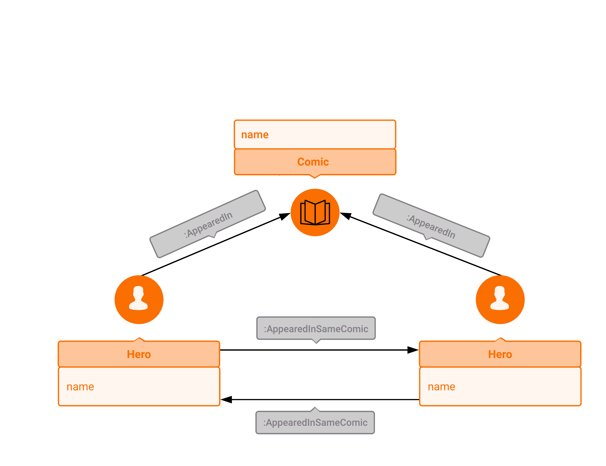

## Marvel Comic Universe Social Network

### Introduction

Spandex. Muscles. Big egos. Bad hair. No, we're not talking about your high
school thrash metal band. We're talking one of the largest fictional social
networks that is the Marvel Comic Universe! Here we'll teach you how to navigate
this complex and confusing assembly of heroes and villains. If you've ever
wanted to know who's Spider-Man's best super-buddy, or wanted to find all the
comic issues where Hulk, Wolverine, Thor, and Black Panther appear together, look
no further and fire up that Memgraph copy of yours!

### Data Model

Although the MCU is chock-full of heroes, the real hero here is Russ Chappell,
who painstakingly gathered the MCU data for the [Marvel Chronology Project](www.chronologyproject.com).
In addition, R. Alberich, J. Miro-Julia, and F. Rossello, three data scientists,
scraped the Chronology Project database, processed the data and put it into a
format that can be easily imported into any data-processing framework available
today. Their aim was to investigate whether this fictional "social network" has
a structure similar to a real-life social network. You can find their interesting
findings in the paper that was the culmination of their work, linked [here](https://arxiv.org/pdf/cond-mat/0202174.pdf).
The data they used, on the other hand, can be found [here](https://www.kaggle.com/csanhueza/the-marvel-universe-social-network).
We've used a slightly modified version of this data to create a graph database
snapshot ready for use.

Now, the data we'll be using in our queries can be classified as follows:
  * nodes, labeled as "Hero", "Comic", or "ComicSeries
    * a "Hero" node has a "name" attribute corresponding to both a hero's
      moniker and her/his real name (e.g. "SPIDER-MAN/PETER PARKER")
    * a "Comic" node has a "name" attribute corresponding to the abbreviated
      comic series name and the issue/volume number if it's included (e.g.
      "Astonishing Tales Vol. 2 12")
    * a "ComicSeries" node has a "title" attribute corresponding to the title of
      the series a given comic is a part of, e.g. the "Comic" node
      "AMAZING SPIDER-MAN VOL 2. 15" is part of series "AMAZING SPIDER-MAN VOL 2.".
      In addition, each "ComicSeries" node has a "publishYear" attribute, which
      is a list of years in which the series was published.
  * edges, labeled "AppearedIn", "AppearedInSameComic", or "IsPartOfSeries"
    * edges connecting a "Hero" node to the "Comic" node it appears in are
      labeled "AppearedIn"
    * edges connecting two "Hero" nodes that appeared in the same comic are
      labeled "AppearedInSameComic"
    * edges connecting a "Comic" node and its corresponding "ComicSeries" node,
      representing the inclusion relationship between a particular comic issue
      and the series it's part of, are labeled "IsPartOfSeries"

A visual scheme of our graph database is given below.



Complete mapping of abbreviated comic titles to the full ones can be found [here](https://www.chronologyproject.com/key.php).

### Importing the Snapshot

### Example Queries using OpenCypher

In the queries below, we are, as usual, using [OpenCypher](https://www.opencypher.org)
to query Memgraph via the console.

Here are some queries you might find interesting:

1) List all the comic series present in the database, next to the number of comics it contains:

```opencypher
MATCH (s:ComicSeries)-[:IsPartOfSeries]-(c:Comic)
WITH s.title as Series,
c as Comic
return Series, count(Comic) as ComicCount
ORDER BY Series;
```

2) List all the heroes that have "SPIDER" in their name

If you take a peek at the Hero nodes, you'll find that their names, while
accurate in most cases, can be a bit mangled. We didn't have time to check and
update all the names that were already present. We swear! Super-busy! But, no
worries, we'll show you how to get a list of potential heroes you might be looking
for. One of the most flexible ways is to use regex matching (represented by the
regex-matching operator "=~").

```opencypher
MATCH (h:Hero) WHERE
h.name =~ ".*SPIDER.+"
RETURN h.name as PotentialSpiderDude
```

We recommend you search for your heroes of interest this way, might save you
some time!

3) List all the heroes that have appeared together with Spider-Man/Peter Parker in a comic:

```opencypher
MATCH (:Hero {name: "SPIDER-MAN/PETER PARKER"})-[:AppearedInSameComic]->(h:Hero)
RETURN DISTINCT h.name AS SpiderAssociate;
```

Wonder why we've used the "DISTINCT" keyword? Here's why - the data graph we got
by loading the scraped MCU data (as used in the paper linked to in the
introduction) contains an edge between two Hero nodes for every comic they
appear in together. So, to remove duplicates, we had to plug in the "DISTINCT" keyword.

4) List all the comic issues where Spider-Man (Peter Parker) and Venom (Eddie Brock) appear together:

```opencypher
MATCH (:Hero {name: "SPIDER-MAN/PETER PARKER"})-[:AppearedIn]->(c:Comic)<-[:AppearedIn]-(:Hero {name: "VENOM/EDDIE BROCK"})
RETURN c.name AS SpideyAndVenomComic;
```

5) List all the comic series in which Spider-Man/Peter Parker appears:

```opencypher
MATCH (:Hero {name: "SPIDER-MAN/PETER PARKER"})-[:AppearedIn]->(c:Comic)-[:IsPartOfSeries]-(s:ComicSeries)
RETURN DISTINCT s.title as SpideySeries;
```

6) List 10 heroes with whom Spider-Man (Peter Parker) appeared most frequently together:

```opencypher
MATCH (:Hero {name: "SPIDER-MAN/PETER PARKER"})-[:AppearedIn]->(c:Comic)<-[:AppearedIn]-(h:Hero)
WITH
distinct(h) AS SpideyFriend,
count(h) AS FriendCount
RETURN SpideyFriend, FriendCount
ORDER BY FriendCount DESC
LIMIT 10;
```

7) Find if there's a connection between Peter Parker/Spider-Man and Beef:

```opencypher
MATCH p=(:Hero {name: "SPIDER-MAN/PETER PARKER"})-[*bfs 1..10]-(b:Hero {name: "BEEF"})
return p;
```

8) List the 10 most popular heroes and 10 most popular comic series in the MCU:

Quickly, name the five most popular heroes in the MCU! Alright, how did your
brain decide what to give as the answer? We're assuming that you have no clue,
but it vaguely has to do with the number and quality of connections each of
those heroes have in your brain. However, how to explain the concept of "popular"
to our database engine?

Well, our philosophy is as follows - a popular hero is the one who's "known" by
more other heroes, or in terms of our MCU graph, a hero that the other heroes have
more connections (edges) to than some other hero is deemed "more popular". We'll
apply analogous reasoning to define the "most popular" comic book series as well.
This philosophy is the one underlying Google's search engine, and the algorithm
embodying it is PageRank, so it would be convenient if we could make use of it.

However, the query engine doesn't support PageRank out-of-the-box, so we have to
come up with a way to plug in PageRank to our database. That's precisely the
purpose of [query modules](../reference_guide/query-modules.md)!

Long story short, the query module system enables us to write C or Python modules
that can access the data stored in our graph database, do some processing, and
return the results of this processing to the query engine, so we can perform
further queries on them. In this particular case, the PageRank algorithm is
implemented as a Python module, and can be found in the query module directory
`/usr/lib/memgraph/query_modules/`, along with its description and the examples
of usage. What you as a user must know is that the pagerank procedure automagically
takes the MCU graph as an argument, and returns a record of pairs of nodes and the
corresponding rank values (rank is a number representing the "popularity" of a given node).

```opencypher
CALL pagerank.pagerank(0.85, 'personalization', 150) YIELD node, rank
WITH
collect(node.name) as MostPopularHeroes,
rank
RETURN MostPopularHeroes
ORDER BY rank DESC
LIMIT 10;
```

How do the results of this query match with your own list? Not bad, right?

Alright, so how do we find the most "popular" comic series? Well, all we have
to remember is that a "ComicSeries" node has an attribute "title" which denotes,
of course, its title. Instead of collecting hero names with
"collect(node.name)", we'll just replace it with "collect(node.title)" and leave
the rest as it was above, except for the name of the return values. Sweet!

```opencypher
CALL pagerank.pagerank(0.85, 'personalization', 150) YIELD node, rank
WITH
collect(node.title) as MostPopularComicSeries,
rank
RETURN MostPopularComicSeries
ORDER BY rank DESC
LIMIT 10;
```

And that, folks, is all there is to it, so go and try out some graph magic of your own!

If you're interested in the PageRank algorithm, we recommend you start [here](https://en.wikipedia.org/wiki/PageRank).

### Nifty things you could do

While the thing we've shown you how to do might be fun for a while, there are
loads of cool things you could do to improve the fun-factor. Here's a very short
list of things we think you could pull off:

* we have loads of Hero nodes, so even the Hobgoblin or Magneto are deemed
  "heroes", but if you were the mayor of the Marvel Comic Universe Town, you
  wouldn't give those guys medals of honor, would you? It would be pretty cool
  if we could classify the MCU entities into "Hero" and "Villain" categories.
  Then you could ask the query engine to give you a list of Spidey's arch
  nemeses in addition to Spidey's best hero buddies.
* similar to the previous idea, it would be insanely cool if someone would add
  more attributes to the heroes like "Superpower", "Level", "Affiliation",
  "Signature moves" etc. If you had that, you could perhaps make a simple
  Pokemon-like game where you'd randomly pick a team of villains and choose a team
  of heroes to fight them.
* you could write your own query module that could run more sophisticated
  analyses on the social network like closeness centrality, Louvain modularity
  etc.

Now go and use your graph database superpowers for greater good! Although the
comic universe is full of heroes, there's always room for one more!
