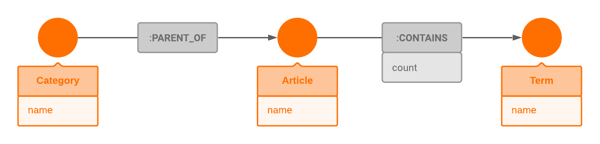

# Introduction

A free, multilingual, widely available subset of collected world's knowledge. The first Wikipedia edit happened in 2001 which started the avalanche of written Wikipedia articles. There were more than 6,200,000 English Wikipedia articles in 2020. Wikipedia is a common starting point for general information, backed up by reliable sources outside of the site. Quality of articles is maintained by various editors, which anyone can become.

In this demo, you will explore the contents and contexts of 339 featured Wikipedia articles.

The following datasets (reduced) were used to create this demo:
1. [Wikipedia network of top categories](https://snap.stanford.edu/data/wiki-topcats.html)
2. [Linked WikiText-2](https://rloganiv.github.io/linked-wikitext-2/#/)
# Data model
Wikipedia Articles is a [graph](https://en.wikipedia.org/wiki/Graph_theory#:~:text=In%20mathematics%2C%20graph%20theory%20is,also%20called%20links%20or%20lines) dataset consisting of the [nodes](https://en.wikipedia.org/wiki/Vertex_(graph_theory)) and [edges](https://en.wikipedia.org/wiki/Glossary_of_graph_theory_terms#edge).

**Nodes** can have the following labels:

1. `Article` with a property `name`
2. `Term`  with a property `name`
3. `Category` with a property `name`

examples:
- `node:Article { name: 'Protein' }`
- `node:Term { name: 'protein folding' }`
- `node:Category { name: 'Molecular biology' }` 

**Edges** can be of the following types:

1. `:CONTAINS` with a property `count` - connects `Article` to `Term`
2. `:PARENT_TO` - connects `Category` to `Article

examples:
- `(n:Article { name: 'Protein' })` `-[:CONTAINS { count: 3 }]->` `(n:Term { name: 'protein folding' })`
- `(n:Category { name: 'Molecular biology' })` `-[:PARENT_TO]->` `(n:Article { name: 'Protein' }`


What's an Article made of? Terms!
>Wikipedia `Articles` contain many words and phrases called `Terms`. This relation is represented with an edge `:CONTAINS`. If `Article`'s text contains a `Term` they are connected with an edge `:CONTAINS` (from `Article` to `Term`). Different `Article` nodes can be connected to the same `Term` node. `count` property on an edge `:CONTAINS` is a number of repeating `Term` in an `Article`.

Who are Article's parents? Categories!
>Wikipedia `Category` is a parent of many `Articles`. This relation is represented with an edge `:PARENT_OF`. If `Category` is a parent of an `Article` they are connected with an edge `:PARENT_OF` (from  `Category` to `Article`). An `Article` can have multiple parent `Categories`.


Here's a visual representation of the graph model:



# Example queries

In the queries below, we are, as usual, using [OpenCypher](https://www.opencypher.org/) to query Memgraph via the console.

1. First, let's explore the dataset by sampling 5 random `Categories` and 5 random `Articles`
```opencypher
MATCH (c:Category)-[:PARENT_OF]->(a:Article)
WITH a, c, rand() AS number
RETURN DISTINCT
c.name as `random Category`,
a.name as `with a random Article`
ORDER BY number
LIMIT 5;
```
```opencypher
MATCH (a:Article)-[:CONTAINS]->(t:Term)
WITH a, t,  rand() AS number
RETURN DISTINCT
a.name as `random Article`,
t.name as `with a random Term`
ORDER BY number
LIMIT 5;
```

1. "Too much text!". Which `Article` is the largest? The one that contains the most amount of `Terms`. `r.count` is an edge property that tells us how many `Terms` does an `Article` contain. All we need to do is `sum` those properties!
```opencypher
MATCH (a:Article)-[r:CONTAINS]->(:Term)
RETURN a.name as `Article`, sum(r.count) as `Number of terms`
ORDER BY `Number of terms` DESC LIMIT 10;
```


3. "Richest category". Which `Category` has the most `Articles`? This time, we can't use `r.count` property of an edge. But we can `count` the edges!```opencypher
MATCH (c:Category)-[r:PARENT_OF]->(:Article)
WITH DISTINCT c, r
RETURN DISTINCT c.name as `Category`, count(r) as `Number of articles`
ORDER BY `Number of articles` DESC LIMIT 10;
```


4. "Center of attention". What is the most popular `Term` in an `Article` "Protein"?```opencypher
MATCH (a:Article {name: "Protein"})-[r:CONTAINS]->(t:Term)
RETURN DISTINCT
t.name as Term,
r.count as Count
ORDER BY r.count DESC
LIMIT 10;
```

5. "Thank you, Captain Obvious". How can we filter these redundant "proteins"? Let's add a condition to ignore `Terms` with variation on "Protein"
```opencypher
MATCH (a:Article {name: "Protein"})-[r:CONTAINS]->(t:Term)
WHERE toLower(a.name) != toLower(t.name)
AND toLower(a.name+"s") != toLower(t.name)
RETURN DISTINCT
t.name as Term,
r.count as Count
ORDER BY r.count DESC
LIMIT 10;
```


6. "Relative > absolute". Absolute values are fine, but how we get [term frequency](https://en.wikipedia.org/wiki/Tf%E2%80%93idf#Term_frequency_2) for our `Terms`? Notice we propagate `total_terms` with `WITH`.
```opencypher
MATCH (:Article {name: "Protein"})-[r:CONTAINS]->(:Term)
WITH sum(r.count) AS total_terms

MATCH (a:Article {name: "Protein"})-[r:CONTAINS]->(t:Term)
WHERE toLower(a.name) != toLower(t.name)
AND toLower(a.name+"s") != toLower(t.name)
WITH r, t, total_terms

RETURN DISTINCT
t.name as Term,
r.count as `Term count`,
total_terms as `Total number of terms`,
toFloat(r.count) / total_terms as term_frequency
ORDER BY term_frequency
DESC LIMIT 10;
```

7. "The real MVP". Stopwords like "where", "or" and "make" usually show up in Wikipedia articles and other texts. Thankfully, this dataset doesn't contain any stopwords. But how can we, in general, know how important a `Term` is in an `Article` ? It may be the case that the `Term` appears in multiple `Articles` very often. Therefore, it's not so important and doesn't give us much new information. [tf-idf](https://en.wikipedia.org/wiki/Tf%E2%80%93idf) is a popular numerical statistic that gives us the answer to our problem. It takes into account how often does a `Term` appear in the `Article` "Protein" and how often in `Articles` overall. Let's calculate `tf_idf` for all `Terms` in an `Article` "Protein" 
```opencypher
MATCH (:Article)
WITH count(*) AS number_of_articles

MATCH (a:Article {name: "Protein"})-[r:CONTAINS]->(t:Term)
WITH sum(r.count) AS terms_in_protein, number_of_articles

MATCH (a:Article {name: "Protein"})-[r:CONTAINS]->(t:Term)<-[r2:CONTAINS]-(total_articles:Article)
WHERE toLower(a.name) != toLower(total_articles.name)
AND toLower(a.name) != toLower(t.name)
AND toLower(a.name+"s") != toLower(t.name)
WITH DISTINCT total_articles, t, toFloat(r.count) as term_in_protein, terms_in_protein, number_of_articles

RETURN DISTINCT
t.name as Term,
term_in_protein / terms_in_protein as tf, 
(-log(toFloat(count(total_articles)+1)/number_of_articles)) as idf,
((term_in_protein / terms_in_protein) * (-log(toFloat(count(total_articles)+1)/number_of_articles))) as tf_idf

ORDER BY tf_idf DESC
LIMIT 10;
```

8. "Find some peace". Let's find `Articles` that contain a `Term` "Croatia"/"croatia" and doesn't contain the `Term` "war". `Articles` whose `name` contains "war" are also excluded.
```opencypher
MATCH (term1:Term)<-[r1:CONTAINS]-(a:Article)-[r2:CONTAINS]->(term2:Term)
WHERE toLower(term1.name) != "war"
AND NOT toLower(a.name) =~ ".*war.*"
AND toLower(term2.name) = "croatia"
RETURN DISTINCT a.name as `Article`, r2.count as ` "croatia" term count`
ORDER BY r2.count DESC LIMIT 10;
```

9. "Like father, like son". Which `Articles` contain a substring of some `Term` that appears in that `Article`? Symbol `=~` denotes a [regular expression](https://docs.memgraph.com/memgraph/reference-overview/reading-existing-data#regular-expressions).
```opencypher
MATCH (a:Article)-[:CONTAINS]->(t:Term)
WHERE toLower(a.name) =~ (".*"+t.name+".*")
AND NOT t.name =~ "[0-9]+"
WITH distinct a, t
RETURN `Article`, `Term`
LIMIT 10;
```

10. "Sega's blue hedgehog". Which `Articles` under `Category` "Windows games" contain the `Term` "sega" ?
```opencypher
MATCH (c:Category {name: "Windows games"})-[:PARENT_OF]->(a:Article)-[r:CONTAINS]->(t:Term)
WHERE toLower(t.name) = "sega"
RETURN a.name as `Article`, r.count as `"Sega" term count`
ORDER BY r.count DESC LIMIT 20;
```