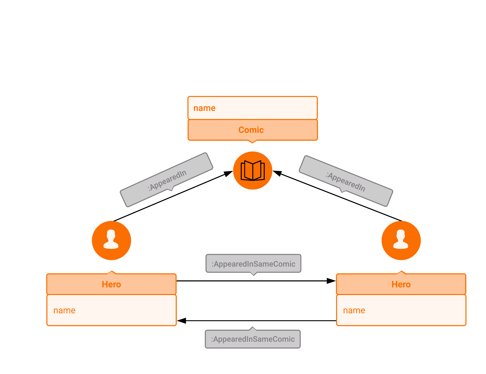

## Marvel Universe Social Network

### Introduction

Spandex. Muscles. Big egos. Bad hair. No, we're not talking about your high
school thrash metal band. We're talking one of the largest fictional social
networks that is the Marvel Comic Universe! Here we'll teach you how to navigate
this complex and confusing assembly of heroes and villains. If you've ever
wanted to know who's Spider-Man's best super-buddy, or wanted to find all the
comic issues where Hulk, Wolverine, Thor, and Black Panther appear together, look
no further and fire up that Memgraph copy of yours!

### Data Model

Although the MCU is chock-full of heroes, the real hero here is Russ Chappell,
who painstakingly gathered the MCU data for the [Marvel Chronology Project](www.chronologyproject.com).
In addition, R. Alberich, J. Miro-Julia, and F. Rossello, three data scientists,
scraped the Chronology Project database, processed the data and put it into a
format that can be easily imported into any data-processing framework available
today. Their aim was to investigate whether this fictional "social network" has
a structure similar to a real-life social network. You can find their interesting
findings in the paper that was the culmination of their work, linked [here](https://arxiv.org/pdf/cond-mat/0202174.pdf).
The data they used, on the other hand, can be found [here](https://www.kaggle.com/csanhueza/the-marvel-universe-social-network).
We've used a slightly modified version of this data to create a graph database
snapshot ready for use.

Now, the data we'll be using in our queries can be classified as follows:
  * nodes, labeled as either "Hero" or "Comic"
    * a "Hero" node has a "name" attribute corresponding to both a hero's
      monniker and her/his real name (e.g. "SPIDER-MAN/PETER PARKER")
    * a "Comic" node has a "name" attribute corresponding to the abbreviated
      comic series name and the issue/volume number if it's included (e.g. "AT2"
      corresponds to "Astonishing Tales Volume 2")
  * edges, labeled either "AppearedIn" or "AppearedInSameComic"
    * edges connecting a "Hero" node to the "Comic" node it appears in are
      labeled "AppearedIn"
    * edges connecting two "Hero" nodes that appeared in the same comic are
      labeled "AppearedInSameComic"

A visual scheme of our graph database is given below.



Complete mapping of abbreviated comic titles to the full ones can be found [here](https://www.chronologyproject.com/key.php).

### Importing the Snapshot

### Example Queries using OpenCypher

In the queries below, we are, as usual, using [OpenCypher](https://www.opencypher.org) 
to query Memgraph via the console.

Here are some queries you might find interesting:

1) List all the heroes that have appeared together with Spider-Man/Peter Parker in a comic:

```opencypher
MATCH (:Hero {name: "SPIDER-MAN/PETER PARKER"})-[:AppearedInSameComic]->(h:Hero)
RETURN DISTINCT h.name AS SpiderAssociate;
```

2) List all the comic issues where Spider-Man (Peter Parker) and Venom (Eddie Brock) appear together:

```opencypher
MATCH (:Hero {name: "SPIDER-MAN/PETER PARKER"})-[:AppearedIn]->(c:Comic)<-[:AppearedIn]-(:Hero {name: "VENOM/EDDIE BROCK"})
RETURN c.name AS SpideyAndVenomComic;
```

3) List 10 heroes with whom Spider-Man (Peter Parker) appeared most frequently together:

```opencypher
MATCH (:Hero {name: "SPIDER-MAN/PETER PARKER"})-[r:AppearedInSameComic]->(h:Hero) WITH
h.name AS SpideyBuddy,
count(r) AS NumCollabs
RETURN SpideyBuddy, NumCollabs
ORDER BY NumCollabs DESC
LIMIT 10;
```

4) List the 10 most popular heroes in the MCU:

Quickly, name the five most popular heroes in the MCU! Alright, how did your
brain decide what to give as the answer? We're assuming that you have no clue,
but it vaguely has to do with the number and quality of connections each of
those heroes have in your brain. However, how to explain the concept of "popular"
to our database engine?

Well, our philosophy is as follows - a popular hero is the one who's "known" by
more other heroes, or in terms of our MCU graph, a hero that the other heroes have
more connections (edges) to than some other hero is deemed "more popular".
This philosophy is the one underlying Google's search engine, and the algorithm
embodying it is PageRank, so it would be convenient if we could make use of it.

However, the query engine doesn't support PageRank out-of-the-box, so we have to
come up with a way to plug in PageRank to our database. That's precisely the
purpose of [query modules](../reference_guide/query-modules.md)!

Long story short, the query module system enables us to write C or Python modules
that can access the data stored in our graph database, do some processing, and
return the results of this processing to the query engine, so we can perform
further queries on them. In this particular case, the PageRank algorithm is
implemented as a Python module, and can be found in the query module directory
"/usr/lib/memgraph/query_modules/", along with its description and the examples
of usage. What you as a user must know is that the pagerank procedure automagically
takes the MCU graph as an argument, and returns a record of pairs of "Hero" nodes and the
corresponding rank values (rank is a number representing the "popularity" of a given node).

```opencypher
CALL pagerank.pagerank(0.85, 'personalization', 150) YIELD node, rank
RETURN node.name AS MostPopularHero
ORDER BY rank DESC
LIMIT 10;
```

How do the results of this query match with your own list? Not bad, right?
Now go and find out more interesting connections in the MCU!

If you're interested in the PageRank algorithm, we recommend you start [here](https://en.wikipedia.org/wiki/PageRank).

5) List whatever your custom fancy algorithm returns

Look at Mr. Fancy Pants right here. Our out-of-the-box functions not working out
for ya? You want to use your own fancy supermath? Well, that's excellent, because
we've got you covered! At some point, you'll want to try out recipes from your own
cookbook, and to get you up to speed, we'll show you one of the ways you could do it
using our [query module system](../reference_guide/query-modules.md) and some elbow
grease. Alright, let's go!

Let's say you want to run a [closeness centrality](https://en.wikipedia.org/wiki/Closeness_centrality)
analysis on the MCU graph. 
