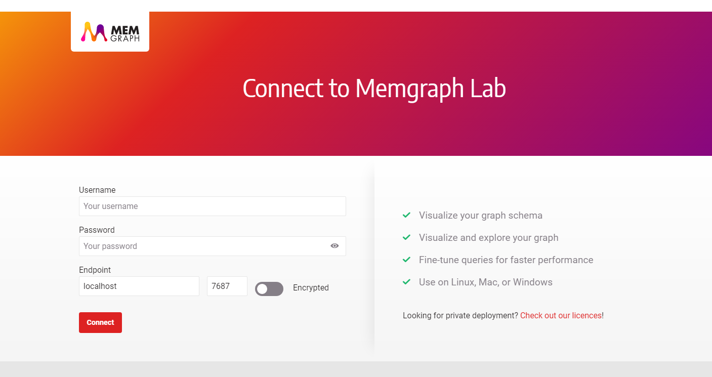

## Querying the database with Memgraph Lab

This article outlines the basic steps necessary to query a running Memgraph database instance from **Memgraph Lab**.

### Prerequisites
Before you proceed with the guide, make sure that you have:
* Installed the latest version of **Memgraph Lab** which you can get from the official [download page](https://memgraph.com/download/).
* A running Memgraph database instance. Instructions on how to do setup Memgraph can be [found here](../installation/installation.md).

### Connecting to the database

Make sure that Memgraph is running and open Memgraph Lab.
If you are starting with a fresh database instance, you don't have to change any of the options.

1. Leave the `Username` and `Password` fields **empty**.
2. The `Host` field can be either **`localhost`**, **`127.0.0.1`** or **`0.0.0.0`**.
3. The `Port` field should be **`7687`**. Every Memgraph instance is listening on this port by default.
4. The `Encrypted` option should be **disabled** by default.

If you fail to connect, make sure that your database instance is up and running. 
If the `Host` address is wrong, take a look at the [Docker Note](../installation/docker-installation.md#docker-note) in the installation guide.

### Getting help

Visit the **Getting help** page in case you run into any kind of problem or you have additional questions.


### Where to next?

To learn more about the **openCypher** language, visit our **[Cypher manual](../../cypher_manual/cypher-manual.md)**.  
For real-world examples of how to use Memgraph, we strongly suggest going through one of the available **[Tutorials](tutorials/tutorials-overview.md)**. 
Details on what can be stored in Memgraph can be found in the article about **[Data Storage](concepts/storage.md)**.